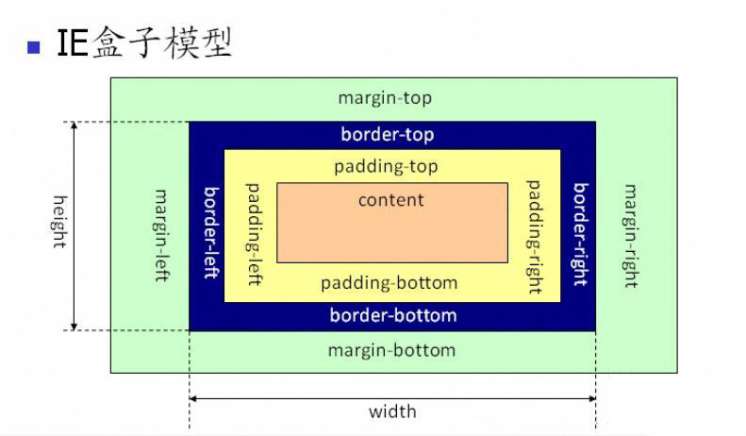

# 盒模型

[盒模型-思维导图](./mind/04-盒模型.html)

## 盒子宽高

### 宽度值

1. 盒子宽度：content宽度 + padding 宽度 + border 宽度（+ 滚动条宽度） + margin 宽度
2. offsetWidth： content宽度 + padding 宽度 + border 宽度 （+ 滚动条宽度）

### width属性设置（推荐将所有的元素都设置为border-box）

1. 标准盒模型：box-sizing: content-box(默认) => content宽度
2. IE盒模型：box-sizing: border-box => content宽度 + padding 宽度 + border 宽度

## 充满容器的盒子

1. 元素状态
   1. 子元素为块元素，且未设定宽度
   2. 容器则是宽度设置为固定值
2. 修改 margin 、 border 或 padding 其中一项的宽度值，造成content减少
3. 当设定值超过容器极限时，容器会被撑开

## margin负值

### 设定元素移动

1. margin-top（向上移动）
2. margin-left（向左移动）

### 临近元素移动

1. margin-right（右侧元素左移）
2. margin-bottom（下方元素上移）

## display

设置元素的内部和外部显示类型

### display-box

1. 定义一个元素到底是否产生显示盒

#### 类型

1. contents
2. none
   1. 元素不显示
   2. 并且会从文档流中移除，包括子元素

### display-outside

1. 元素的外部显示类型

#### 类型

1. block
   1. 块元素
   2. 默认宽度为父元素宽度，独占一行，多元素会另起一行，并可以自动换行
   3. 可以设置width、height、margin和padding属性
2. inline
   1. 行内元素
   2. 默认宽度为内容宽度，不会自动换行
   3. 设置width、height属性无效，只可设置水平方向的margin和padding属性

### display-inside

1. 元素的内部显示类型

#### 类型

1. flow-root
   1. 块级元素
   2. 会生成BFC
2. table
3. flex
4. grid

### display-listitem

1. 元素的外部显示类型变为 block 盒
2. 内部显示类型变为多个 list-item inline 盒

#### 类型

1. list-item
   1. 块元素现实
   2. 有列表标记

### display-internal

1. 有些布局模型（如 table 和 ruby）有着复杂的内部结构，因此它们的子元素可能扮演着不同的角色
2. 只有在这些特定的布局模型中才有意义

#### 类型

1. table-row
2. table-cell
3. ...

### display-legacy

1. 单个关键字来指定display的属性
2. 对于相同布局模式的 block 级和 inline 级变体需要使用单独的关键字

#### 类型

1. inline-block（inline flow-root）
   1. 行内块元素
   2. 默认宽度为内容宽度，不会独占一行
   3. 可以设置width、height、margin和padding属性
2. inline-table（inline table）
3. inline-flex（inline flex）
4. inline-grid（inline grid）

## 隐藏元素

### 不响应绑定事件

#### display: none

渲染树不包含渲染对象，不占据页面空间

#### visibility: hidden

占据页面空间

#### display: none与visibility: hidden区别

1. 渲染树
   1. display: none的元素完全从渲染树中消失，不会占据任何空间
   2. visibility: hidden的元素仍然在渲染树中，也会占据空间
2. 继承
   1. display: none为非继承属性，子孙节点会随着元素一起消失
   2. visibility: hidden继承属性，子孙节点是继承了hidden消失
3. 回流和重绘
   1. display: none会造成文档回流
   2. visibility: hidden会使元素重绘
4. 读屏器
   1. display: none不会读取
   2. visibility: hidden的内容仍可以读取

### 响应绑定事件

#### z-index: 负值

利用其他元素覆盖元素隐藏

#### position: absolute

利用绝对定位将元素移出可视区域

#### transform: scale(0, 0)

元素缩放为 0，来实现元素的隐藏，占据页面空间

#### clip/clip-path

利用元素裁剪

#### opacity: 0（可点击）

利用透明度为0隐藏元素，占据页面空间
