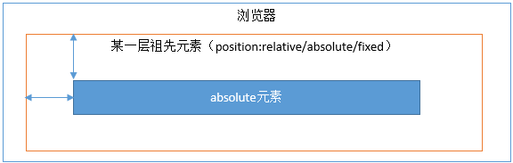
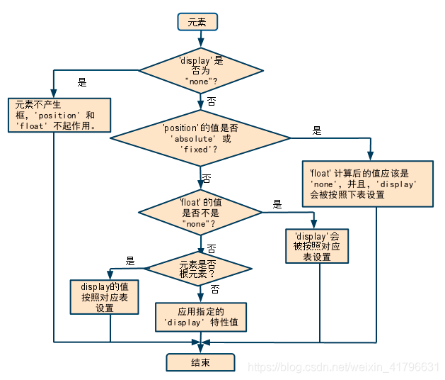

# 内容布局

[内容布局-思维导图](./mind/05-内容布局.html)

## position

网页元素定位

### position属性值

#### relative


定位上下文为元素自身，不影响其他元素

#### absolute



使用最近的定位上下文，最外层为body

#### fixed


window和iframe作为定位上下文

##### absolute与fixed的异同

1. 相同点
   1. 更改元素以inline-block形式展示
   2. 脱离普通文档流，不再占据文档空间，具有破坏性，导致其他元素位置变化
   3. 覆盖非定位元素
2. 不同点
   1. 定位上下文不同
   2. 滚动条页面，绝对定位会跟随父元素移动

#### sticky

1. 在 position:relative 与 position:fixed 定位之间切换
2. 当页面滚动超出目标区域时，转变为position:fixed

#### static（默认值）

#### inherit（继承）

###  z-index

1. 用于控制元素层叠
2. 需要元素的 position 属性是 relative，absolute 或是 fixed

#### [z-index失效](https://shiyousan.com/post/635861461562038949)

1. 父元素
   1. 层级低于其他兄弟元素
   2. position 为 relative：父元素 position 改为 absolute 或 static
2. 目标元素
   1. position未设置为非static：设置该元素的 position 属性为 relative，absolute 或是 fixed
   2. 设置了 float 浮动：float 去除，改为 display：inline-block
3. IE6
   1. 设置z-index的同时还设置了float：float 去除，改为 display：inline-block
   2. E6-IE7下父元素没有设置z-index即父元素非层叠元素

#### 层叠顺序

1. 背景和边框 > 负z-index > 块级盒 > 浮动盒 > 行内盒 > z-index为0 > 正z-index
2. 当z-index为auto时，当前层叠上下文为0，不会建立新上下文，除非为根元素


##  float

float是一个被误用的属性，设计初衷用于文字环绕，float可以实现table的布局，因此被误用于布局

### float特性

1. 包裹性，元素设置float，呈现形式更改为类似inline-block形式
2. 浮动元素在碰到容器边框或者其他浮动元素边框时停留
3. float元素会脱离文档流

### float引起的问题

1. 高度塌陷：浮动元素移出了文档流，容器在计算自身高度的时候便忽略了它，造成内容溢出
2. 浮动元素同级，非浮动元素会被遮挡

### clear

1. 清除浮动元素对该元素影响
2. 元素盒子的边不能和前面的浮动元素相邻

#### clear属性

1. both，left和right
2. 推荐直接both，左右浮动设置必会导致其中之一无效，所以both就行

### 清除浮动

#### 处理高度塌陷

##### 设置父元素

1. 父元素设置高度
2. 父元素设置BFC

##### 父元素添加元素

1. 最后添加设置clear:both的元素
2. 添加伪元素:after

```css
.clearfix:after {
    content: ' ';
    display: table;
    /* 可以为其他的如block */
    clear: both;
}

/*IE6-7 不支持 :after，使用 zoom:1 触发 hasLayout*/
.clearfix {
    zoom: 1;
}
```

#### 处理元素遮挡

1. 被遮挡元素设置BFC

## flex

### flex相关概念

1. 容器（flex container）：设定dispaly:flex的元素
2. 成员（flex item）：容器的子节点
3. 容器的方向轴：主轴（main axis）和交叉轴（cross axis）

### flex容器属性

#### flex-direction

1. 定义主轴的方向
2. row（默认值）
3. row-reverse
4. column
5. column-reverse

#### justify-content

1. 所有成员在主轴的对齐方式
2. flex-start（默认值）
3. flex-end
4. center
5. space-between
6. space-around
7. space-evenly

#### align-items

1. 所有成员在交叉轴的对齐方式
2. stretch（默认值）
3. flex-start
4. flex-end
5. center
6. baseline

#### flex-warp

1. 所有成员是单行显示和多行显示
2. nowrap
3. wrap
4. wrap-reverse

#### flex-flow

1. flex-direction和flex-warp简写
2. 默认row nowrap

### flex成员属性

#### align-self

1. 项目自身交叉轴对齐方式，会覆盖align-items设定
2. 属性和align-items相同

#### order

1. 定义项目的排列顺序
2. 数值越小越靠前，默认值为0

#### flex-grow

1. 项目增长的量，存在剩余空间会放大

#### flex-shrink

1. 项目缩减的量，空间不足则会缩小

#### flex-basis

1. 项目增长和缩减的基准
2. 默认值为auto，项目原本大小

#### flex

1. flex-grow，flex-shrink和flex-basis简写
2. 默认值为0 1 auto

```css
/*flex: 1 等价于*/
div {
    flex-grow: 1;
    flex-shrink: 1;
    flex-basis: 0%;
}
```

## [display、float、position关系](https://blog.csdn.net/weixin_41796631/article/details/89453234)

### 转化方式

1. 转化为table
   1. inline-table
2. 转化为block
   1. inline
   2. inline-block
   3. run-in
   4. table-row-group
   5. table-column
   6. table-column-group
   7. table-header-group
   8. table-footer-group
   9. table-row
   10. table-cell
   11. table-caption
3.  剩余的保持不变

### 判断方式



#### display值为none

1. float和position都不起作用
2. 元素不产生框

#### position是absolute或fixed

1. 当元素display值不为none
2. position是absolute或者fixed时，此时float不起作用计算值也为none
3. display值会转换
4. 元素框的位置由top、left、right、bottom值和其父元素决定

#### float值不为none

1. 当元素display值不为none
2. position不是absolute或者fixed
3. float会生效，display值会转换

#### 元素为根元素

1. 如果元素是根元素，设置的display值会转换
2. 否则元素的display值为指定值或默认值
