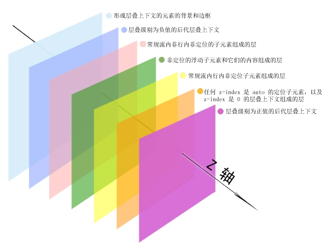

# 内容布局

## position

网页元素定位

### position属性值

1. relative
   1. 定位上下文为元素自身
   2. 不影响其他元素
2. absolute
   1. 使用最近的定位上下文，最外层为body
   2. 元素会inline-block化
   3. 脱离文档流
3. fixed
   1. window和iframe作为定位上下文
   2. 脱离文档流
4. sticky
   1. 在 position:relative 与 position:fixed 定位之间切换
   2. 当页面滚动超出目标区域时，转变为position:fixed
5. static（默认值）
6. inherit（继承）

###  z-index

1. 用于控制元素层叠
2. 需要元素的 position 属性是 relative，absolute 或是 fixed

#### [z-index失效](https://shiyousan.com/post/635861461562038949)

1. 父元素
   1. 层级低于其他兄弟元素
   2. 父元素为relative：改为absolute或static
2. 目标元素
   1. position未设置为非static
   2. 设置了float：去除浮动

#### 层叠上下文

1. 根元素html本身有一层根层叠上下文
2. 普通元素的position为非static，并且设置了z-index
3. 层叠顺序：背景和边框 > 负z-index > 块级盒 > 浮动盒 > 行内盒 > z-index为0 > 正z-index



## float

float是一个被误用的属性，设计初衷用于文字环绕，float可以实现table的布局，因此被误用于布局

### float特性

1. 元素inline-block化
2. 脱离文档流
3. 浮动元素在碰到容器边框或者其他浮动元素边框时停留

### clear

1. 清除浮动元素对该元素影响
2. 元素盒子的边不能和前面的浮动元素相邻
3. 只有块级元素才有效的

#### clear属性

1. both，left和right
2. 推荐直接both，左右浮动设置必会导致其中之一无效，所以both就行

### 清除浮动

#### 处理高度塌陷

##### 设置父元素

1. 父元素设置高度
2. 父元素设置BFC

##### 父元素添加元素

1. 最后添加设置clear:both的元素
2. 添加伪元素:after

```css
.clearfix:after {
    content: ' ';
    display: table;
    /* 可以为其他的如block */
    clear: both;
}

/*IE6-7 不支持 :after，使用 zoom:1 触发 hasLayout*/
.clearfix {
    zoom: 1;
}
```

#### 处理元素遮挡

1. 被遮挡元素设置BFC

## flex

### flex相关概念

1. 容器（flex container）：设定dispaly:flex的元素
2. 成员（flex item）：容器的子节点
3. 容器的方向轴：主轴（main axis）和交叉轴（cross axis）

### flex容器属性

1. flex-direction
   1. 定义主轴的方向
   2. row（默认值）
   3. row-reverse
   4. column
   5. column-reverse
2. justify-content
   1. 所有成员在主轴的对齐方式
   2. flex-start（默认值）
   3. flex-end
   4. center
   5. space-between
   6. space-around
   7. space-evenly
3. align-items
   1. 所有成员在交叉轴的对齐方式
   2. stretch（默认值）
   3. flex-start
   4. flex-end
   5. center
   6. baseline
4. flex-warp
   1. 所有成员是单行显示和多行显示
   2. nowrap
   3. wrap
   4. wrap-reverse
5. flex-flow
   1. flex-direction和flex-warp简写
   2. 默认row nowrap

### flex成员属性

1. align-self
   1. 项目自身交叉轴对齐方式，会覆盖align-items设定
   2. 属性和align-items相同
2. order
   1. 定义项目的排列顺序
   2. 数值越小越靠前，默认值为0
3. flex-grow
   1. 项目增长的量，存在剩余空间会设置比例放大
4. flex-shrink
   1. 项目缩减的量，空间不足则会按照设置比例缩小
5. [flex-basis](https://juejin.cn/post/7074577621933260830)
   1. flex元素在主轴方向上的初始大小，项目增长和缩减的基准
   2. 默认值为auto，项目原本大小
   3. 0%与0px就是和height与width设置成相同值一样
   4. max-width/min-width > flex-basis > width > box
6. flex
   1. flex-grow，flex-shrink和flex-basis简写
   2. 默认值：0 1 auto
   3. flex：1的值：1 1 0%（标准历经0px -> 0% -> 0px，但是浏览器还是0%）

## [display、float、position关系](https://blog.csdn.net/weixin_41796631/article/details/89453234)

### 转化方式

1. 转化为table
   1. inline-table
2. 转化为block
   1. inline
   2. inline-block
   3. run-in
   4. table-row-group
   5. table-column
   6. table-column-group
   7. table-header-group
   8. table-footer-group
   9. table-row
   10. table-cell
   11. table-caption
3. 剩余的保持不变

### 判断方式


1. display：none
   1. float和position都不起作用
   2. 元素不会再渲染树中
2. display为其它
   1. position: absolute/fixed
      1. float无效
      2. display值会转换
   2. position为其它
      1. float: 不为none
         1. display值会转换
      2. float：none
         1. 根元素，则display值会转换
         2. 其它元素不变
3. 生效优先级：display：none > position: absolute/fixed > float: 不为none
