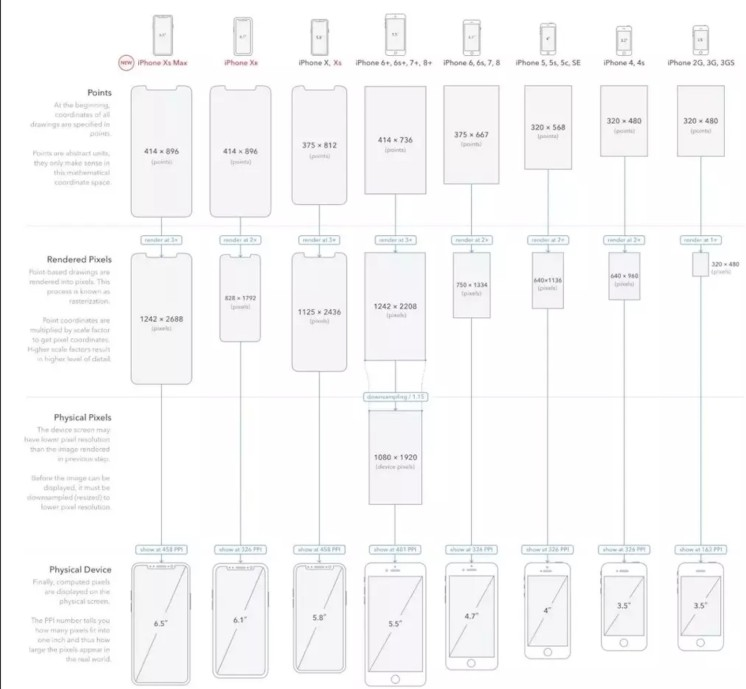

# 响应式

[响应式-思维导图](./mind/06-响应式.html)

## 布局单位

### px：固定像素长度

#### 像素

屏幕显示的最小区域

##### 像素类型

1. css像素
2. 物理像素
3. window.devicePixelRatio = 设备的物理像素 / CSS像素

### em/rem：文本相对单位长度

1. em相对于父元素
2. rem相对于根元素

### %：相对于参照的百分比长度

#### [%的参照](https://juejin.cn/post/6844903613798547469#heading-2)

##### 定位

1. relative：相对父元素宽高
2. absolute：祖先元素中存在定位的元素宽高
3. fixed：相对于视窗宽高

##### 盒子模型

1. width/height：父元素宽高
2. margin/padding：父元素的宽度（注意）
3. border-radius：自身的宽高

##### 背景值

1. background-size：自身的宽高
2. background-position：自身的宽高值减去背景图片的宽高值所得到的剩余值

##### transform

1. translate()：自身的宽高
2. scale()：自身的宽高
3. transform-origin：父元素宽高

##### 字体

1. font-size：父元素字体大小
2. line-height：参照当前字体大小计算，后代继承计算出来的值
3. text-indent：父元素的width，用于首行缩进

### vw/vh：相对于视图窗口的百分比长度

1. vmin/vmax：vw与vh中相对较小或较大值

## 响应式实现

### 响应式实现原理

1. 利用@media检测不同尺寸，页面头部必须要设定viewport的meta
2. 按照不同尺寸设定不同样式

### 响应式实现方式

#### media query和rem

1. 通过媒体查询设置根元素的rem，将rem用做长度单位
2. 但是变化是阶梯型的，可能出现显示宽度与设置不同的情况

#### vm/vh

1. 利用vm/vh设置相对于窗口的自适应

## 移动端适配

### 根元素字体大小设置

使用比例单位替换px

```css
/*这里62.5%是相对于浏览器默认字体大小来说的，浏览器大多默认16px，而此时rem的值就是10px。*/
html {
    font-size: 62.5%
}
```

### 不同像素照片尺寸设置

#### 像素倍数（相较于IphoneX）

1. 1242/414=3
2. 屏幕的像素密度为 3，也就是常说的 3 倍屏，因此需要添加图片为3倍像素才不会失真

#### 适配实现

1. 可以只提供高清图，但是会造成宽带浪费和加载延迟
2. 通过媒体查询来按照像素选择图片

```css
my-image {
    background: (low.png);
}

@media only screen and (min-device-pixel-ratio: 1.5) {
    #my-image {
        background: (high.png);
    }
}
```



### 1px问题处理

Retina屏幕 的机型上，移动端页面的 1px 会呈现出不止 1px 的效果

#### 产生原因：手机实际像素高于CSS渲染像素

#### 解决方式（两倍屏）

##### 伪元素（推荐）

1. 设置相对于元素的绝对定位伪元素，top和left设置为0，将伪元素叠放在父元素下
2. 伪元素大小为目标元素两倍
3. 伪元素边框为1px，并缩放为0.5

```css
#container[data-device="2"] {
    position: relative;
}

#container[data-device="2"]::after {
    position: absolute;
    top: 0;
    left: 0;
    width: 200%;
    height: 200%;
    content: "";
    transform: scale(0.5);
    transform-origin: left top;
    box-sizing: border-box;
    border: 1px solid #333;
}
```

##### 直接写 0.5px

给标签设置属性

```html
<div id="container" data-device={{window.devicePixelRatio}}></div>
```

设置样式时处理

```css
#container[data-device="2"] {
    border: 0.5px solid #333
}
```

兼容性不行：IOS8以上，安卓不兼容

#### viewport 缩放来解决

将页面整体缩放到比例为1的状态

```js
const scale = 1 / window.devicePixelRatio;
// 这里 metaEl 指的是 meta 标签对应的 Dom
metaEl.setAttribute('content', `width=device-width,user-scalable=no,initial-scale=${scale},maximum-scale=${scale},minimum-scale=${scale}`);
```
