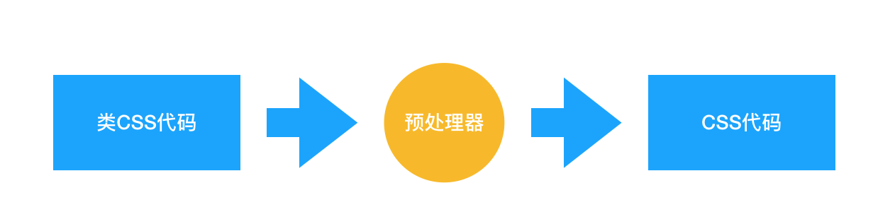
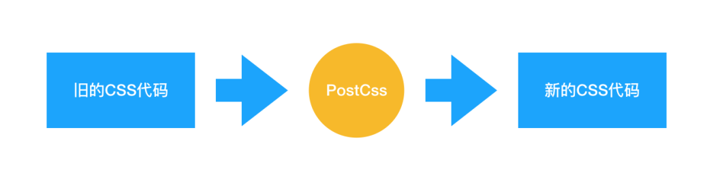

# 工程化
1. 宏观设计（CSS代码组织，CSS代码拆分，CSS代码模块结构）
2. 编码优化（写出更好的CSS）
3. 构建（处理CSS，打包结果更优）
4. 可维护性（后期维护更加方便）

## CSS框架

预先准备好的软件框架，允许使用层叠样式表语言更容易，更符合标准的进行网页设计

### [CSS框架种类](https://cloud.tencent.com/developer/article/1572146?from=article.detail.1793543)

1. [tailwind](https://www.tailwindcss.cn/)
2. [Bootstrap](https://www.bootcss.com/)

## 预处理器

预处理器使用类似CSS的语法，编译器处理，按照自己的语法生成CSS

CSS预处理器会增加一些原生CSS不具备的特性：
1. 嵌套
2. 循环
3. 混合
4. 继承

### 预处理器优势

1. CSS模块化，利于复用
2. 支持CSS变量
3. 提供计算函数，支持循环
4. 支持extend和mixin，轻松实现多重继承
5. CSS更加简洁，增加适应性，可读性和可维护性
6. 屏蔽浏览器私有化语法差异
7. 可兼容已有的CSS代码

### 预处理器种类

1. [Sass](https://sass-lang.com/)
2. [Less](https://less.bootcss.com/)
3. [Stylus](https://www.stylus-lang.cn/)

## 后处理器

对已有的CSS文件进行处理

1. 提高CSS代码可读性
2. 使处理后的CSS文件有更好的兼容性，适配低版本浏览器时，Autoprefixer 插件可以帮助我们自动增加浏览器前缀
3. 允许我们编写面向未来的 CSS，PostCss 能够帮助我们编译 CSS next 代码，类似Babel

### 后处理器种类

1. [postCSS](https://www.postcss.com.cn/)

## Webpack

默认的Webpack文件不能处理CSS的，需要添加Loader辅助

### CSS处理loader

css-loader必须在style-loader之前

#### css-loader

导入CSS模块，对CSS代码进行编译处理

#### style-loader

创建style标签，将CSS写入到标签中
