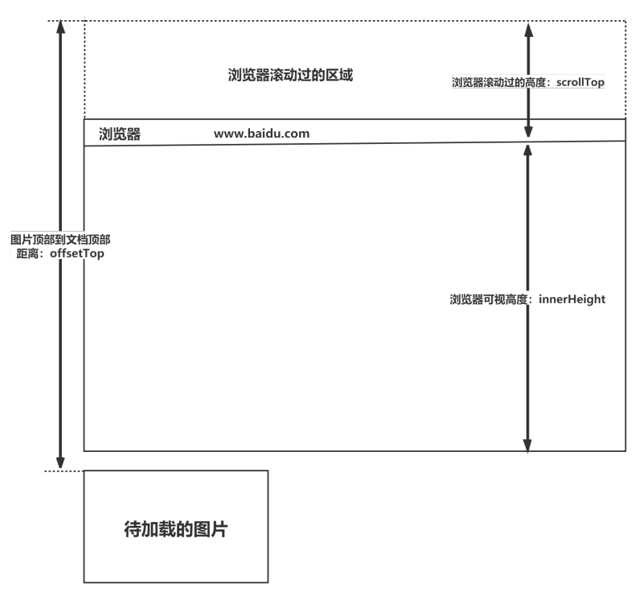

# 优化方式

## 加载性能

### CSS压缩

打包时压缩CSS，减少加载文件大小

### 减少使用@import，替换为link

link不会等待页面渲染完成后加载，而是和页面一起加载

### 雪碧图

将众多小图标放在一张大图中，利用background-image，background-repeat和background-position组合展示对应图片

#### 雪碧图优点

1. 减少网页HTTP请求
2. 多张图片合为一张图所占大小会减少

#### 雪碧图缺点

1. 自适应不够好，高分辨率或宽屏下容易背景断裂
2. 开发维护麻烦

### 图片懒加载

#### 浏览器尺寸

##### window

屏幕高度
1. window.screen.height

浏览器可视区的高度
1. window.innerHeight

##### document

浏览器滚动的过的距离
1. document.body.scrollTop
2. document.documentElement.scrollTop

body高度
1. document.body.clientHeight

##### element

元素距离顶端高度
1. element.offsetTop

#### 计算是否可见

img.offsetTop < window.innerHeight + document.body.scrollTop

## CSS使用优化

### 优先简写样式

margin: top 0 bottom 0替换为margin-bottom: bottom; margin-left: 0

### 去除空规则

空规则的产生原因一般来说是为了预留样式

### 属性值设置

1. CSS属性值为0时，不加单位
2. 属性值为浮动小数0.xx，可以省略小数点之前的0

### 回流与重绘优化

详细间浏览器渲染原理

### 慎重使用高性能属性

浮动和定位使用需要考虑是否有可以替代方式

#### translate替代绝对定位修改位置

触发复合（compositions）
1. transform 或 opacity只触发复合
2. 定位则会触发布局（reflow）或重绘（repaint），进而触发复合

GPU图层
1. transform 使浏览器为元素创建⼀个 GPU 图层
2. 改变绝对定位会使⽤到 CPU

原始空间占据
1. translate 改变位置时，元素依然会占据其原始空间
2. 绝对定位不会

### 正确使用display的属性

错误的display会造成某些样式组合失效

### 不滥用web字体

标准化各种浏览器前缀

### [GPU加速](https://lz5z.com/Web%E6%80%A7%E8%83%BD%E4%BC%98%E5%8C%96-CSS3%E7%A1%AC%E4%BB%B6%E5%8A%A0%E9%80%9F/)

GPU加速会产生新的图层，并放到GPU中处理

不会触发重绘和重排

#### 复合图层创建情形

1. 3D CSS transform
2. video 和 canvas 标签
3. CSS filters
4. 元素覆盖时，使用了 z-index 属性

#### 强制触发GPU加速

1. 3D 的 transform
2. opacity
3. filter
4. will-change

#### 2D和3D CSS transform区别

1. 3D渲染前便会产生新的图层
2. 2D是在运行时产生图层，运行结束时删除图层

#### GPU加速缺点

1. 过多地开启硬件加速可能会耗费较多的内存
2. GPU 渲染会影响字体的抗锯齿效果

## 选择器性能

### ID选择器作为其关键选择器，则不要为规则增加标签

#### 关键选择器

1. 选择器的最后面的部分为关键选择器（即用来匹配目标元素的部分）
2. CSS选择符是从右到左进行匹配的
3. 使用后代选择器的时候，浏览器会遍历所有子元素来确定是否是指定的元素

### 利用CSS继承，减少重复设定CSS属性

### 减少使用部分选择器

1. 少用通配规则
2. 少用元素选择器
3. 少用后代选择器

后代选择器的开销是最高的，将选择器的深度降到最低，最高不要超过三层

### 选择器优化嵌套，尽量避免层级过深

## 可维护和健壮性

1. 将具有相同属性的样式抽离出来，整合到一个class中
2. 样式与内容分离，CSS代码定义到外部CSS文件中
