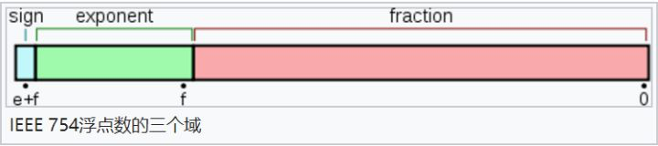

# 数据类型

## 类型分类

### 原始数据类型

#### undefined

作为未定义的值，即只是创建和初始化这个变量，但是未赋值

##### 安全获取undefined

undefined作为标识符，可以用作变量来使用，但是直接使用会出错

可以使用void 0来获取真正的undefined

#### null

存储值为空的数据类型，作为对象原型链的终点

#### string

#### boolean

#### number

##### NaN

特殊number，表示不是数字的值

特性：与任何值都不等，包括自身，但是Object.is是相等的

##### 0.1+0.2!=0.3

JavaScript使用二进制存储数据



* 第一部分（蓝色）：用来存储符号位（sign），用来区分正负数，0表示正数，占用1位
* 第二部分（绿色）：用来存储指数（exponent），占用11位
* 第三部分（红色）：用来存储小数（fraction），占用52位

0.1的二进制是0.00011001100...，而0.2的二进制是：0.0011001100...

小数位最多只能保留53位有效数字，多余的遵从“0舍1入”原则舍弃

解决办法：设置个误差范围，即机器精度，通常为2^-52

>Number.EPSILON：ES6提供的机器精度，判断方式为Math.abs(arg1 - arg2) < Number.EPSILON

#### [symbol](https://www.zhangxinxu.com/wordpress/2018/04/known-es6-symbol-function/)

创建后独一无二并且不可变的数据类型，即使参数相同

作用
1. 作为对象属性的唯一标识符
2. 解决变量名冲突问题

特点
1. 不能使用new命令
2. 参数相同的Symbol是不同的

Symbol 值多作为属性名，有以下限制
1. 只能为公有属性
2. 获取不能用.，而是[]

Symbol属性获取

可以被Object.getOwnPropertySymbols()获取

不能被for...in，for...of遍历

不能被Object.keys()或者Object.getOwnPropertyNames()返回

JSON.stringify()会忽略

#### bigInt

表示任意精度格式的整数，可安全存储和操作大整数

提出原因：Number.MAX_SAFE_INTEGER表示最⼤安全数字（9007199254740991），超过则无法计算，从而不得不使用第三方库计算

### 引用数据类型

#### Object

无序的数据集合

Object是所有的引用数据类型的基础，可以引申出如Array，Function等其它类型

## 类型存储方式

### 存储结构

1. 栈内存
   1. 先进后出
   2. 占据空间小，大小固定
2. 堆内存
   1. 优先队列，按照优先级排列
   2. 占据空间大，大小不固定

### 变量存储方式

1. 原始数据类型：直接存放在栈内存中
2. 引用数据类型：栈内存存放对应堆内存地址，堆内存存放数据

### 释放方式

1. 栈内存：由编译器自动分配释放
2. 堆内存：由开发者分配释放，若不释放则由回收机制处理

## 类型判断

### 所有类型可用

#### typeof

目标为原始数据类型，则都可以识别

目标为引用数据类型，只有function和object

##### typeof null == object

类型标签：avaScript 第一个版本中，所有值都存储在 32 位的单元中，每个单元包含一个小的 类型标签(1-3 bits) 以及当前要存储值的真实数据

```
000: object   - 当前存储的数据指向一个对象。
  1: int      - 当前存储的数据是一个 31 位的有符号整数。
010: double   - 当前存储的数据指向一个双精度的浮点数。
100: string   - 当前存储的数据指向一个字符串。
110: boolean  - 当前存储的数据是布尔值。
```
由于null的机器码全为0，所以识别为object

#### Object.prototype.toString.call()

利用对象toString进行输出值判断，不直接使用toString是因为部分对象toString被重写了

#### constructor

判断构造函数是否是对应对象

### 仅引用类型

#### __proto__

判断隐式原型是否是类型对象的显式原型

#### instanceof

判断原型链上是否有该对象

#### isPrototypeOf

调用对象原型的isPrototypeOf，判断检测对象是否属于该对象
```JS
Array.prototype.isPrototypeOf(arr)
```
### 专用判断

#### Array
1. Array.isArray()

#### NaN

1. isNaN
2. Number.isNaN（优先）

isNaN会尝试数值转化，转化为NaN的为true，Number.isNaN不会

## 类型转换

### [ToPrimitive](https://juejin.cn/post/6844903864613732360)

对象转化为基本类型的方法，以对象的函数值属性存在的

当一个对象转换为对应的原始值时，会调用此函数

1. 无法显式调用
2. 调用对象的内部方法`[[DefaultValue]]`完成

#### 参数

1. input 需要转化的值
2. hint 期望转化的类型

hint在Date对象，默认值为string，其它则默认为number

#### 转化优先级

当 hint === number 或为空时：valueOf() > toString() > 抛出TypeError 异常

hint === string：toString() > valueOf() > 抛出TypeError 异常

#### 转换规则

##### ToString

1. Undefined => "undefined"
2. Null => "null"
3. Boolean
   1. true => "true"
   2. false => "false"
4. Number
   1. NaN => "NaN"
   2. +0/-0 => "0"
   3. Infinity => "Infinity"
   4. 数字直接转换，会保留负号
5. Symbol => 直接转换，但是只允许显式强制类型转换
6. Object => ToPrimitive(value, string)

##### ToNumber
1. Undefined => NaN
2. Null => 0
3. Boolean
   1. true => 1
   2. false => 0
4. String
   1. "" => 0
   2. "Infinity" => Infinnity
   3. 去掉首尾空格进行转化，有效数字直接转化，无效则返回NaN
5. Symbol => 无法进行转换
6. Object => ToPrimitive(value, number)

##### ToBoolean
1. Undefined => false
2. Null => false
3. String
   1. "" => false
   2. 其它为true
4. Number
   1. +0/-0/NaN => false
   2. 其它为true
5. Object => true

### 显式转换

1. Srting() => ToString
2. Number() => ToNumber
3. Boolean() => ToBoolean

### [隐式转换](https://juejin.cn/post/6844903864626315277)

#### 一元操作符

直接进行ToNumber转换

#### 二元操作符

##### [a+b](https://blog.csdn.net/dk2290/article/details/86534595)

是否存在字符串(包括某一项化为字符串)
1. 存在对非字符串进行ToString后拼接
2. 不存在则按照ToNumber转换

特殊情况：
1. function，返回值为代码字符串
2. {}的判断，优先级为语句块 > 函数 > 对象字面量([object Object])，所以{}+1等价于{}; +1
3. []，因为valueOf转化的结果是对象，所以转而使用ToString，返回 ''

##### a-b，a*b与a/b

a和b都进行ToNumbe转换

##### a && b与a || b

a和b进行ToBoolean转换，按照判断结果返回a或b的值

##### a == b

判断类型是否相同
1. 相同比较两者大小
2. 不同执行类型转换
   1. null 和 undefined => 返回ture
   2. number 和 string => ToNumber转换string，再按照流程重新处理
   3. 一方为boolean => ToNumber转换bool，再按照流程重新处理
   4. object， 且另一方为 string、number 或者 symbol => ToNumber转换object，再按照流程重新处理

###### 相等比较方法

1. ==   会进行隐式转换在比较，只在判断null和undefined时使用==
2. ===（优先使用）   直接比较，不会进行转换
3. Object.is()   一般与===相同，但是-0与+0不相等，两个NaN相等

##### a > b与a < b

1. 操作数有对象则执行 ToPrimitive(对象, null)
2. 比较
   1. 双方出现非字符串 => 对非字符串执行 ToNumber，然后再比较
   2. 比较双方都是字符串 => 按字母顺序进行比较

##### a ≥ b和a ≤ b

1. a ≤ b等价于!(a > b)
2. a ≥ b 同理按照 !(a < b) 处理

##### 包装类型

基本类型是没有属性和方法的，为了便于操作基本类型的值，会在后台隐式地将基本类型的值转换为对象

步骤
1. 通过基本类型创建对应实例
2. 执行实例的方法，获取结果
3. 销毁实例

##### 其它

1. alert() => 自动将任何值都转换为字符串以进行显示


