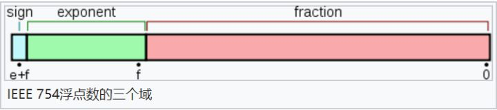

# 类型分类

[类型分类-思维导图](./mind/01-类型分类.html)

## 分类方式

### 原始数据类型

#### undefined

作为未定义的值，即只是创建和初始化这个变量，但是未赋值

##### 安全获取undefined

1. undefined作为标识符，可以用作变量来使用，但是直接使用会出错
2. 可以使用void 0来获取真正的undefined

#### null

存储值为空的数据类型，作为对象原型链的终点

#### string

#### boolean

#### number

##### NaN

特殊number，表示不是数字的值

1. 与任何值都不等，包括自身
2. Object.is是相等的

##### 0.1+0.2!=0.3



1. JavaScript使用二进制存储数据
   1. 第一部分（蓝色）：用来存储符号位（sign），用来区分正负数，0表示正数，占用1位
   2. 第二部分（绿色）：用来存储指数（exponent），占用11位
   3. 第三部分（红色）：用来存储小数（fraction），占用52位
2. 0.1的二进制是0.00011001100...，而0.2的二进制是：0.0011001100...
3. 小数位最多只能保留53位有效数字，多余的遵从“0舍1入”原则舍弃

###### 解决办法

1. 设置个误差范围，即机器精度，通常为2^-52
2. Number. EPSILON：ES6提供的机器精度，判断方式为Math.abs(arg1 - arg2) < Number. EPSILON

#### symbol：[详见JavaScript/内置对象/Symbol](../05-内置对象/07-Symbol.md)

#### bigInt

表示任意精度格式的整数，可安全存储和操作大整数

提出原因：Number. MAX_SAFE_INTEGER表示最⼤安全数字（9007199254740991），超过则无法计算，从而不得不使用第三方库计算

### 引用数据类型

#### Object：[详见JavaScript/内置对象/Object](../05-内置对象/02-Object.md)

1. 无序的数据集合
2. Object是所有的引用数据类型的基础，可以引申出如Array，Function等其它类型

## 存储方式

### 存储结构

1. 栈内存
   1. 先进后出
   2. 占据空间小，大小固定
2. 堆内存
   1. 优先队列，按照优先级排列
   2. 占据空间大，大小不固定

### 变量存储方式

1. 原始数据类型：直接存放在栈内存中
2. 引用数据类型：栈内存存放对应堆内存地址，堆内存存放数据

### 释放方式

1. 栈内存：由编译器自动分配释放
2. 堆内存：由开发者分配释放，若不释放则由回收机制处理，[详见浏览器原理/回收机制](../../浏览器原理/06-回收机制.md)

## 判断类型方式

### 所有类型可用

#### typeof

1. 目标为原始数据类型，则都可以识别
2. 目标为引用数据类型，只有function和object

##### typeof null == object

```
000: object   - 当前存储的数据指向一个对象。
  1: int      - 当前存储的数据是一个 31 位的有符号整数。
010: double   - 当前存储的数据指向一个双精度的浮点数。
100: string   - 当前存储的数据指向一个字符串。
110: boolean  - 当前存储的数据是布尔值。
```

1. 类型标签：avaScript 第一个版本中，所有值都存储在 32 位的单元中，每个单元包含一个小的 类型标签(1-3 bits) 以及当前要存储值的真实数据
2. 由于null的机器码全为0，所以识别为object

#### Object.prototype.toString.call()

1. 利用对象toString进行输出值判断
2. 不直接使用toString是因为部分对象toString被重写了
3. [详见JavaScript/代码手写/对象相关](../08-代码手写/01-对象相关.md)

#### constructor

判断构造函数是否是对应对象

### 仅引用类型

#### `__proto__`

判断隐式原型是否是类型对象的显式原型

#### instanceof：[原理见JavaScript/代码手写/对象相关](../08-代码手写/01-对象相关.md)

判断原型链上是否有该对象

#### isPrototypeOf

调用对象原型的isPrototypeOf，判断检测对象是否属于该对象

```js
Array.prototype.isPrototypeOf(arr)
```

### 专用判断

#### Array

1. Array.isArray()

#### NaN

1. isNaN
2. Number.isNaN（优先）

##### isNaN与Number.isNaN区别

1. isNaN会尝试数值转化，转化为NaN的为true
2. Number.isNaN不会
