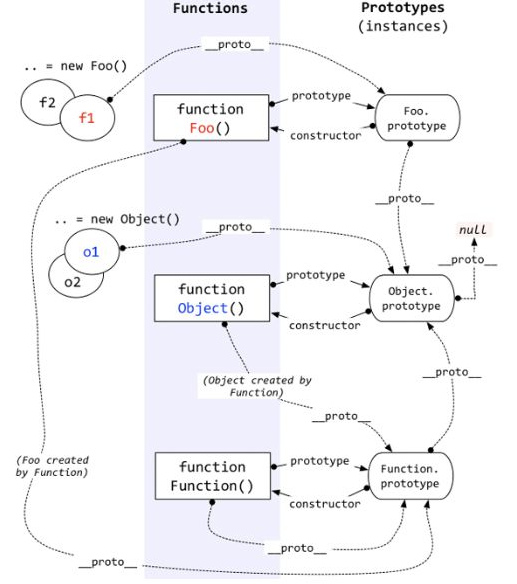
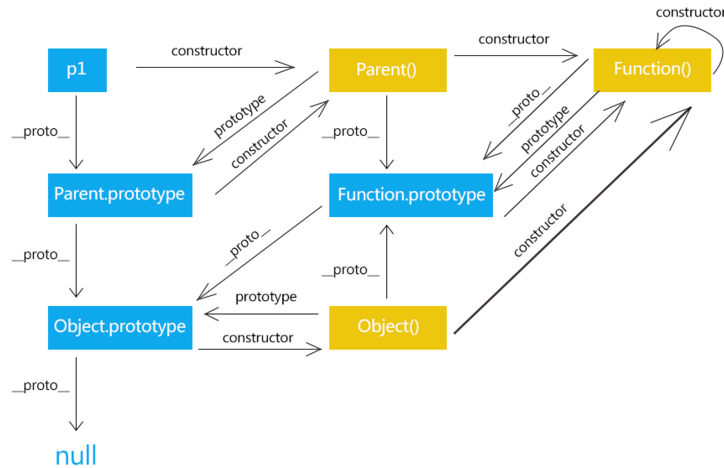

# 原型和原型链

## 原型

1. JavaScrip是一个基于原型继承的语言
2. JavaScript 中的对象有一个特殊的 `[[Prototype]]` 内置属性，其实就是对于其他对象的引用，几乎所有的对象在创建时都会给这个属性赋值

### 原型概念

#### 隐式原型 `__proto__`

就是之前提及的 `[[Prototype]]` 属性，浏览器中可以用 `__proto__` 获取，具有以下特点
1. 引用型对象都具有__proto__
2. 指向对象的构造函数的prototype

#### 显式原型prototype

用于构造对象时将其赋值给对象的 `[[Prototype]]` 属性

1. 只有函数对象才会有的属性
2. 包含所有实例共享的属性和方法的对象（原型对象）
3. 对象的constructor指向构造函数

### 属性获取和判断

由于原型链的存在，分为自有属性和原型属性

#### 属性获取

1. 可枚举的
   1. Object.keys() ：对象自有属性
   2. for...in ：所有非Symbol、可枚举的属性，包括原型属性
2. 所有
   1. Object.getOwnPropertyNames() ：对象自有属性

#### 属性判断

##### Object.prototype.propertyIsEnumerable（是否可枚举）

1. true，则自有属性且可枚举
2. false
   1. 原型属性
   2. 不可枚举
   3. 属性是方法返回false

##### Object.prototype.hasOwnProperty（是否是自身属性）

利用这个接口可以给for...in过滤

### 原型修改与重写

1. 原型修改：仅修改prototype的属性，这样不会造成constructor丢失
2. 原型重写：直接修改prototype
   1. 不推荐
   2. 因为会造成constructor丢失，但是可以重新赋值constructor解决

## 原型链

1. 原型链就是当一个对象创建时，它的隐式原型`__proto__`就是其构造函数的显式原型prototype
2. 这样形成构造函数和对象的链接关系





### 原型查找

1. 对象在寻找属性时，自身不存在则会不断访问`__proto__`
2. 直到找到目标或者找到 `Object.prototype.__proto__`，其值为null，并返回undefined

### 原型判断

原型判断遵循以下原则

1. 构造函数的实例对象的 `__proto__` 指向构造函数的prototype
2. 所有的对象都是Object构造（包括所有的prototype），其 `__proto__` 指向Object.prototype
3. 所有的方法都是Function构造（包括Function自身），其 `__proto__` 都指向Function的prototype

```js
Object.prototype.__proto__ === null
Function.prototype.__proto__ === Object.prototype
Object.__proto__ === Function.prototype
Function.__proto__ === Function.prototype

Object instanceof Function // true
Function instanceof Function // true
Function instanceof Object // true
Object instanceof Object // true
```
