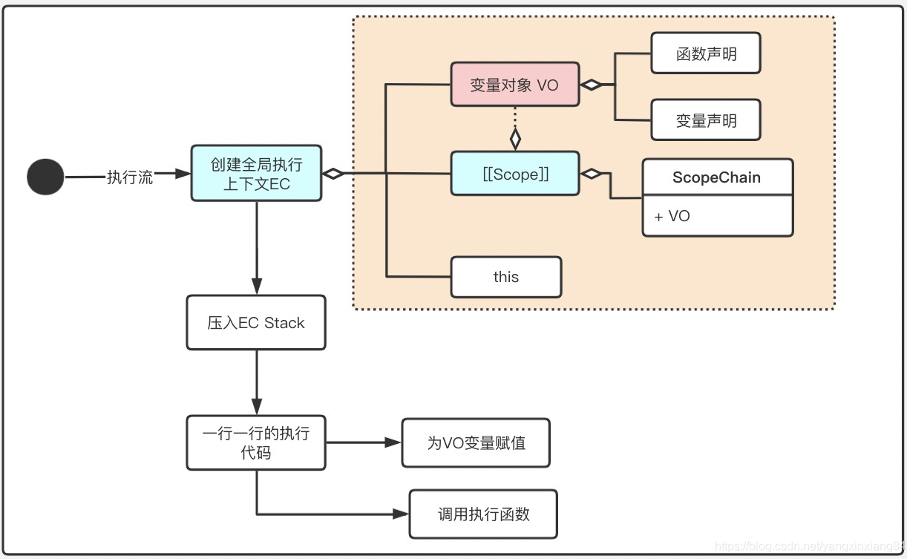
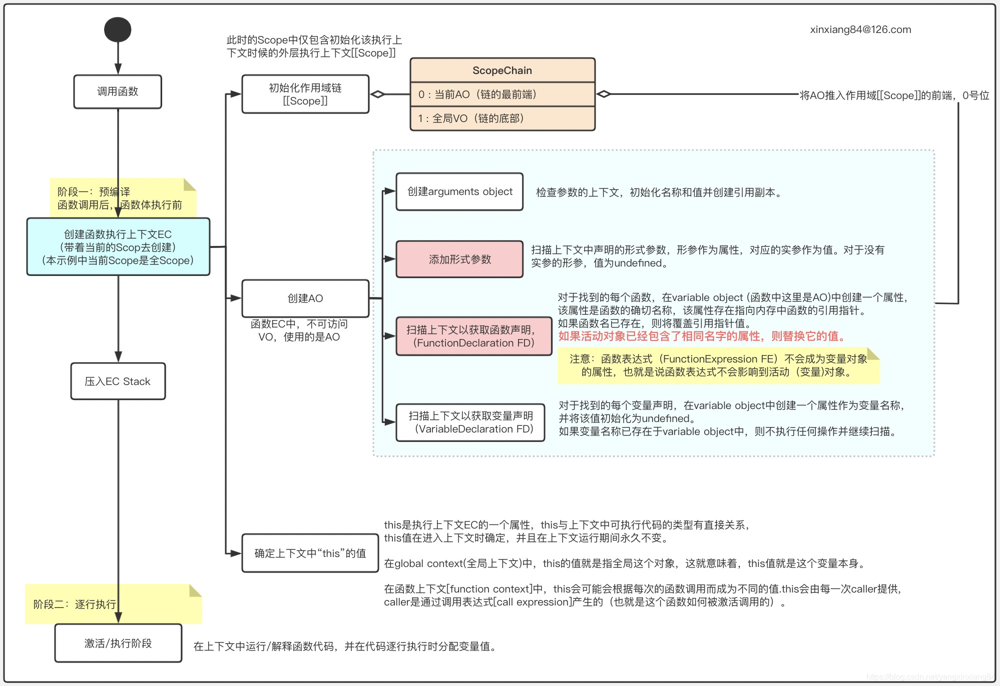
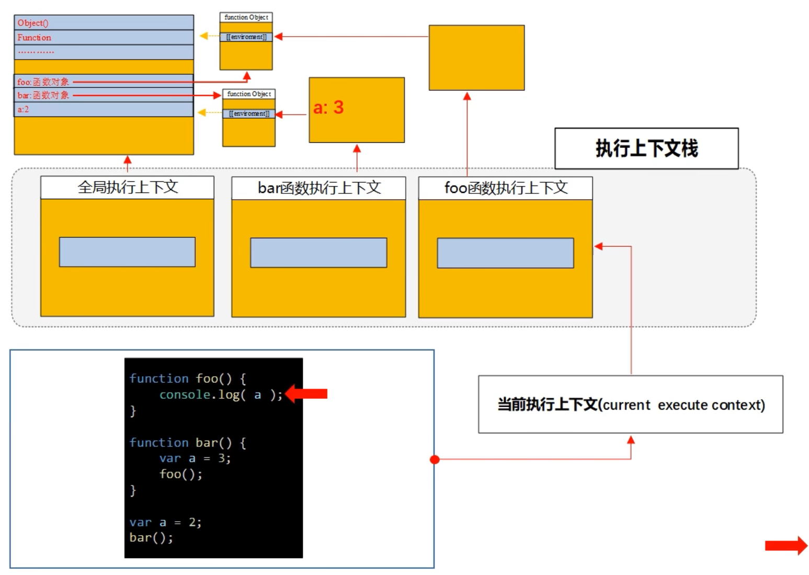

# 执行上下文

## 执行上下文分类

1. 全局执行上下文
   1. JS脚本解析时会创建全局上下文
   2. 增加变量this

2. 函数执行上下文
   1. 函数执行前会创建函数上下文
   2. 增加变量this、arguments和函数参数

3. Eval上下文
   1. 执行 eval函数内部的代码也有属于它的上下文
   2. 由于开发中是尽量避免或不用eval函数，故此不作讨论

## 创建执行上下文

1. 进入全局代码
2. 进入function函数体代码
3. 进入eval函数参数指定的代码
4. 进入module代码

## 上下文结构

### 组成部分

1. Scope
   1. 作用域
   2. 名称查找变量的一套规则
2. VO
   1. 变量对象（Variable Object）
   2. 当前上下文中定义的变量和函数声明
3. AO
   1. 活动对象（Active Object）
   2. 创建函数的时候初始化的一个对象，包含变量对象中的内容
   3. 通常为VO + 函数参数变量 + arguments
4. this
   1. 上下文创建时指定的一个对象

### 结构组成

1. 全局执行上下文
   1. Scope
   2. VO
   3. this
2. 函数执行上下文
   1. Scope
   2. AO
   3. this

## 执行栈ECS

1. 执行栈就是解释引擎记录执行上下文的容器
2. 栈底是全局执行上下文，栈顶是当前正在执行的上下文

### 运行方式

1. JS执行时，首先压入全局执行上下文
2. 每当函数调用时，会为该函数创建上下文并压入栈顶
3. 函数执行完成后弹出该上下文，转至上一层上下文
4. 全部执行完成后，全局上下文弹出

## [上下文创建过程](https://blog.csdn.net/yangxinxiang84/article/details/113051811)

### 全局执行上下文创建

1. 执行代码之前，先进入创建上下文阶段
   1. 初始Scope
   2. 检查声明，创建VO，将VO放到Scope
   3. 确定this
2. 代码执行阶段
   1. VO声明的变量赋值
   2. 内部函数执行

### 函数执行上下文创建

1. 查找调用函数的代码
2. 执行代码之前，先进入创建上下文阶段
   1. 初始Scope
   2. 创建AO，将AO放到Scope
   3. 确定this
3. 代码执行阶段
   1. AO声明的变量赋值
   2. 内部函数执行

## 与作用域区别

1. 执行上下文在运行时确定，随时可能改变
2. 函数调用时使用声明时所处的上下文，而非执行时所处的上下文
3. 即作用域在定义时就确定，并且不会改变

