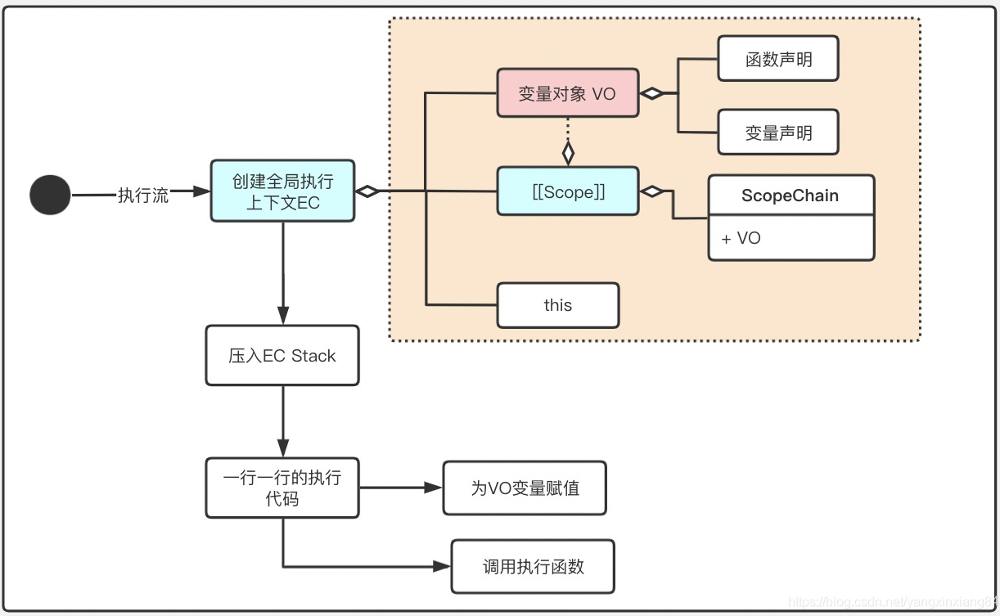
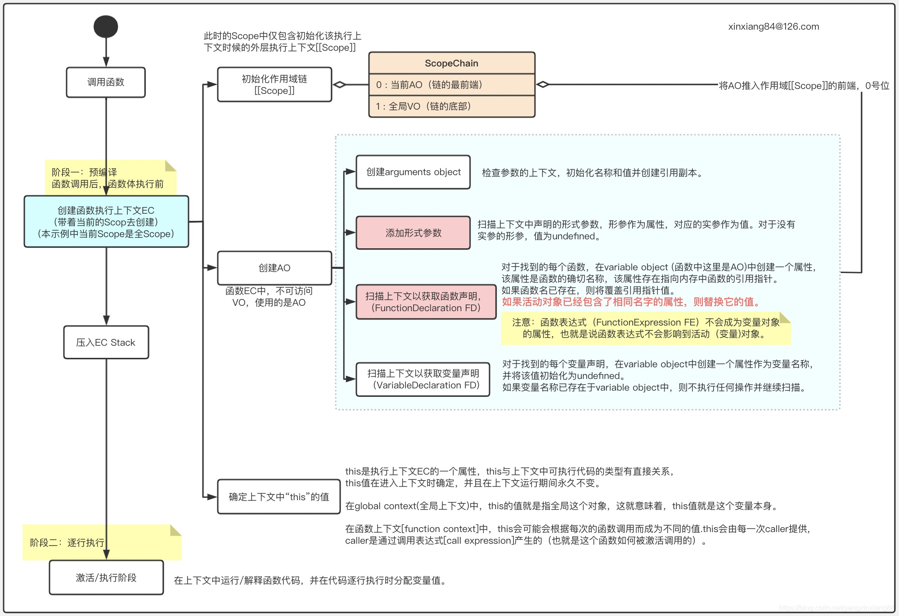

# 执行上下文

[执行上下文-思维导图](./mind/04-执行上下文.html)

## 执行上下文分类

### 全局执行上下文

1. JS脚本解析时会创建全局上下文
2. 增加变量this

### 函数执行上下文

1. 函数执行前会创建函数上下文
2. 增加变量this、arguments和函数参数

### Eval上下文

1. 执行 eval函数内部的代码也有属于它的上下文
2. 由于开发中是尽量避免或不用eval函数，故此不作讨论

## 上下文结构

### 组成部分

#### Scope

1. 作用域
2. 名称查找变量的一套规则

#### VO

1. 变量对象，Variable Object
2. 在上下文中定义的变量和函数声明

#### AO

1. 活动对象，Active Object
2. 创建函数的时候初始化的一个对象，包含变量对象中的内容
3. 通常为VO + 函数参数变量 + arguments

#### this

1. 上下文创建时指定的一个对象

### 结构组成

#### 全局执行上下文

1. Scope
2. VO
3. this

#### 函数执行上下文

1. Scope
2. AO
3. this

## 执行栈ECS

1. 执行栈就是解释引擎记录执行上下文的容器
2. 栈底是全局执行上下文，栈顶是当前正在执行的上下文

理解执行栈，推荐先去理解浏览器的JavaScript的执行方式

### 运行方式

1. JS执行时，首先压入全局执行上下文
2. 每当函数调用时，会为该函数创建上下文并压入栈顶，执行完成后该上下文弹出，转至上一层上下文
3. 全部执行完成后，全局上下文弹出

## [上下文创建过程](https://blog.csdn.net/yangxinxiang84/article/details/113051811)

### 全局执行上下文创建

1. 执行代码之前，先进入创建上下文阶段
   1. 初始Scope
   2. 创建VO，并将VO放到Scope中
   3. 扫描上下文获取变量和函数声明
   4. 确定this
2. 代码执行阶段

### 函数执行上下文创建

1. 查找调用函数的代码
2. 执行代码之前，先进入创建上下文阶段
   1. 初始Scope
   2. 创建AO
   3. 扫描上下文获取变量和函数声明
   4. 确定this
3. 代码执行阶段

## 执行上下文与作用域区别

1. 执行上下文在运行时确定，随时可能改变
2. 作用域在定义时就确定，并且不会改变
