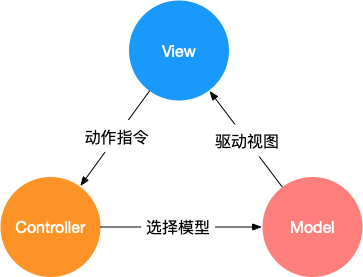
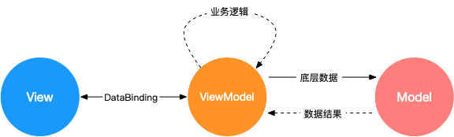
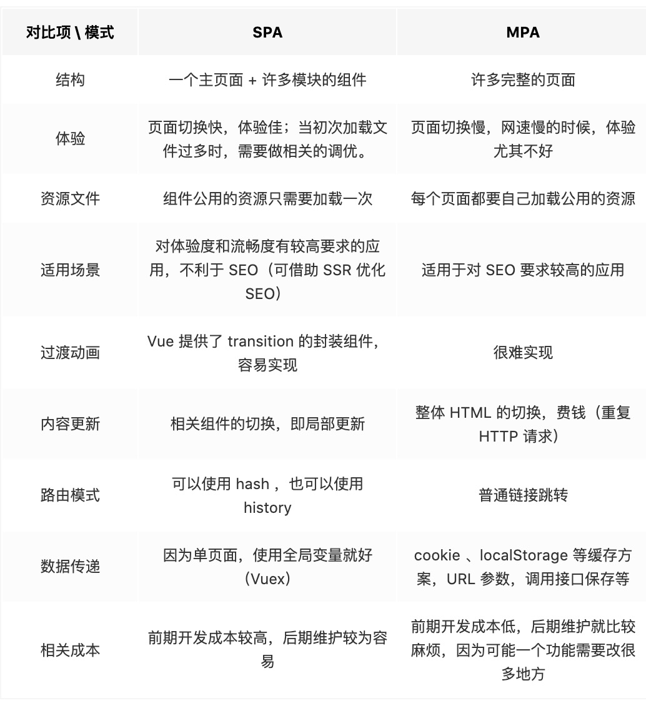
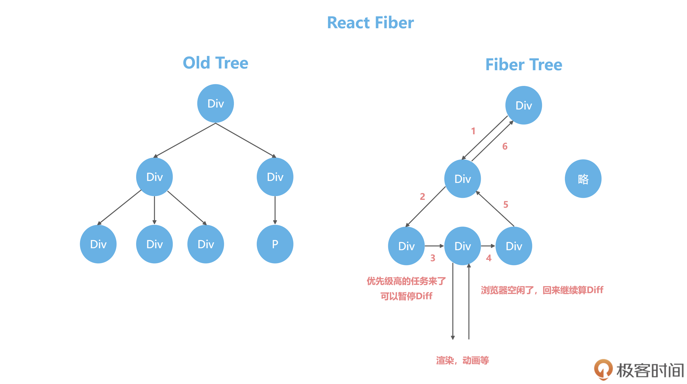
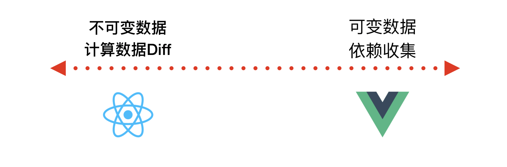

# 基本概念

## MVVM

### MVVM和MVC、MVP的区别

#### MVC

通过分离 Model、View 和 Controller 的方式来组织代码结构
1. View 负责页面的显示逻辑
2. Model 负责存储页面的业务数据和数据处理操作
3. Controller 层主要负责用户与应用的响应操作

联系方式
1. View和Model用观察者模式联系，Model更新会触发View更新
2. 交互产生时Controller触发Model更新，Model再通知View更新

#### MVVM

1. Model代表数据模型，数据和业务逻辑都在Model层中定义
2. View代表UI视图，负责数据的展示
3. ViewModel负责联系Model和View

联系方式
1. ViewModel监听Model数据，控制View更新，或者处理View交互，更新Model数据

#### MVP

1. 与 MVC 唯一不同的在于 Presenter 和 Controller
2. Presenter 同时具有Model和View的接口，可以再其中处理View和Model的同步更新

### MVVM优缺点

1. 优点
   1. 分离视图和模型，降低代码耦合
   2. 自动更新DOM，让开发者关注数据操作
   3. 提高可测试性
2. 缺点
   1. BUG难调试，无法确定是Model问题还是View问题
   2. 大模块的Model也很大，长期持有会造成内存花费
   3. 大型图形应用程序，视图状态多，VM的构建和维护成本高

## SPA单页面

1. 仅在 Web 页面初始化时加载相应的 HTML、JavaScript 和 CSS
2. SPA 不会因为用户的操作而进行页面的重新加载或跳转，利用路由机制实现 HTML 内容的变换
3. 页面的切换只是相关组件的切换，仅刷新局部资源

### SPA优缺点

1. 优点
   1. 用户体验好，内容改变不需要整个页面重新加载
   2. SPA服务器压力小
   3. 前后端职责分离，架构清晰
2. 缺点
   1. 初次加载耗时多，首次加载时将 JavaScript、CSS 统一加载，部分页面按需加载
   2. 前进后退路由管理，页面切换需要自己建立堆栈管理，不能使用浏览器的前进后退功能
   3. SEO难度大，所有的内容都在一个页面中动态替换显示

### 与多页面应用区别

#### 多页面概念

1. 多个独立页面的应用
2. 每个页面必须重复加载资源

## Vue相关

### Vue的优点

1. 轻量级框架
2. 简单易学
3. 双向数据绑定
4. 组件化
5. 视图，数据和结构分离
6. 虚拟DOM

### Vue优化

#### 编码阶段

1. 减少data中数据，data中数据会进行响应式处理并且会收集对应watcher
2. v-if和v-for不连用
3. v-for的每一项绑定事件使用事件代理
4. 更多情况下使用v-show替代v-if
5. key保证唯一
6. 使用路由懒加载和异步组件
7. 防抖、节流
8. 第三方模块按需导入

#### 打包优化

1. 压缩代码
2. Tree Shaking/Scope Hoisting
3. 使用cdn加载第三方模块
4. 多线程打包happypack
5. splitChunks抽离公共文件
6. sourceMap优化

#### 用户体验

1. 骨架屏
2. 使用缓存(客户端缓存、服务端缓存)优化、服务端开启gzip压缩等
3. 图片懒加载v-lazy
4. 长列表滚动到可视区域动态加载

#### SEO优化

1. 预渲染
2. 服务端渲染SSR

### React和Vue异同

#### 相同点

1. 注意力集中在核心库，其他功能如路由和状态管理由其他库处理
2. 都有自己的构建工具，有一个最佳实践设置的项目模板
3. 都使用了Virtual DOM
4. 都有props概念，允许组件间传值
5. 都鼓励组件化应用

#### 不同点

##### 数据流

1. Vue支持双向绑定
2. React一直提倡单向数据流

##### 虚拟DOM

1. Vue2引入虚拟DOM，同时渲染中会跟踪组件依赖关系，无需重新渲染整个组件
2. React应用状态改变则全部子组件都会重新渲染，可以通过PureComponent/shouldComponentUpdate控制

##### 模板编写

1. Vue推荐HTML模板编写
2. React推荐使用JSX编写

###### template和jsx的有什么分别

1. 解析方式不同
   1. template通过vue-loader编译.vue文件，内部依赖的vue-template-compiler模块
   2. jsx使用babel-plugin-transform-vue-jsx
2. 但是都是render的表现形式
   1. JSX更灵活，复杂组件更具优势
   2. template虽然呆滞，但是更符合视图和逻辑分离习惯，更直观

##### 数据监听

1. Vue认为数据可变，Vue通过对getter和setter的劫持，精确知道数据变化
2. React强调数据不可变，React通过比较引用方式，不优化则会有大量不必要的DOM重新渲染

##### 高阶组件

1. Vue通过mixins对组件进行扩展，Vue.js使用HTML模板创建视图组件，这时模板无法有效的编译无法使用HOC
2. React可以通过高阶组件（HOC）扩展，高阶组件就是高阶函数，而React的组件本身就是纯粹的函数

vite）

##### 构建工具

1. React => Create React APP
2. Vue => vue-cli（但是vue3更推荐使用

##### 跨平台

1. React => React Native
2. Vue => Weex

#### 处理性能瓶颈

##### 问题产生

1. Vue问题
   1. Vue核心就是“响应式”
   2. 也就是数据变化后，会主动通知我们，响应式数据新建 Watcher 监听，本身就比较损耗性能
   3. 项目大了之后每个数据都有一个 watcher 会影响性能
2. React问题
    1. React 的虚拟 DOM 的 Diff 计算逻辑来说，如果虚拟 DOM 树过于庞大，使得计算时间大于 16.6ms，那么就可能会造成性能的卡顿

##### 处理方式

1. React 为了突破性能瓶颈，借鉴了操作系统时间分片的概念，引入了 Fiber 架构
2. 就是把整个虚拟 DOM 树微观化，变成链表，然后我们利用浏览器的空闲时间计算 Diff
3. 浏览器有需求，我们可以把没计算完的任务放在一旁，把主进程控制权还给浏览器，等待浏览器下次空闲

1. 对于 Vue 2 来说，组件之间的变化，可以通过响应式来通知更新
2. 组件内部的数据变化，则通过虚拟 DOM 去更新页面
3. 响应式的监听器，控制在了组件级别，而虚拟 DOM 的量级，也控制在了组件的大小

###### Vue 需不需要 React 的 Fiber？

1. Vue将虚拟DOM控制在了组件级，不会出现长时间计算Diff的问题
2. Vue3虚拟Dom的静态标记和自动缓存功能，让静态的节点和属性可以直接绕过Diff逻辑，也大大减少了虚拟Dom的Diff事件
3. 时间切片也会带来额外的系统复杂性，投入与产出不理想

## 其它

### SSR

#### 服务端渲染

1. 更好的SEO
2. 首屏加载速度更快

#### 开发受限

1. 服务端只支持beforeCreate和created两个钩子
2. 外部扩展库时有的需要特殊处理

并且更多的服务端负载

### assets和static

1. 相同点则是都用于存放静态资源
2. assets，其中的静态资源文件在打包时，会对资源进行体积压缩和代码格式化
3. static，打包不会走压缩和格式化流程
4. 推荐自定义的静态资源放assets，第三方资源由于处理了，放static减少打包时间
