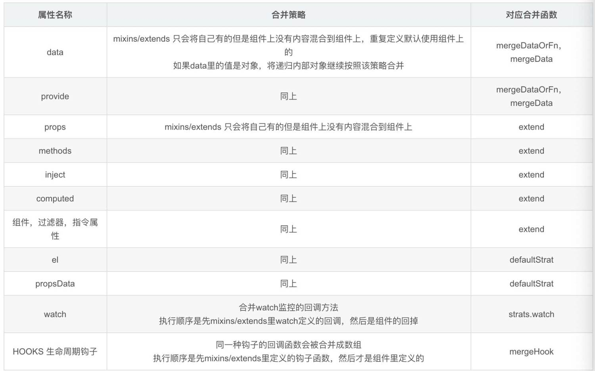

# 类构建

## Vue.use

Vue.use用于应用全局的插件或者配置

### 作用

1. 注册全局配置属性
2. 注册全局引用方法

原理见（类构建/initGlobalAPI/initUse）

### 步骤

1. 插件检查：检查插件列表是否存在传入插件，存在直接返回
2. 参数转化：toArray方法将参数的类数组转化为数组
3. 插件执行
   1. plugin.install是function，则执行plugin.install.apply(plugin, args)
   2. plugin是function，则执行plugin.apply(null, args)
4. 插件入队，installedPlugins.push(plugin)

## Vue.mixin与Vue.extends

都是对Vue的处理，只是Vue.mixin直接在Vue上添加，Vue.extends是生成一个新的构建器

### Vue.mixin

1. 能够为 Vue 组件编写可插拔和可重用的功能
2. 希望在多个组件之间重用一组组件选项，则可以将其编写为 mixin，并在组件中简单的引用它
4. 钩子按照传入顺序依次调用，并在调用组件自身的钩子之前被调用
5. 混入对象可以像正常的实例对象一样包含实例选项，并会被合并到最终的选项中

原理见（类构建/initGlobalAPI/initMixin）

#### 与mixins的区别

```js
// mixin
Vue.mixin({})
// mixins
mixins: [myMixin],
```

1. Vue.mixin是全局混入，适合添加AJAX和工具类，但是要谨慎使用
2. mixins局部混入，用于添加部分逻辑，并且mixins混入的钩子会优先于组件自身钩子执行

### Vue.extends

1. 扩展组件生成一个构造器
2. 便于扩展单文件组件，接收一个对象或构造函数，通常会与 $mount 一起使用

### 配置合并

#### mergeOptions

mergeOptions按照不同的策略执行配置合并，执行步骤如下
1. 规范化选项（normalizeProps、normalizelnject、normalizeDirectives)
2. 对未合并的选项，进行判断
3. 合并处理
   1. 利用策略模式
   2. 根据一个通用 Vue 实例所包含的选项进行分类逐一判断合并
   3. 将合并结果存储在新定义的 options 对象里
4. 返回合并结果 options

原理见（类构建/initGlobalAPI/mergeOptions）

#### mixin与extends配置合并差异



## Vue.directive

原理见（类构建/initGlobalAPI/initAssetRegisters）

### [directive使用方式](https://cn.vuejs.org/v2/guide/custom-directive.html)

```js
// 全局定义
Vue.directive("focus", {})

// 局部定义
directives: {
    focus: {}
}
```

### directive使用场景

普通DOM元素进行底层操作的时候，可以使用自定义指令
1. 鼠标聚焦
2. 下拉菜单
3. 自定义指令实现图片懒加载
4. 自定义指令集成第三方插件

## Vue.filters

在Vue中使用filters来过滤数据，filters不会修改数据，而是过滤数据

原理见（类构建/initGlobalAPI/initAssetRegisters）

### filters使用方式

template中使用

```html
<li>商品价格：{{item.price | filterPrice}}</li>
```

script中使用

```js
filters: {
    filterPrice(price) {
        return price ? ('￥' + price) : '--'
    }
}
```
