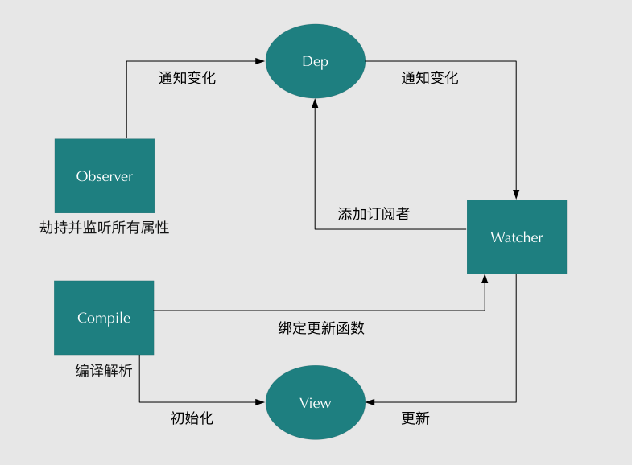

# 响应式原理

## 双向绑定原理

数据劫持采用发布-订阅者模式



### observe

对对象进行递归遍历，处理setter和getter

1. getter：触发watcher收集到dep中
2. setter：更新值时重新observe并触发dep.notify更新watcher渲染

### compiler

1. 解析模板，触发数据的getter产生数据监听
2. 一旦数据变动则会触发setter

### watcher

作为Observer和Compiler之间的桥梁

1. 数据getter时触发依赖Dep收集watcher
2. 自身存在update方法，用于触发页面更新
3. dep调用notify时会触发收集的所有watcher更新

## 响应式数据处理

### 响应式数据处理大致流程


1. vue实例创建，遍历data中的属性
2. Object.defineProperty更改data属性中的getter和setter
3. 内部追踪依赖关系，利用watcher进行处理，渲染的时候依赖会进行收集watcher
4. 后续依赖的setter被调用时，watcher会进行重新计算，组件进行更新

### data为什么是个函数

1. 组件每次创建时都需要有自己私有的数据空间
2. 直接返回对象则同一组件共用data
3. 用函数则是会在每次服用组件时返回一个新data，相同组件间的数据不会互相干扰

### data值变动会立即更新视图吗

1. 不会，vue的渲染是异步更新，减少重复运算
2. 数据变化vue会开启一个队列并缓冲同一事件循环中发生数据变更
3. 同一个watcher触发多次，但是只会向队列推入一次

### 使用defineProperty处理缺陷

1. Object.defineProperty()对一些对象属性操作时，有一些方法无法拦截
   1. 数组下标修改
   2. delete操作删除
2. 对于这些问题Vue通过重写默认函数处理这个问题
3. 而在Vue3.0 中使用Proxy处理
   1. Proxy能监听到任何数据改变
   2. 缺点式兼容性不好

### 数组响应式处理

封装处理的方法

```js
const methodsToPatch = [
    'push',
    'pop',
    'shift',
    'unshift',
    'splice',
    'sort',
    'reverse'
]
```

其主要原理就是重写数组中的原生方法

1. 对新增数组的方法的插入值进行响应式处理：ob.observeArray(inserted)
2. 通知dep进行渲染更新：ob.dep.notify()
3. 原理详见[Vue/Code/响应式原理/响应式处理](../02-响应式原理/01-响应式处理.md)

### vue如何监听对象或者数组某个属性的变化

vue修改数组某一项或者对象的属性修改，但是页面并不会更新

可以用以下方式解决

1. this.$set
   1. 如果是数组，直接使用splice方法
   2. 如果是对象，判断属性是否存在，对象是否响应式
   3. 原理见[Vue/Code/类构建/stateMixin](../01-类构建/03-stateMixin.md)
2. 数组则使用处理过的七个方法修改

### delete和Vue.delete删除数组区别

1. delete只是被删除元素变成了undefined，其他元素的键值不变
2. Vue.delete 直接删除数组并改变了数组的键值
3. 原理见[Vue/Code/类构建/stateMixin](../01-类构建/03-stateMixin.md)

## 依赖收集

详见（响应式原理/依赖收集）

1. initState初始化状态，defineReactive将对象变成响应式，并且getter则会进行依赖收集
2. mount时，实例化渲染wacther，并会将传入的updateComponent触发，触发里面vm._render()时则同时触发响应式数据的getter
3. 原理见[Vue/Code/响应式原理/依赖收集](../02-响应式原理/02-依赖收集.md)

### defineReactive

1. 实例化了一个Dep实例dep
2. get时触发dep.depend进行依赖收集

### Dep

1. 存在静态属性target暂存一个全局唯一的Watcher
2. subs是一个Watcher数组，针对watcher的收集
3. depend触发当前全局的Watcher的addDep
4. notify则是触发subs中所有的update

### Watcher

1. 渲染watcher的get会触发响应式对象的get
2. addDep触发传入dep的addSub收集当前watcher

## 异步更新

### Computed和Watch的区别

1. 原理见[Vue/Code/响应式原理/computed和watch](../02-响应式原理/03-computed和watch.md)

#### Computed

1. 支持缓存，只有数据值发生变化才重新计算，并且默认缓存
2. 参数为函数则默认为get，也可以是对象去主动实现get和set
3. 不支持异步

#### Watch

1. 不支持缓存，数据变化就触发操作，即使值没变
2. 触发函数接收两个参数，最新的值和变化之前的值
3. 具有配置参数
   1. deep：深度监听
   2. immediate：组件加载立即触发
4. 支持异步

#### 使用时机

1. Computed需要数值计算时使用
2. Watch数据变化就需要执行，即使值未变

### Computed和Methods的区别

1. Computed会按照依赖进行缓存，只有值不同才触发
2. Methods则调用就执行

### $nextTick

1. 本质上时对JavaScript的EventLoop的应用，利用事件队列的异步处理
   1. Promise
   2. MutationObserver
   3. setImmediate
   4. setTimeout
2. 原理见[Vue/Code/响应式原理/异步更新](../02-响应式原理/04-异步更新.md)
3. 可以和$ref结合获取更新后的dom，用于dom相关的插件处理

#### 使用异步更新的原因

1. 同步更新在多次对一个或多个属性赋值，会频繁触发 UI/DOM 的渲染
2. 当具有VirtualDOM，每次变动就计算开销巨大

#### 使用nextTick的情况

1. 数据变化后执行的DOM操作
2. created()钩子进行DOM操作

## 响应式相关

### computed、methods和watch的区别

1. computed
   1. 一个LazyWatcher，会缓存值
   2. 当子项未发生变动时，其获取值的方法不会更新
2. methods
   1. 每次调用都会执行，没有缓存
3. watch
   1. 一个userWatcher，针对监听的处理
   2. 当监听的值发生变动会触发传入的cb
