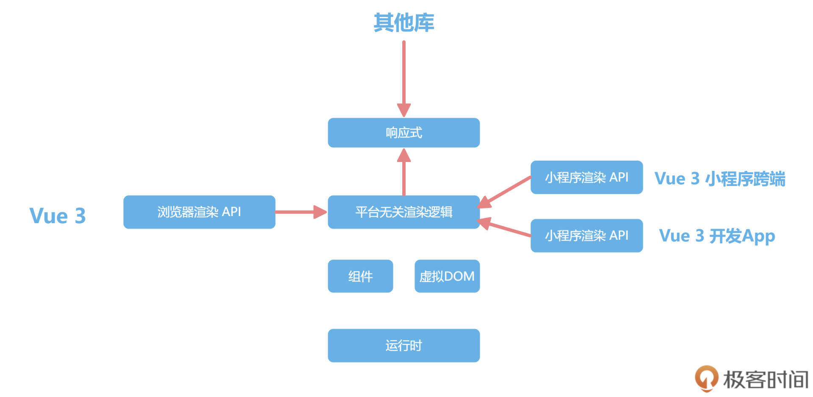

# 相关概念

## Vue3新特性

### TypeScript 重构

由于Flow不再维护，同时由于大环境驱使，不同于Vue2使用的Flow，Vue3采用了TypeScript重写

同时类型系统带来了更方便的提示，并且让我们的代码能够更健壮

### 项目管理结构

Vue2内部运行时，是直接执行浏览器API，但这样就会在Vue2的跨端方案中带来问题，要么直接进入Vue源码中，和Vue一起维护，比如Weex

Vue3使用Monorepo管理项目结构，每个模块都可以单独发布和使用

1. Vue3中响应式独立处理啊，与Vue解耦，甚至可以在React中使用
2. 渲染逻辑拆成两个部分
   1. 平台无关的渲染逻辑
   2. 浏览器渲染API

以后希望Vue3开发其他平台就不需要fork所有代码了



### 新组件

Vue3还内置了Fragment、Teleport和Suspense 三个新组件
1. Fragment: Vue3组件不再要求有一个唯一的根节点，清除了很多无用的占位div
2. Teleport: 允许组件渲染在别的元素内，主要开发弹窗组件的时候特别有用
3. Suspense: 异步组件，更方便开发有异步请求的组件（可以用于骨架屏）

### 响应式系统

由于Vue2使用Object.defineProperty存在缺陷，Vue3使用Proxy进行更换

使用Proxy代表了框架将会越来越多拥抱浏览器新特性

详细见（02-响应式系统更新）

### CompositionAPI

CompositionAPI将各功能模块的代码可以放在一起处理，便于后续调试和修改

详细见（03-CompositionAPI）

### Vite

Vite是Webpack一种替代平，取消了Webpack的预打包，利用ES6的import实现按需编译，极大提升了开发体验

详细见（04-Vite）

## Vue3性能提升总结

### 响应式系统升级

vue2采用defineProperty

vue3中使用了Proxy对象重写响应式
1. 监听动态新增属性
2. 监听属性删除
3. 监听数组的索引和length属性

### 编译优化

vue2中标记静态根节点，优化diff

vue3标记和提升静态根节点，diff只需要对比动态节点内容
1. Fragments：无需创建最外层根节点
2. 静态提升：将文本标签提升到外层缓存，后续无需重新创建直接使用
3. Patch flag：createVNode会传入动态属性名，后续只检查传入的属性名对象
4. 缓存事件处理函数：会将事件缓存至_cache

### 源码体积的优化

1. 移除不常用的API，如filter等
2. TreeSharking支持

## Vue2升级Vue3

对于新项目，直接使用Vue3更推荐，当然Vue3使用了Proxy，兼容性会有问题（如IE11）


### 利用@vue/compat

一个Vue3的构建版本，提供了兼容Vue2的行为，当使用那些在 Vue 3 中发生变化或者废弃的特性时，这个版本会提出警告，从而避免兼容性问题的发生，帮助你很好地迁移项目

老项目@compositon/api包使用vue3的composition api来重构和优化

```JS
// 引入compat
"dependencies": {
    -"vue": "^2.6.12",
    +"vue": "^3.2.19",
    +"@vue/compat": "^3.2.19"
        ...
},
// vue.config.js
// 利用别名替换
module.exports = {
    chainWebpack: config => {
        config.resolve.alias.set('vue', '@vue/compat')......
    }
}
```

### 利用gogocode

自动化替换工具的原理很简单，和Vue的Compiler优化的原理是一样的，也就是利用编译原理做代码替换

即Vue2的源码，解析成AST，然后根据Vue3的写法对AST进行转换
