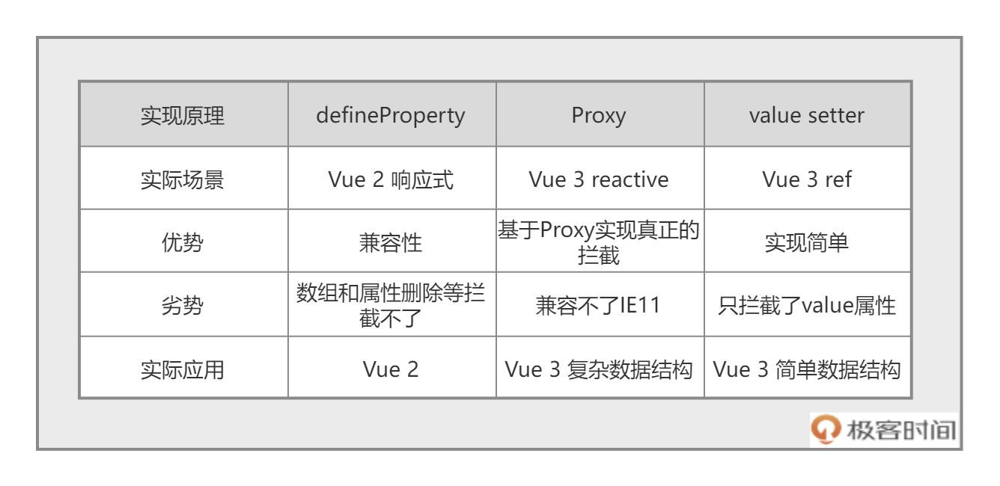

# 响应式更新

## 三种响应式实现原理

Vue3的响应式机制是基于Proxy实现的，重要意义在于它解决了Vue2响应式的缺陷，即部分操作defineProperty是无法处理的

1. defineProperty（Vue2）
2. Proxy（Vue3 reactive）
3. value setter（Vue3 ref）



### 采用Proxy的原因

#### defineProperty缺陷

1. 添加或删除对象的属性时，Vue检测不到
2. 无法监控到数组下标和长度的变化

对于这些问题，vue2只能通过$set/delete和修改数组的原生方法解决

#### Proxy优势

1. 用于定义基本操作的自定义行为（如属性查找，赋值，枚举，函数调用等）
2. Proxy直接代理整个对象而非对象属性，只需要代理一层就可以监听所有属性
3. Proxy可以监听数组的变化

#### 采用的原因

1. 不需用使用$set/delete触发响应式
2. 全方位的数组变化检测，消除了Vue2无效的边界情况
3. 支持 Map，Set，WeakMap和WeakSet

## 响应式应用

利用响应式和CompositionAPI可以对浏览器的存储处理封装

```JS
// 将data自动存放到本地localStorage，并实时监听更新
function useStorage(name, value = []) {
    let data = ref(JSON.parse(localStorage.getItem(name) || value))
    watchEffect(() => {
        localStorage.setItem(name, JSON.stringify(data.value))
    })
    return data
}
```

当然Vue社区提供了工具集Vueuse，对浏览器基本操作进行了处理

## 手写响应式

```JS
const {
    effect,
    reactive
} = require('@vue/reactivity')

let dummy
const counter = reactive({
    num1: 1,
    num2: 2
})
effect(() => {
    dummy = counter.num1 + counter.num2
    console.log(dummy)
})
setInterval(() => {
    counter.num1++
}, 1000)
```

每一次对响应式对象counter的修改，都会执行effect内部注册的函数

但是effect内部的函数式如何知道count已经变化了，其实大致原理如下
1. effect中获取counter.num1和counter.num2的时候，就会触发counter的get拦截函数
2. get函数，会把当前的effect函数注册到一个全局的依赖地图中去
3. 当counter.num1变动时，就会触发set拦截函数，去依赖地图中找到注册的effect函数，然后执行


TODO(原理实现后续添加)
