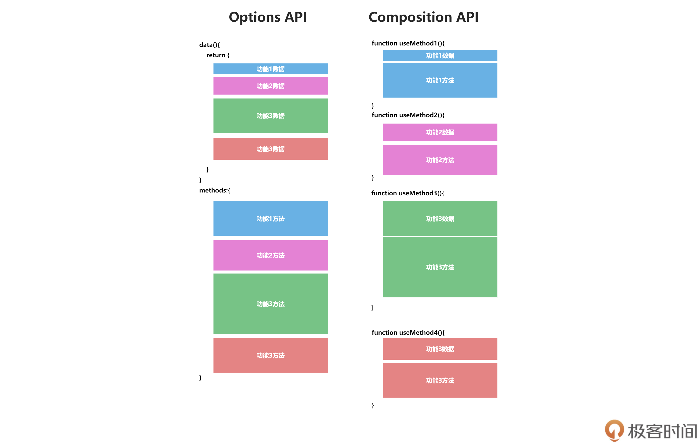

# CompositionAPI

Composition API 可以让我们更好地组织代码结构

简单使用

```VUE
<script setup>
import { ref } from "vue";
let count = ref(1)
function add(){
    count.value++
}
</script>
```

## 设计动机

### Options API（vue2采用方式）

1. 包含一个描述组件的选项（data，methods等）
2. 开发复杂组件，同一功能逻辑拆分在不同地方，调试代码麻烦需要上下拖动

### Composition API



一组基于函数的API，它的使用没有位置的规范

具有更加灵活的组件逻辑，甚至可以将组建的逻辑抽离到一个方法中导出，例如鼠标组件逻辑

```JS
// utils/mouse.js
import {
    ref,
    onMounted,
    onUnmounted
} from 'vue'

export function useMouse() {
    const x = ref(0)
    const y = ref(0)

    function update(e) {
        x.value = e.pageX
        y.value = e.pageY
    }
    onMounted(() => {
        window.addEventListener('mousemove', update)
    })

    onUnmounted(() => {
        window.removeEventListener('mousemove', update)
    })
    return {
        x,
        y
    }
}

// 组件内直接使用
import {
    useMouse
} from '../utils/mouse'

let {
    x,
    y
} = useMouse()
```

同时style中支持数据绑定

```VUE
<script setup>
let color = ref('red')
function change() {
  color.value = Math.random()>0.5? "blue":"red"
}
</script>

<style scoped>
h1 {
  color:v-bind(color);
}
</style>
```

## 使用方式

### 创建实例

createApp用于创建组件

内部可以使用setup
1. setup中的代码就是beforeCreate和created时执行，所以不需要
2. 其他的就是在之前的增加on开头

### 创建响应式对象

1. reactive：将传入对象变成响应式
2. toRefs：将对象的所有属性都变成响应式对象
3. ref：将普通数据包装一个对象成为响应式

### 计算属性与侦听器

#### computed

计算属性，向computed中传入具有get和set的对象可以实现

```JS
const fullName = computed({
    get() {
        return firstName.value + ' ' + lastName.value
    },
    set(newValue) {
        [firstName.value, lastName.value] = newValue.split(' ')
    }
})
```

#### watch

1. 传入的值应当是响应式处理过的对象，watch只追踪明确侦听的源
2. watch()是懒执行的，仅在侦听源变化时，才会执行回调
3. 返回值为取消监听函数

```JS
watch(
    () => state.someObject,
    (newValue, oldValue) => {}, {
        deep: true
    }
)
```

#### WatchEffect

1. watchEffect会在副作用发生期间追踪依赖，它会在同步执行过程中，自动追踪所有能访问到的响应式 property
2. 返回值时取消监听函数

```JS
async function fetchData() {
    const response = await fetch(url.value)
    data.value = await response.json()
}
watch(url, fetchData)

// watchEffect由于自动追踪所有能访问到的响应式，所以可以简化为
// 这里会自动追踪 url.value 作为依赖
watchEffect(async () => {
    const response = await fetch(url.value)
    data.value = await response.json()
})
```
