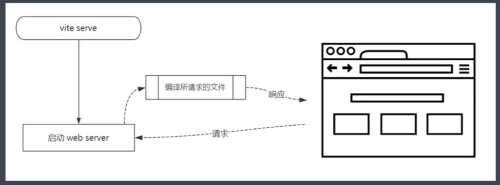
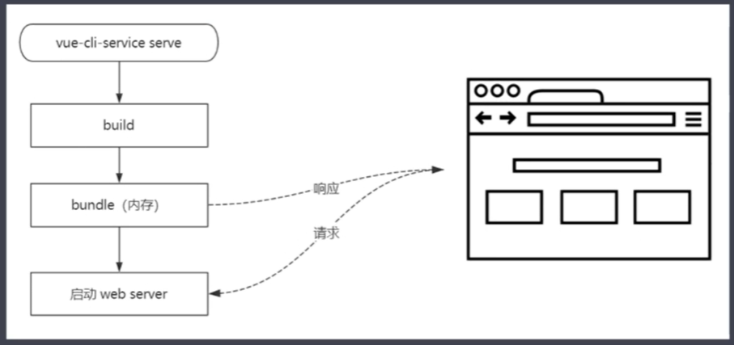

# Vite

## Vite实现前提

现在浏览器都支持以下两种功能

1. ES Module
2. 模块默认延迟加载，类似defer，在DOMContentLoaded事件之前执行

## Vite特点

1. 快速冷启动
2. 按需编译
3. 热模块更新
4. 开箱即用

## Vite和Cli区别

### 运行方式

1. Vite在开发模式下不需要打包就可以直接运行
2. Vue-Cli开发模式下必须对项目进行打包才能运行

### 打包方式

1. vite采用Rollup打包
2. Vue-Cli采用Webpack打包

#### 使用webpack打包原因

1. 浏览器不支持模块化
2. 零散文件会产生大量HTTP请求

### 编译过程

1. Vite是按需编译，利用浏览器支持ESModule，只编译这个页面需要的代码
2. Webpack则是完全编译好后，将代码防至内存获取

### HMR

1. vite只编译当前修改的文件
2. webpack则是以这个文件入口重写build一次，所有涉及的依赖都会重新加载

## 手写vite（TODO）
