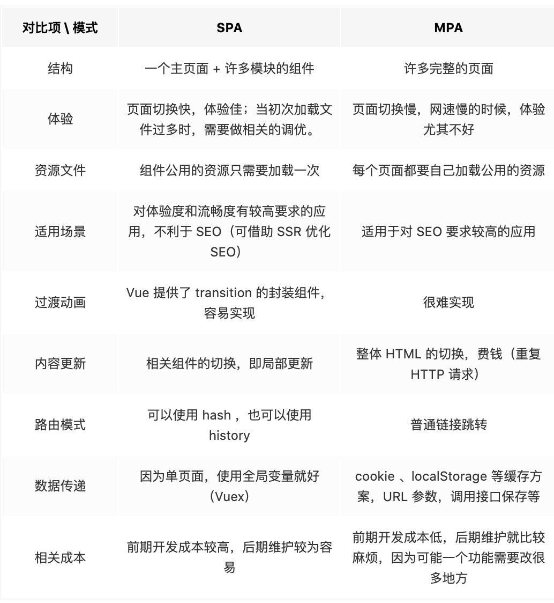

# 基本概念

## MVVM和MVC

### MVC

1. View负责页面显示逻辑
2. Model负责数据逻辑部分
3. Controller处理用户交互部分
4. Controller负责将变动Model的数据在触发View更新

### MVVM

1. Model代表数据模型，处理数据和业务逻辑
2. View代表UI视图，负责数据的展示
3. ViewModel监听Model数据，控制View更新，或者处理View交互，更新Model数据
4. Vue并没有完全遵循MVVM，因为它允许使用$refs让Model和View直接交互，而不是通过VM

#### MVVM优缺点

1. 优点
   1. 分离视图和模型，降低代码耦合
   2. 自动更新DOM，让开发者关注数据操作
2. 缺点
   1. BUG难定位，无法确定是Model问题还是View问题

## SPA单页面

1. 初始化加载时会处理HTML、JavaScript 和 CSS大部分资源加载
2. 页面不会随着用户操作重新加载或跳转，而是通过前端路由进行局部更新处理

### SPA优缺点

1. 优点
   1. 路径更改只进行局部更新
   2. 服务器在首次请求时获取大部分资源，后续压力小
   3. 前后端职责分离，架构清晰
2. 缺点
   1. 首次加载耗时长
   2. 需要自己构建一个前端路由机制，而非使用浏览器的路径跳转
   3. SEO难度大，所有的内容都在一个页面中动态替换显示

### 与多页面应用区别

## Vue相关

### Vue的优点

1. 轻量级框架
2. 简单易学
3. 双向数据绑定
4. 组件化
5. 视图，数据和结构分离
6. 虚拟DOM

### Vue的设计模式

1. 发布订阅机制 => Vue的事件注册和发布
2. 观察者模式 => Vue响应式数据处理
3. 策略模式 => 配置合并逻辑处理

### Vue编码优化

1. 减少对象层级，无需响应式的数据则放在外部
2. v-if和v-for不连用
3. v-for的每一项绑定事件使用事件代理
4. v-show与v-if按场景使用
5. V-for必须存在key，并且key保证唯一
6. 使用路由懒加载和异步组件
7. 防抖、节流
8. 第三方模块按需导入
9. 适当使用keep-alive

### React和Vue异同

#### 相同点

1. 都有核心库，并提供前端路由和状态管理插件库
2. 都使用Virtual DOM
3. 都鼓励组件化应用

#### 不同点

1. 数据流
   1. Vue支持双向绑定，但是父子间提倡单向
   2. React提倡单向数据流
2. 模板编写
   1. Vue推荐HTML模板编写
   2. React推荐使用JSX编写
   3. 两者解析方式不同，模板更符合视图逻辑分离，而JSX则表现更加灵活
3. 数据监听
   1. Vue认为数据可变，Vue通过对getter和setter的劫持，精确知道数据变化
   2. React强调数据不可变，React通过比较引用方式，不优化则会有大量不必要的DOM重新渲染
4. 高阶组件
   1. Vue通过mixins对组件进行扩展
   2. React天然亲近函数式组件
5. 构建工具
   1. React => Create React APP
   2. Vue => vue-cli（但是vue3更推荐使用Vite)
6. 跨平台
   1. React => React Native
   2. Vue => Weex

### Vue处理性能瓶颈

1. Vue主要是通过响应式数据新建Watcher更新，细粒度过低的一对一监听影响性能
2. React则是整体DOM的DIFF计算更新，但DOM过大，计算时间超出了16.6ms则会感到卡顿

#### 处理方式

1. React利用时间切片概念，引入了Fiber架构
   1. 将整个虚拟DOM变成链表，并在浏览器空闲时间进行DIFF计算
   2. 当浏览器需要资源时，可以暂停计算，等到下次空闲时再执行
2. Vue2则是将watcher控制在组件级别，并增加虚拟DOM处理DIFF

#### Vue需不需要React的Fiber

1. Vue将虚拟DOM控制在了组件级，不会出现长时间计算DIFF的问题
2. Vue虚拟Dom的静态标记和自动缓存功能，处理的节点会跳过DIFF处理
3. 时间切片也会带来额外的系统复杂性，投入与产出不理想

## 其它

### SSR

#### 服务端渲染

1. 更好的SEO
2. 首屏加载速度更快

#### 开发受限

1. 服务端只支持beforeCreate和created两个钩子
2. 异步数据需要服务端进行处理
3. 部分外部库不兼容

并且更多的服务端负载

### assets和static

1. 相同点则是都用于存放静态资源
2. assets，其中的静态资源文件在打包时，会对资源进行体积压缩和代码格式化
3. static，打包不会走压缩和格式化流程
4. 推荐自定义的静态资源放assets，第三方资源由于处理了，放static减少打包时间
