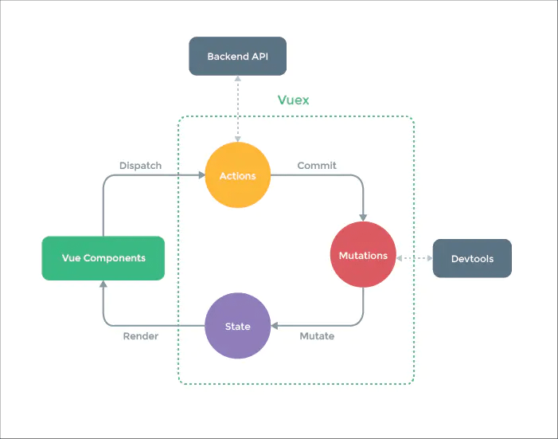

# 面试题

## Vuex原理



1. Vuex是一个单项数据流
2. 核心就是store维护了一个Vue实例
    1. state存储数据具有响应式
    2. getters借助vm的computed实现
3. 利用ModuleCollection与Module处理模块间关系
4. 利用installModule将模块的actions与mutations注册到store上
5. VueComponent =(dispatch)=> Actions =(commit)=> Mutaions => State更新 => 页面渲染更新 => Getters更新

### Vuex组成

#### state

1. 页面状态管理容器对象，全局唯一
2. 放置到vm的data中，设置为`$$state`

#### getters

1. state对象读取方法
2. 处理成computed放到store.vm中

#### mutations

1. 提交方式为commit
2. 严格模式下唯一修改state的方式
3. 同步提交
4. 同一key只允许有一个handle
5. 原理为获取handle直接执行

##### 为什么mutation不可以异步操作

1. mutation执行完成后都会对应到一个新的状态变更
2. devtools可以打个快照存下来，如果支持异步，则无法知道状态何时更新

#### actions

1. 分发方式为dispatch
2. 处理业务代码
3. 支持异步处理
4. 每个key维护一个数组，允许同一key存在多个handle
5. 原理是将每个handle存放至promise中执行

#### modules

1. 模块处理
2. 支持命名空间设置

## 批量使用Vuex的属性（辅助函数）

1. mapState
2. mapGetters
3. mapMutations
4. mapActions
5. createNamespacedHelpers

## Vuex严格模式

1. 状态变更且不是由mutation引起的，将会抛出错误
2. 调用store内部的`vm.$watch`增加对`$$state`的深度deep监听
3. 监听内部state的变动时是否是_commiting为true，为false则报错

```js
const store = new Vuex.Store({ strict: true })
```

## 和其它的差异

### Vuex和localStorage

1. 存储位置
    1. vuex存储在内存中，刷新就丢失
    2. localstorage则长久存储在本地文件中，刷新不丢失
2. 响应式
    1. Vuex能做到数据的响应式
    2. localstorage无法响应式处理
3. 修改值
    1. vuex不可以随意变动state
    2. localstorage则可以更改

### Vuex和Redux

都是单—的数据源，并且变化可以预测

#### 两者区别

1. Vuex改进了Redux中的Action和Reducer函数，以mutations变化函数取代Reducer，无需switch
2. Vuex由于Vue自动重新渲染的特性，无需订阅重新渲染函数
3. Vuex数据流，View调用store.commit提交对应的请求到Store中对应的mutation函数，store改变（vue检测到数据变化自动渲染）

#### 使用目的

1. 组件通信：对多层嵌套组件和兄弟组件处理过于繁琐，且难以维护
2. 指定规则：定义和隔离状态管理中的各种概念并强制遵守一定的规则，代码变得更结构化和易维护

## Vuex应用

### 持久化存储处理

1. Vuex本身不支持持久化，刷新就丢失
2. 自己写插件存储至LocalStorage中
3. vuex-persist插件

```js
function persists() {
    // 每次状态变化存至localstorge
    return function(store) {
        let localState = JSON.parse(localStorage.getItem('VUEX:STATE'))
        if (localState) {
            store.replaceState(localState)
        }
        store.subscribe((mutations, rooState) => {
            localStorage.setItem('VUEX:STATE', JSON.stringify(rooState))
        })
    }
}
```
