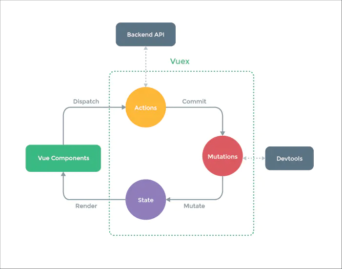

# 面试题

## Vuex属性

1. state => 基本数据(数据源存放地)
2. getters => 从基本数据派生出来的数据
3. mutations => 提交更改数据的方法，同步
4. actions => 像一个装饰器，包裹mutations，使之可以异步
5. modules => 模块化Vuex

### action和mutation的区别

使用时先触发actions，由actions触发mutation

1. Mutation专注于修改State，理论上是修改State的唯一途径，Action业务代码、异步请求
2. Mutation：必须同步执行，Action：可以异步，但不能直接操作State

#### 为什么mutation不可以异步操作

mutation执行完成后都会对应到一个新的状态变更

devtools可以打个快照存下来，然后就可以实现 time-travel 了，如果支持异步，则无法知道状态何时更新

### 批量使用Vuex的属性

利用辅助函数
1. mapState
2. mapGetters
3. mapMutations
4. mapActions
5. createNamespacedHelpers

## Vuex严格模式

无论何时发生了状态变更且不是由mutation函数引起的，将会抛出错误

```js
const store = new Vuex.Store({
    strict: true,
})
```

## Vuex原理



核心就是维护了一个state
1. Vuex的状态存储是响应式的
2. 改变state状态的唯一途径就是commit

### 执行流程

1. 组件会触发（dispatch）一些事件或动作，也就是图中的 Actions
2. Action 则会将数据修改的这个动作提交（Commit）到 Mutations 中
3. 然后 Mutations 就去改变（Mutate）State 中的数据
4. 当 State 中的数据被改变之后，触发组件重新渲染

### Vue Components

Vue组件，执行dispatch方法触发对应action进行回应

### actions

操作行为处理模块
1. 负责处理Vue Components接收到的所有交互行为
2. 支持同步和异步，API请求可以在这里
3. 提供了Promise的封装，以支持action的链式触发
4. 支持多个同名方法，按照注册顺序执行

dispatch为操作行为触发方法，唯一能执行action的方法

### mutations

状态改变操作方法
1. Vuex修改state的唯一推荐方法，其他修改方式在严格模式下将会报错
2. 只能同步
3. 方法名全局唯一

commit为状态改变提交操作方法，唯一能执行mutation的方法

### state

页面状态管理容器对象，集中存储Vuecomponents中data对象的零散数据，全局唯一

### getters

state对象读取方法

## 和其它的差异

### Vuex和Redux

都是单—的数据源，并且变化可以预测

两者区别如下
1. Vuex改进了Redux中的Action和Reducer函数，以mutations变化函数取代Reducer，无需switch
2. Vuex由于Vue自动重新渲染的特性，无需订阅重新渲染函数
3. Vuex数据流，View调用store.commit提交对应的请求到Store中对应的mutation函数，store改变（vue检测到数据变化自动渲染）

使用的目的是为了
1. 组件通信：对多层嵌套组件和兄弟组件处理过于繁琐，且难以维护
2. 指定规则：定义和隔离状态管理中的各种概念并强制遵守一定的规则，代码变得更结构化和易维护

### Vuex和localStorage

存储位置
1. vuex存储在内存中
2. localstorage 则以文件的方式存储在本地，只能存储字符串类型的数据

应用场景
1. Vuex 是一个专为 Vue.js 应用程序开发的状态管理模式
2. localstorage是本地存储，是将数据存储到浏览器的方法
3. Vuex能做到数据的响应式，localstorage不能

永久性
1. 刷新页面时vuex存储的值会丢失
2. localStorage则不会

### Vuex和全局对象

1. Vuex的状态存储时响应式的
2. Vuex的状态不可以随意改变
