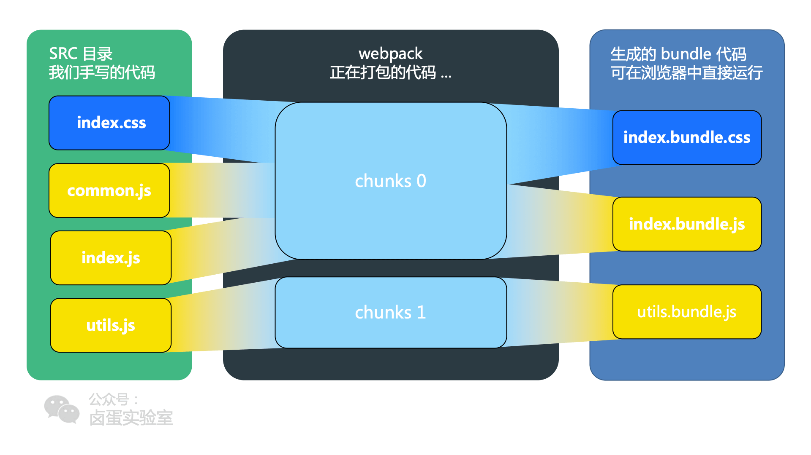

# 基本概念

## 模块化

模块化将一个复杂的系统分解为多个模块，便于后续编码

### 命名空间缺陷

jQuery 采用的是命名空间的形式，将所有的API放在了window.$下

1. 命名空间冲突
2. 无法合理的管理项目和依赖的版本
3. 无法方便的控制加载顺序

### JS的模块化

#### CommonJS

一种广泛使用的JS模块化标准

其核心思想为：
1. 使用require方法来同步加载依赖的其他模块
2. 通过module.exports导出需要暴露的接口

同时具有以下特点

优点
1. 代码可复用与Node.js环境下运行
2. Npm许多包都采用该规范，环境好

缺点
1. 无法直接在浏览器中运行，需要工具转化为ES5

#### AMD

一种异步的模块加载方式

具有以下特点：

优点
1. 可以不转换代码直接在浏览器中运行，同时也可以在Node中运行
2. 异步加载模块
3. 可并行加载多个模块

缺点
1. 原生JS库中未支持，需要导入AMD库才能使用

#### ES6的模块化

语言层面上的模块化

特点如下：

优点
1. 静态引入，便于Tree-sharking

缺点
1. 支持率不高，兼容性不太好

### 样式的模块化规范

使用@import引入样式

## 构建工具

构建工具作用
1. 代码转换
2. 文件优化
3. 代码分割
4. 模块合并
5. 自动刷新
6. 代码校验
7. 自动发布

### Grunt

一个任务执行者，其配置文件为Gruntfile.js

#### Grunt特点

优点
1. 只执行我们定义的任务
2. 大量可复用插件封装好了常见的构建任务

缺点
1. 集成度不高，配置麻烦

### Gulp

一个基于流的自动化构建工具

#### Gulp使用

1. gulp.task注册一个任务
2. gulp.run执行任务
3. gulp.watch监听文件的变化
4. gulp.src读取文件
5. gulp.dest写文件

#### Gulp特点

优点
1. 流式写法简单直观

缺点
1. 异常处理麻烦
2. 难精细控制

### Webpack

模块化打包工具

#### Webpack特点

优点
1. 处理模块化的项目，开箱即用
2. 通过Plugin扩展
3. 不止局限于Web开发
4. 社区庞大，资源多

缺点
1. 只能模块化项目使用

### Rollup

类似Webpack但是专注于ES6的模块打包工具

#### Rollup特点

优点
1. 利用tree-sharking处理ES6的代码进行简洁
2. 打包结果由于没有Webpack的模块加载，执行和缓存的代码，体积更小（推荐JS库）

缺点
1. 生态不完善，功能不太完整

### Parcel（不推荐使用）

快速零配置的模块化工具

#### Parcel特点

优点
1. 内置常见场景的构建方案和依赖
2. 以HTML为入口，自动检测和打包依赖资源
3. 默认支持模块热替换

缺点
1. 不支持SourceMap
2. 不支持剔除无效代码

## Webpack简单使用

### 命令行

#### 安装指令

全局安装

```BASH
npm install webpack webpack-cli -g
```

局部安装

```BASH

## 安装最新稳定版

npm i -D webpack

## 安装指定版本

npm i -D webpack@<version>

## 安装最新体验版

npm i -D webpack@beta
```

安装webpack V4+版本时, 需要额外安装webpack-cli

```BASH
npm i -D webpack-cli
```

#### 依赖配置

1. -D 开发依赖(--dev)
2. -S 生产依赖(--save)（线上环境会使用到的, 默认）

#### 检查安装

全局版本

```BASH
webpack -v
```

当前项目检查，npx npm自带工具，软连接到./node_modules/webpack/bin/webpack.js

```BASH
npx webpack -v
```

指定模块检查

```BASH
./node_modules/.bin/webpack -v
```

### Loader

文件转换翻译工具
1. 默认只提供js和json
2. 其他格式需要进行配置告诉webpack使用什么loader进行处理

配置方式为module下的rules中添加对象配置

### Plugin

扩展webpack功能，通过向webpack构建流程中注入钩子实现

配置方式为plugins中添加

### DevServer

利用webpack-dev-server，webpack添加 --watch开启监听

热模块替换则是在启动DebServer时加上--hot参数

## Webpack核心概念

### 核心概念

#### Entry

入口， Webpack执行构建的第一步

#### Moudle

一个模块对应一个文件，会从配置的Entry开始递归找出所有的依赖的模块

#### Chunk

代码块，Chunk由多个模块组合而成，用于代码的合并和分割

#### Loader

模块转换器，将模块原有内容按照需求转换成新内容

#### Plugin

扩展插件，webpack构建流程中特定时机注入扩展逻辑，改变输出结果

#### Output

输出结果，处理后得出的最终结果

### 相关问题

#### bundle，chunk，module是什么



1. 对于一份同逻辑的代码，当我们手写下一个一个的文件，每个文件就是module
2. module 源文件传到 webpack 进行打包时，webpack 会根据文件引用关系生成 chunk 文件
3. webpack 处理好 chunk 文件后，最后会输出 bundle 文件，这个 bundle 文件包含了经过加载和编译的最终源文件

#### Loader和Plugin的不同

作用不同
1. Loader的作⽤是让webpack拥有了加载和解析⾮JavaScript⽂件的能⼒
2. Plugin 可以监听Webpack构建流程的事件，在合适的时机通过 Webpack 提供的 API 改变输出结果

用法不同
1. Loader在module.rules中配置，作为模块解析的规则存在
2. 每个Plugin在plugins中创建实例并单独配置
