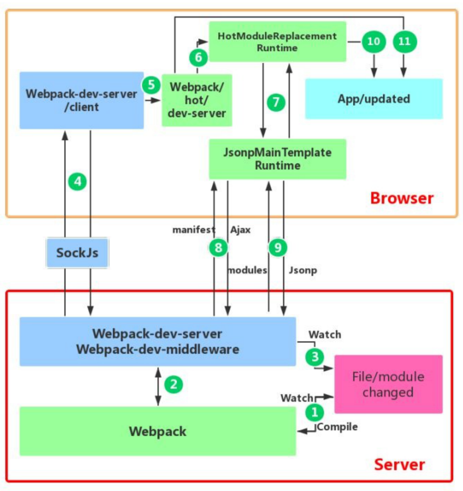

# 使用体验

[开发体验-思维导图](./mind/02-开发体验.html)

## 打包分析

### speed-measure-webpack-plugin

测量各个插件的loader花费时间

```bash
npm i speed-measure-webpack-plugin -D
```

配置

```js
//webpack.config.js
const SpeedMeasurePlugin = require("speed-measure-webpack-plugin");
const smp = new SpeedMeasurePlugin();
const config = {
    //...webpack配置
}
// 包裹webpack配置
module.exports = smp.wrap(config);
```

### webpack-bundle-analyzer

分析webpack打包后的模块依赖关系

```bash
npm install webpack-bundle-analyzer -D
```

配置

```js
const BundleAnalyzerPlugin = require('webpack-bundle-
        analyzer ').BundleAnalyzerPlugin;
        module.exports = merge(baseWebpackConfig, {
            //....
            plugins: [
                //...
                new BundleAnalyzerPlugin(),
            ]
        })
```

## 自动删除打包文件

利用clean-webpack-plugin处理

```bash
npm install --save-dev clean-webpack-plugin
```

## Html自动生成并引入JS

打包结束时生成html文件，并将打包的js模块引入到html中

安装插件

```bash
npm install --save-dev html-webpack-plugin
```

```js
module.exports = {
    plugins: [
        new htmlWebpackPlugin({
            title: "My App",
            filename: "app.html",
            template: "./src/index.html"
            // inject: true | 'head' | 'body' | false  // 将资源放置到哪里
        })
    ]
};
```

利用ejs语法设置相关内容

```html
<title><%= htmlWebpackPlugin.options.title %></title>
```

## 自动刷新

### 文件监听

#### 开启方式

1. webpack.config.js中设置watch: true
2. 启动命令带上 --watch

#### watchOptions

```js
watchOptions: { // 监听模式选项
    // 不监听的文件或文件夹，支持正则匹配，默认为空
    ignored: /node_modules/,
    //监听到变化发生后，等300ms再执行动作，截流，防止文件更新太快导致重新编译频率太快，默认为300ms，
    aggregateTimeout: 300,
    // 不停地询问系统指定的文件有没有发生变化，默认每秒询问1000次
    poll: 1000
},
```

##### 优化方式

1. watchOptions.poll值越小越好，降低检查的频率
2. watchOptions.aggregateTimeout值越大越好，降低重构建的频率
3. ignored过滤不需要监听文件

#### 工作原理

1. 定时获取文件的最后编辑时间，发现编辑时间不一致则认为不一致了
2. 当文件变化了也不会立即告诉监听者，而是先缓存，收集一段时间一次性通知

### 自动刷新浏览器

#### 实现方式

1. 浏览器扩展提供接口
2. 开发的网页注入代理客户端代码
3. 将网页放入一个iframe中
4. DevServer支持，注入则是默认方式

#### 自动刷新浏览器优化性能

默认inline方式会向每个chunk注入代码，造成重复

1. 关闭inline方式：devServer.inline配置，默认采用注入方式，关闭则使用iframe方式
2. 手动注入代理客户端代码

```html
<script src="http://localhost:8080/webpack-dev-server.js"></script>
```

## 热替换

Hot Module Replacement
1. 不刷新整个网页的情况下做到实时渲染
2. 不要在生产环境使用热替换

### 热替换优势

1. 实时预览反应更快
2. 能保持当前页面的运行状态

### 热替换启动

1. 在启动时带上参数 --hot
2. devServer配置上设置为hot: true

### 热替换原理

1. 向要开发的网页中注入一个代理客户端连接DevServer和网页
2. 利用独特的模块替换机制处理文件更新



#### 步骤1

1. webpack处于watch模式
2. 监听文件变化并重新打包，打包后的代码的JavaScript对象保存在内存中

#### 步骤2

1. webpack-dev-middleware调用webpack暴露的API对代码进行监控
2. webpack-dev-middleware通知webpack将代码打包到内存中

#### 步骤3

webpack-dev-server对文件变化的监控
1. devServer.watchContentBase为true时，server监听配置文件夹中静态文件变化
2. 通知浏览器进行live-reload（此处时浏览器刷新）

#### 步骤4

1. webpack-dev-server通过sockjs在浏览器和服务端之间建立websocket长连接
2. webpack将编译各个阶段状态通知浏览器
3. 浏览器根据消息进行操作，如文件的hash值来进行后续热替换

#### 步骤5-6

1. webpack/hot/dev-server根据webpack-dev-server/client传来的信息进行处理
2. 决定使用浏览器更新还是热更新，浏览器更新则直接到步骤11，后续就不再执行

#### 步骤7-9

1. HotModuleReplacement.runtime 是客户端 HMR 的中枢
2. 将传递的hash值发送给JsonpMainTemplate.runtime
3. JsonpMainTemplate.runtime向服务端发送Ajax请求，服务端返回json，包含了所需更新模块的hash值
4. JsonpMainTemplate.runtime再次通过jsonp向服务端请求最新代码

#### 步骤10

1. HotModulePlugin对新旧模块进行比对，决定是否更新模块和依赖关系

#### 失败处理

1. HMR失败后，回退到 live reload 操作
2. 通知浏览器获取最新打包代码
