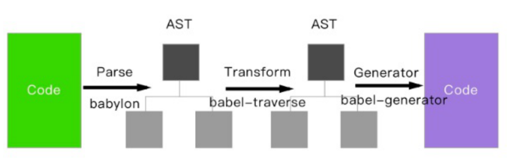

# 兼容性

由于JS和CSS版本和在不同浏览器的环境下，会产生许许多多兼容性问题

## Babel

将采用 ECMAScript 2015+ 语法编写的代码转换为向后兼容的 JavaScript 语法

### 作用

1. 语法转换
2. Polyfill方式在目标环境中添加缺失的特性
3. 源码转换

### Babel环境搭建

安装插件

```bash
npm i babel-loader @babel/core @babel/preset-env -D
```

webpack配置

```js
// webpack.config.js
{
    test: /\.js$/,
    exclude: /node_modules/,
    use: {
        loader: "babel-loader",
        options: {
            // 语法转化插件 preset-env
            presets: ["@babel/preset-env"]
        }
    }
}
```

### Babel配置

#### Babel整体配置

.babelrc配置babel，预设(presets) 和 插件(plugins)

```js
{
    "presets": [
        [
            "@babel/preset-env",
            {
                "debug": true,
                "useBuiltIns": "usage", // Polyfill按需架子啊
                "targets": {
                    "browsers": ["> 1%", "last 2 versions", "not ie <= 8"]
                }
            }
        ]
    ],
    "plugins": [
        [
            "@babel/plugin-transform-runtime", // 防止全局被污染
        ]
    ],
}
```

#### 预设(presets) 和 插件(plugins)

##### 预设和插件都是babel插件引入方式

1. babel通过plugins进行转化处理
2. preset（预设）则是一组plugins和配置的共享模块

##### 官方提供的预设

1. @babel/preset-env：ES2015+ syntax
2. @babel/preset-typescript：TypeScript
3. @babel/preset-react：React
4. @babel/preset-flow：Flow

### Polyfill

作为一个处理JS的补丁，用于处理一些不支持的方法

#### Polyfill组成

1. core.js
   1. 一个集成了ES6新的JS的补丁polyfill
   2. 不支持生成器和异步操作
2. regenerator
   1. regenerator用于支持generator
   2. generator已经被放弃，改用async/await

##### 注意

1. Babel 7.4.0 版本开始，这个软件包已经不建议使用
2. 建议直接使用core.js和regenerate

#### Polyfill使用方式

安装Polyfill

```bash
npm install @babel/polyfill --save
```

引入Polyfill

```js
// 应用入口顶部通过 require 将 polyfill 引入进来
require("babel-polyfill");
// 应用入口使用 ES6 的 import 语法，你需要在入口顶部通过 import 将 polyfill 引入，以确保它能够最先加载
import "babel-polyfill";
```

#### Polyfill按需加载（useBuiltIns）

```js
// webpack.config.js
use: {
    loader: "babel-loader",
    options: {
        presets: [
            [
                "@babel/preset-env",
                {
                    useBuiltIns: "usage",
                    core.js: 3
                },
            ]
        ]
    }
}
```

useBuiltIns 用于处理polyfill的按需注入

##### 参数

1. entry 需要在入口文件进行import "@babel/polyfill"一次，babel会进行按需注入
2. usage 不需要import，全自动进行检测（试验阶段）
3. fasle 不会按需注入

#### Polyfill全局污染

1. 直接使用core.js或polyfill则会污染全局系统
2. runtime则会对内置组件进行别名处理，防止污染

安装

```bash
npm install --save @babel/runtime
npm install --save-dev @babel/plugin-transform-runtime
```

配置

```js
{
    "preset": [
        ["@babel/preset-env"]
    ],
    "plugins": [
        [
            "@babel/plugin-transform-runtime", {
                "absoluteRuntime": false,
                "corejs": 3,
                "helpers": true,
                "regenerator": true,
                "useESModules": false,
            }
        ]
    ]
}
```

#### Proxy不能被Polyfill

1. Class 可以用 function 模拟
2. Promise 可以用callback 模拟
3. 但是Proxy 不能用defineProperty 模拟

### Babel转义过程



#### 解析 Parse

1. 将代码解析⽣成抽象语法树（AST）
2. 词法分析与语法分析

#### 转换 Transform

1. 解析的AST并通过babel-traverse对其进⾏遍历
2. 此过程中进⾏添加、更新及移除等操作

#### ⽣成 Generate

1. 变换后的AST再转换为JS代码,
2. 使⽤到的模块是 babel-generator

## PostCSS

提升CSS的兼容性

安装插件

```bash
npm i postcss-loader autoprefixer -D
```

```js
// webpack.config.js
{
    test: /\.less$/,
    include: path.resolve(__dirname, "./src"),
    use: [
        "style-loader",
        {
            loader: "css-loader",
            options: {}
        },
        "less-loader",
        "postcss-loader"
    ]
},
```

```js
// postcss.config.js
const autoprefixer = require("autoprefixer");
module.exports = {
    // // IE 10 为打包目标
    // plugin: [autoprefixer("IE 10")]
    plugin: [autoprefixer({
        // last 2 version 兼容最近两个版本
        // >1% 占有率大于1%
        overrideBrowsersList: ["last 2 version", ">1%"]
    })]
}
```
