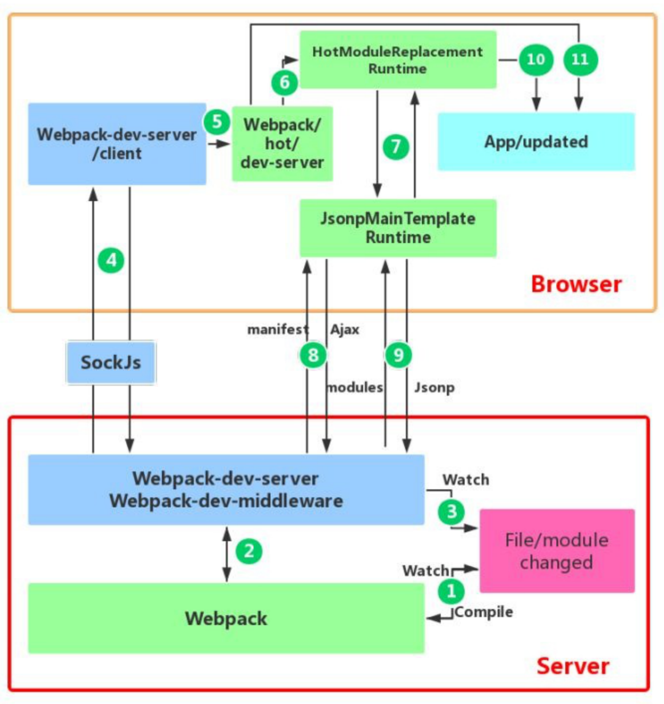

# 优化开发体验

## 缩小文件搜索范围

### Loader配置优化

1. loader对文件的转换十分耗时，减少loader的处理
2. 通过test、include和exclude配置Loader应用规则的文件，提高命中率

### resolve相关配置

resolve.modules优化，利用绝对路径指明第三方模块存储位置，减少逐级向上查找

```JS
modules: [path.resolve(dirname, 'node_modules')]
```

resolve.mainFields优化，决定采用模块的哪一个入口文件

```JS
mainFields: ['main'] // 设置为['main']，减少搜索步骤
```

resolve.alias优化，利用别名，在导入模块时直接采用模块提供的编译过的文件

但是除非这个库整体性比较好，一般不采用，主要是会影响Tree-Sharking

```JS
'react': path.resolve(dirname, './node_modules/react/dist/react.min.js');
```

resolve.extensions优化
1. 后缀列表尽可能短
2. 频率高的放前面
3. 引入代码时尽可能带上后缀

### module.noParse优化

直接忽略未采用模块化的文件的解析

```JS
noParse: [/react\.min\.js$/]
```

## DllPlugin

1. 将网页依赖的模块抽离出来并打包到一个个单独的动态链接库中
2. 下次导入的模块存在于某个动态链接库中，则模块会从动态库中获取
3. 页面需要的所有动态链接库都需要被加载

### .dll概念

动态链接库，包含为其他模块调用的函数和数据

### 实现插件

1. DllPlugin：用于打包出一个个动态链接库
2. DllReferencePlugin：用于在配置文件中引入DllPlugin打包出来的动态链接库文件

## 多进程处理

1. 任务分解给多个子进程去并发的执行，子进程处理完后再把结果发送给主进程
2. 让webpack在同一时刻处理多个任务，提升多核电脑处理能力

### 文件构建多进程

1. HappyPack
2. thread-loader（推荐），配置起来更简单

### 代码压缩多进程

ParallelUglifyPlugin

1. webpack内置UglifyJS但是不支持多进程
2. 小项目不推荐，进程会产生开销反而降速

## 外部扩展externals

从输出的 bundle 中排除依赖，防止某些import打包到bundle中

实现方式入下

1. externals: {jquery: 'jQuery'}
2. 同时将对应的文件放到CDN服务器中，并在项目中引入

## 剔除多余代码

通过ES6的静态语法分析对代码进行处理

1. Tree-shaking：去除未使用的代码
2. Scope Hoisting：将多个文件函数放到一个函数中

## 使用体验

### 自动刷新

#### 文件监听

##### 文件监听开启方式

1. webpack.config.js中设置watch: true
2. 启动命令带上 --watch

##### 文件监听配置方式

webpack.config.js中配置watchOptions

##### 文件监听工作原理

1. 定时获取文件的最后编辑时间，发现编辑时间不一致则认为不一致了，watchOptions.poll用于控制定时检查的周期
2. 当文件变化了也不会立即告诉监听者，而是先缓存，收集一段时间一次性通知，watchOptions.aggregateTimeout用于设置等待时间

##### 文件监听优化性能

ignored过滤node_modules

```JS
ignored: /node_modules/
```

减少监听
1. watchOptions.poll值越小越好，降低检查的频率
2. watchOptions.aggregateTimeout值越大越好，降低重构建的频率

#### 自动刷新浏览器

##### 自动刷新浏览器实现方式

1. 浏览器扩展提供接口
2. 开发的网页注入代理客户端代码
3. 将网页放入一个iframe中
4. DevServer支持，注入则是默认方式

##### 自动刷新浏览器优化性能

默认inline方式会向每个chunk注入代码，造成重复

1. 关闭inline方式：devServer.inline配置，默认采用注入方式，关闭则使用iframe方式
2. 手动注入代理客户端代码

```HTML
<script src="http://localhost:8080/webpack-dev-server.js"></script>
```

### 热替换

Hot Module Replacement
1. 在不刷新整个网页的情况下做到实时渲染
2. 不要在生产环境使用热替换

#### 热替换优势

1. 实时预览反应更快
2. 能保持当前页面的运行状态

#### 热替换启动方式

1. 在启动时带上参数 --hot
2. devServer配置上设置为hot: true

#### 热替换优化

提示优化（不友好，不知道ID和模块对应关系）
Update modules: 68

其他优化则和自动刷新一样

#### 热替换原理

向要开发的网页中注入一个代理客户端连接DevServer和网页，并利用独特的模块替换机制处理



##### 步骤1

webpack处于watch模式，监听文件变化并重新打包，打包后的代码的JavaScript对象保存在内存中

##### 步骤2

webpack-dev-middleware调用webpack暴露的API对代码进行监控，通知webpack将代码打包到内存中

##### 步骤3

webpack-dev-server对文件变化的监控
1. devServer.watchContentBase为true时，server监听配置文件夹中静态文件变化
2. 通知浏览器进行live-reload（此处时浏览器刷新）

##### 步骤4

webpack-dev-server通过sockjs在浏览器和服务端之间建立websocket长连接
1. webpack将编译各个阶段状态通知浏览器
2. 浏览器根据消息进行操作，如文件的hash值来进行后续热替换

##### 步骤5-6

webpack/hot/dev-server根据webpack-dev-server/client传来的信息进行处理

决定使用浏览器更新还是热更新，浏览器更新则直接到步骤11，后续就不再执行

##### 步骤7-9

HotModuleReplacement.runtime 是客户端 HMR 的中枢
1. 将传递的hash值发送给JsonpMainTemplate.runtime
2. JsonpMainTemplate.runtime向服务端发送Ajax请求，服务端返回json，包含了所需更新模块的hash值
3. JsonpMainTemplate.runtime再次通过jsonp向服务端请求最新代码

##### 步骤10

HotModulePlugin对新旧模块进行比对，决定是否更新模块和依赖关系

##### 失败处理

HMR失败后，回退到 live reload 操作，通知浏览器获取最新打包代码
