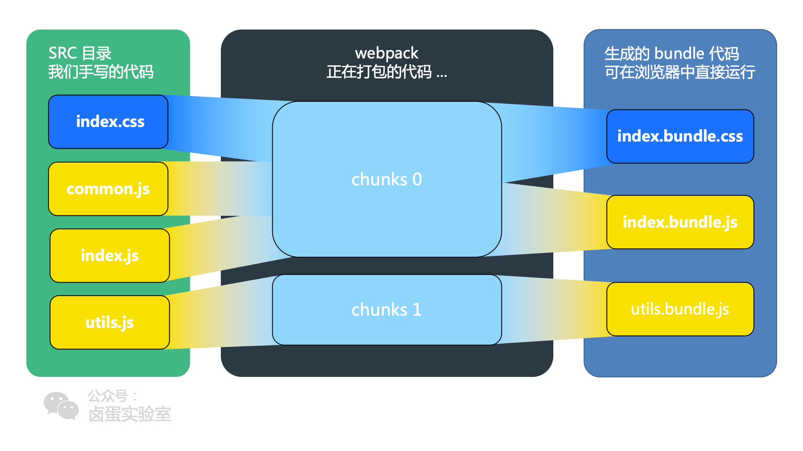

# Webpack

## 事件流（类似生产线）

1. 经过一系列的处理流程后才能将源文件转化成输出结果
2. 只有当前的处理完成后才能提交到下一个流程处理
3. 插件类似插入生产线的某个功能，特定时机对线上资源进行处理

## 核心概念

### Entry：入口

入口， Webpack执行构建的第一步

### Moudle：模块

一个模块对应一个文件，会从配置的Entry开始递归找出所有的依赖的模块

### Chunk：代码块

代码块，Chunk由多个模块组合而成，用于代码的合并和分割

### Loader：模块转换器

模块转换器，将模块原有内容按照需求转换成新内容

### Plugin：扩展插件

扩展插件，webpack构建流程中特定时机注入扩展逻辑，改变输出结果

### Output：输出结果

输出结果，处理后得出的最终结果

## 相关类

### Tapable

1. Webpack通过Tapable组织生产线
2. 插件只需要监听它所关心的事件，就能加入到生产线中
3. 保持了插件的有序性

### Complier

1. Complier负责整个的构建流程（准备、编译、输出等）
2. 文件监听与启动编译

### Compliation

1. Compliation只负责编译过程，每个实例只代表一次编译
2. 一个Compilation对象包含了当前的模块资源、编译生成资源、变化的文件等

## bundle，chunk，module是什么

1. 每一个文件就是一个module
2. 当每个module在webpack解析后，webpack会根据模块关系构建chunk
3. chunk处理好后，编译出bundle文件

## 运行流程

### 初始化参数

1. 从配置文件和shell中读取和合并参数，并得出最终参数

### 开始编译

此时具有一个完整的配置

1. 实例化Compiler对象：全局唯一，包含完整的webpack配置
2. 加载插件：调用插件的apply方法，使插件可以监听后续的事件节点
3. 应用node的文件系统至compiler对象：方便文件的寻找和读取
4. 确定入口：读取配置的Entrys

### 编译模块

此时具有一个全局的Compiler对象，插件应用完毕，同时得到文件的入口entry

1. 获取文件路径entry，通过entry读取模块内容entryContent
2. 利用Loader将entryContent转化为entrySource
3. 生成entryModule对象，并设置模块的id和source，然后推入modules中

### 完成模块编译（最后修改机会）

使用loader翻译完所有的模块后，得到每一个模块被翻译后的最终内容和他们的依赖关系

1. 根据入口和模块的依赖关系组成一个chunk
2. 把每个Chunk转化成一个单独的文件加入到输出列表中

### 输出完成

1. 确定输出列表的路径和文件名
2. 把文件内容写入到文件系统中
