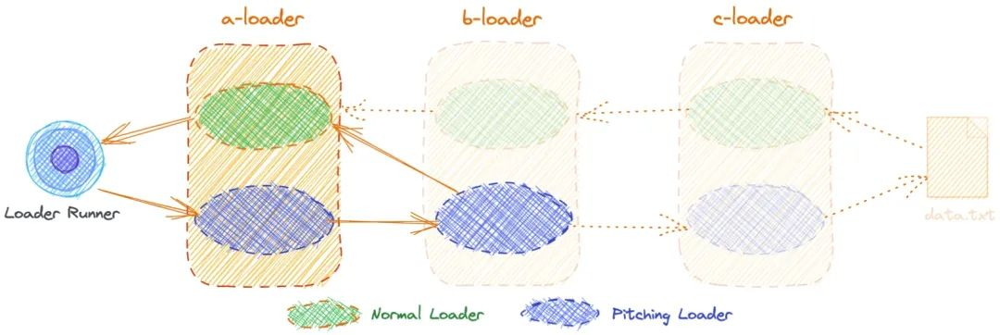

# [Loader](https://www.teqng.com/2021/08/11/%E5%A4%9A%E5%9B%BE%E8%AF%A6%E8%A7%A3%EF%BC%8C%E4%B8%80%E6%AC%A1%E6%80%A7%E6%90%9E%E6%87%82webpack-loader/)

## Loader概念

导出函数的 JavaScript 模块

### Loader作用

1. 将源文件经过转化输出新结果
2. 一个文件同时还可以经过多个loader一起处理

### Loader顺序

由后往前依次处理

## Loader分类

### Normal Loader

JavaScript模块导出的函数

```js
module.exports = fuction() {}
```

#### Normal Loader分类

1. pre 前置
2. post 后置
3. normal 普通
4. inline 行内

可以通过rule对象的enforce属性指定前置和后置

```
enforce: "pre",
enforce: "post",
```

#### Normal Loader三个参数

1. content：源文件内容
2. map：使用的SourceMap数据
3. meta：数据，可以为任何内容

#### Normal Loader顺序

从右往左

### Pitching Loader

JavaScript模块导出的函数上增加的pitch属性

```js
module.exports.pitch = fuction() {}
```

#### Pitching Loader三个参数

1. data：用于数据传递，之后的normal中可以通过this.data获取
2. remainingRequest：剩余请求路径
3. precedingRequest：前置请求路径

#### Pitching Loader顺序

默认为从左往右

但是pitch可以中断，当pitch方法返回非undefined值时，则跳过剩余loader



## 编写Loader

Loader只进行转义工作，对拿到的source进行处理后返回，提供loaderUtils方便开发

配置获取

```js
loaderUtils.getOptions(this)
```

返回值

```js
// 同步返回
return value // 只能一个值
this.callback(err, content, sourceMap, abstractSyntaxTree) // 可以多个值

// 异步返回
var callback = this.async() //在异步回调中出发callback方法
```

简单插件实现

```js
const babel = require('babel-core');

function loader(source, inputSourceMap, data) {
    const options = {
        presets: ['es2015'],
        inputSourceMap: inputSourceMap,
        sourceMaps: true,
        filename: this.request.split('!')[1].split('/').pop()
    }
    let {
        code,
        map,
        ast
    } = babel.transform(source, options);
    return this.callback(null, code, map, ast);
}

module.exports = loader;
```
