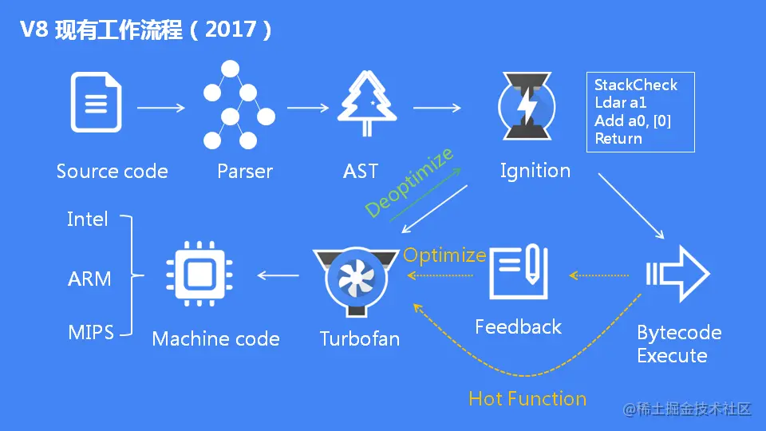

# 浏览器组成

[浏览器组成思维导图](./mind/01-浏览器组成.html)

## 浏览器组成结构

### 浏览器引擎（Browser Engine）

协调UI和渲染引擎，在他们之间传输指令

### 渲染引擎（Rendering Engine）

1. 为给定的URL提供可视化的展示
2. 不同浏览器使用不同的引擎
3. 每一个标签页都会有一个

#### 内核

提供API给浏览器开发使用，同时提供加载和渲染网页，调用操作系统的服务

1. Trident（IE 浏览器）
2. Gecko（Firefox 浏览器）
3. Presto（Opera 浏览器（以前））
4. Webkit（Safari 浏览器）
5. Blink（Chrome 浏览器，Webkit的一个分支）

### JS解释器（JavaScript Interpreter）

解释和运行网站的JavaScript代码

### 网络（Networking）

基于互联网HTTP和FTP协议，处理网络请求

### 数据存储（Data Storage）

管理和存储用户数据

### ⽤户界⾯（User Interface）

主要提供用户与浏览器引擎交互的方法

### 后端界⾯（UI Backend）

用于绘制基本的窗口小部件，比如组合框和窗口

## V8引擎

### V8引擎执行JS过程

#### 预解析

1. 检查语法错误但不生成AST
2. 当函数未被使用时，则不会进行全量解析

#### 生成AST

经过词法/语法分析，生成抽象语法树

#### 生成字节码

基线编译器(Ignition)将AST转换成字节码

#### 生成机器码

优化编译器(Turbofan)将字节码转换成优化过的机器码

### V8引擎优化

1. 优化JIT：如果某些机器码经常使用，V8引擎会将其保存起来，优化执行
2. 隐藏类：V8借用了类和偏移位置的思想，将对象划分成不同的组
3. 内嵌缓存：即缓存对象查询的结果
4. 垃圾回收：栈内存回收和堆内存回收
