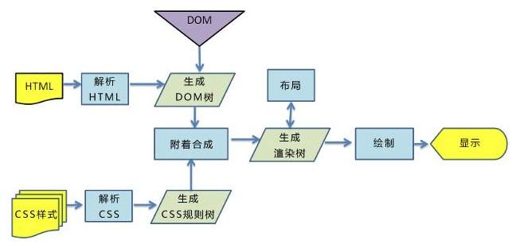

# 渲染原理

## 渲染资源加载

### 资源加载过程

1. 资源分类
2. 资源安全策略检查
3. 资源优先级计算
4. 按顺序利用加载器加载资源

### 加载器

1. 特定资源加载器（ImageLoader，FontLoader...)
2. 缓存资源加载器（CachedResourceLoader）
3. 通用资源加载器（ResourceLoader) 从网络或者文件系统获取资源

### [预加载](https://juejin.cn/post/6915204591730556935)

1. Preload（提前加载）：提前加载用于当前页面的资源
2. Prefetch（预判加载）：用于加载未来（比如下一个页面）会用到的资源，并且空闲时处理，优先级最低
3. Preconnect（提前连接）：知道会和某个域通信，便提前连接

## 渲染过程

渲染过程就是HTML代码渲染成图像的过程

### 解析HTML

生成DOM树

### 解析CSS

生成CSSOM规则树

###  构建渲染树

1. 渲染对象：是一个包含有颜色和大小等属性的矩形，与DOM元素相对应
2. 不可见的DOM元素（display: none），该元素和其子节点不会被插入渲染树

### 渲染树布局（回流或重排）

浏览器计算出各个节点在页面中的确切位置和大小

### 渲染树绘制（重绘）

遍历渲染树并调用渲染对象的 paint 方法将它们的内容显示在屏幕上

## 回流和重绘

### 回流

当渲染树中元素的尺寸、结构或者属性发生变化时，浏览器会重新渲染部分或者全部文档的过程就称为回流

回流开销大，应当减少使用

#### 触发回流方式

1. 首次渲染
2. 窗口尺寸变化
3. DOM元素的几何属性(width/height/padding/margin/border)发生变化
4. DOM元素移动或增删会触发回流
5. CSS伪类激活
6. 特殊属性读取（使用getComputedStyle或者读写offset/scroll/client等属性）

### 重绘

元素的样式发生变化，但不影响其在文档流中的位置时，浏览器就会对元素进行重绘

#### 触发重绘

DOM样式发生变化，但是页面整体布局和几何属性未变化

## 渲染优化

### JavaScript

JavaScript加载既会阻塞HTML的解析，也会阻塞CSS的解析
1. JS加载、解析与执行会阻塞文档的解析
2. 解析过程中请求样式信息，此时浏览器会优先解析CSSOM再执行JS，最后解析文档

#### JavaScript优化方式

1. JS文件放在body后，最后加载
2. 使用async或defer异步引入

### CSS

1. CSSOM负责存储渲染信息，浏览器就必须保证在合成渲染树之前，CSSOM是完备的
2. CSSOM阻塞渲染时，页面会一直处于白屏阶段

#### CSS优化方式

1. 样式放置在head中，优先加载
2. link 替代 @import 引入
3. 样式少，使用style

#### link，style，@import三者渲染区别

1. link：派发新HTTP线程加载，不阻碍GUI渲染
2. @import：暂停GUI渲染，直到加载完文件
3. style：GUI直接渲染

### DOM树和CSSOM树

1. 减少代码层级
2. 使用HTML语义化标签

### 回流和重绘

主要目的就是减少回流和重绘的触发

#### 样式设置

使用class替代style

#### 隐藏元素

visibility: hidden替代display:none

#### 元素操作前脱离文档流

利用display:none或者定位的absolute或者fixed使元素脱离文档流

可以在元素进行复杂动画或者批量修改元素使用

#### documentFragment

多次DOM修改操作时，先创建documentFragment处理然后在插入DOM中

#### 利用渲染队列机制

> 渲染队列：浏览器会将所有的回流、重绘的操作放在一个队列中，当队列到了一定的数量或者时间间隔，浏览器便会统一处理

DOM的多次读操作（或写操作）放在一起，减少回流重绘次数

#### 属性备份

多次访问节点属性时，可以将节点属性备份，然后使用备份

### 关键渲染路径（处理首屏渲染）

#### 关键渲染路径优化方向

1. 关键资源的数量：关键资源是可能阻止网页首次渲染的资源
2. 关键路径长度：某些资源只能在上一资源处理完毕之后才能开始下载，减少这种资源
3. 关键字节的数量：浏览器需要下载的关键字节越少，处理内容并让其出现在屏幕上的速度就越快，减少资源数或压缩资源

#### 关键渲染路径优化步骤

对关键路径进行分析和特性描述：资源数、字节数、长度
1. 最大限度减少关键资源的数量：删除它们，延迟它们的下载，将它们标记为异步等
2. 优化关键字节数以缩短下载时间（往返次数）
3. 优化其余关键资源的加载顺序：需要尽早下载所有关键资产，以缩短关键路径长度

### GPU加速

1. 动画实现过程中利用transform: translateZ(0)，欺骗浏览器开启GPU加速
2. will-change开启gpu加速，就是性能不太好

原理见CSS优化方式
