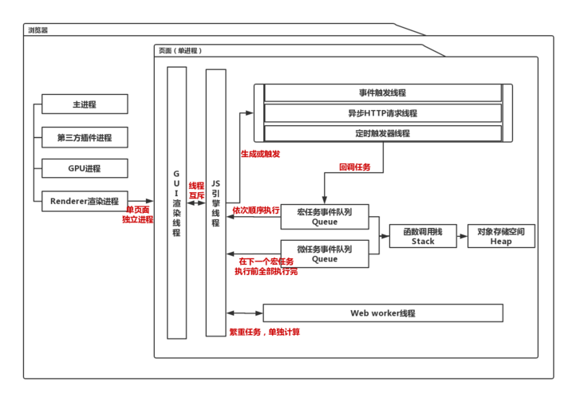
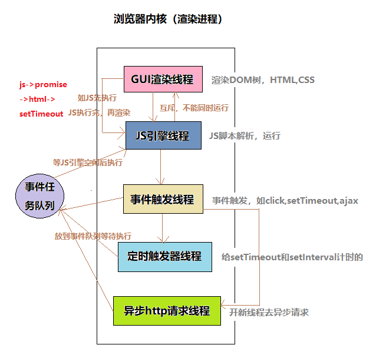

# 进程和线程

## 相关概念

### 浏览器概念

1. 浏览器是多进程多线程模式
   1. 单进程会导致某个页面出错，整个浏览器崩溃
   2. 每个页面代表一个进程，chrome会将多个空白页合并到一个进程
   3. 页面的进程负责管理多个线程
2. JS引擎的执行是单线程

### 进程和线程比较

#### 资源

1. 进程是资源分配的最小单位，述了 CPU 在运行指令及加载和保存上下文所需的时间，即代表了一个程序
2. 线程是CPU调度的最小单位，描述了执行一段指令所需的时间

#### 组成

1. 进程由多线程组成，任意一线程执行出错，导致整个进程的崩溃

#### 通信

1. 进程间内容互相隔离，需要借助进程间通信
2. 同一进程中的多线程共享数据

##### 进程间通信

1. 管道通信：文件思想，一个进程读一个进程写
2. 消息队列通信：一个进程向队列中写入，一个进程从队列读取
3. 信号量通信：简单数字标记，通过计数表示资源是否可用
4. 共享内存通信：通过一块共享内存进行通信

#### 系统开销

1. 进程创建或撤销时，操作系统会分配或回收资源，开销大，资源包括内存，I/O等
2. 线程切换只需要保存和设置少量寄存器内容，不会引起进程切换，开销小

### 死锁

#### 死锁原因

1. 多个进程争夺同一资源的僵局
2. 原因是竞争资源，两个进程互相需要对方的正在使用的资源

#### 死锁处理方式

1. 一次性分配全部资源
2. 可剥夺资源，当需要资源得不到时，释放自身资源
3. 资源请求增加编号，进程按顺序获取

### 并发/并行

1. 并发（宏观）：多个任务不断切换执行
2. 并行（微观）：利用CPU多个核心，同时执行多个任务

## 浏览器进程架构



### 浏览器主进程（1）

页面显示，用户交互，子进程管理，存储功能等

### GPU 进程（1）

初始目的用于3D CSS渲染，之后用于UI界面绘制

### 网络进程（1）

网络资源加载

### 插件进程（n）

负责插件运行，一个插件启动一个

### 渲染进程（n）

将 HTML、CSS 和 JavaScript 转换为用户可以与之交互的网页，每一个页面都有一个渲染进程



#### GUI渲染线程（互斥）

1. 负责页面绘制
2. 回流或者重绘时会触发

#### JS引擎线程（互斥）

1. 负责JavaScript脚本解析和执行
2. GUI渲染线程与JS引擎线程互斥，JS引擎线程优先

#### 事件触发线程

1. 控制事件循环，将事件放到对应的处理线程中
   1. DOM事件
   2. 定时器触发
   3. 异步http请求
   4. ...
2. 事件触发时，将注册的事件回调放至事件队列对尾，等待执行

#### 定时器触发线程

1. 控制setInterval与setTimeout的时间计数
2. 由于单线程，阻塞线程状态就会影响计时的准确
3. 当计数到达设定值时，通知事件触发线程

#### 异步http请求线程

1. 处理XMLHttpRequest请求
2. 当状态变更时，通知事件触发线程

## 工作者线程（Web Workers）

HTML5中提出的一种后台线程中运行脚本的方法，线程可以执行任务并不干扰GUI渲染线程和JS引擎线程处理

### 工作者线程特点

1. 以实际线程实现
2. 每个工作者线程并行执行
3. 共享内存，SharedArrayBuffer的数据是多线程共享的，其他数据共享则需要复制或转移数据
4. 不一定处于当前页面进程
5. 创建和销毁的开销大，启用工作者线程应当是长期运行的服务

### 工作者线程类型

#### 专用工作者线程（Dedicated Worker）

1. Web Worker
2. 只能被创建它的页面使用
3. 处理页面执行线程里不合适做的任务（导致渲染和响应卡顿的任务）

##### 适用于以下任务

1. 密集计算
2. 大量数据处理
3. 文件输入和输出

#### 共享工作者线程（Shared Worker）

1. 类似专用工作者线程，是其扩展形式
2. 由同源的任意页面共享

#### 服务工作者线程（Service Worker）

1. 类似浏览器中代理服务器的线程，可以拦截外出请求和缓存响应，让网页在无网络环境下使用
2. 多个页面共享一个服务工作者线程
3. 用于让网页模拟原生应用程序，即渐进式Web应用 PWA（Progressive Web Apps）

### [web worker使用（另两种只是API不同，流程差不多）](https://www.ruanyifeng.com/blog/2018/07/web-worker.html)

#### 主线程

1. new Worker创建实例
2. 注册message监听
3. postMessage发送消息
4. worker.terminate()关闭线程

```js
// 检测浏览器是否支持
if (typeof(Worker) === 'undefined') return
```

```js
// 调用Worker()构造函数，新建一个 Worker 线程
var worker = new Worker('work.js');
```

```js
// 主线程调用worker.postMessage()方法，向 Worker 发消息
worker.postMessage('Hello World');
worker.postMessage({
    method: 'echo',
    args: ['Work']
});
```

```js
// 主线程通过worker.onmessage指定监听函数，接收子线程发回来的消息
worker.onmessage = function(event) {
    console.log('Received message ' + event.data);
    doSomething();
}

function doSomething() {
    worker.postMessage('Work done!');
}
```

```js
// 主线程可以监听 Worker 是否发生错误。如果发生错误，Worker 会触发主线程的error事件
worker.onerror(function(event) {
    console.log([
        'ERROR: Line ', e.lineno, ' in ', e.filename, ': ', e.message
    ].join(''));
});
// 或者
worker.addEventListener('error', function(event) {
    // ...
});
```

```js
// Worker 完成任务以后，主线程就可以把它关掉
worker.terminate();
```

#### 工作者线程

1. 注册message监听
2. postMessage发送消息
3. self.close()关闭自身
4. importScripts加载脚本

```js
// 注册监听
self.addEventListener('message', function(e) {
    self.postMessage('You said: ' + e.data);
}, false);
// self代表子线程自身，即子线程的全局对象，等价于以下写法
// 写法一
this.addEventListener('message', function(e) {
    this.postMessage('You said: ' + e.data);
}, false);

// 写法二
addEventListener('message', function(e) {
    postMessage('You said: ' + e.data);
}, false);
```

```js
// Worker 内部关闭自身
self.close()
```

```js
// 脚本加载
importScripts('script1.js', 'script2.js');
```

## 多页签间通信

### websocket：详见[计算机网络/Websocket](../计算机网络/06-WebSocket.md)

### ShareWorker：详见上文工作者线程

### localStorage

1. 一个注册localStorage监听
2. 一个修改localStorage值

### postMessage

1. 获得某一页签的引用，然后可用postMessage
