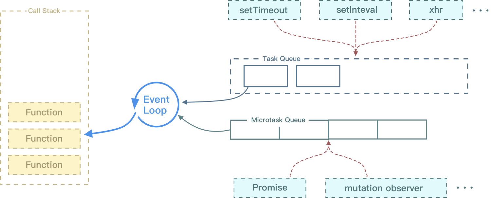
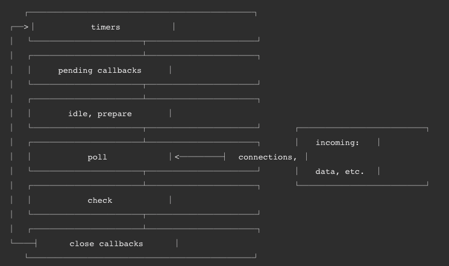

# 事件循环

[推荐视频](https://www.bilibili.com/video/BV1K4411D7Jb?spm_id_from=333.337.search-card.all.click)

## JS执行方式

### 单线程

1. JS单线程运行，同一时间只能做一件事
2. 可以使用工作者线程开辟新线程，详见[浏览器原理/进程和线程](./02-进程和线程.md)

### JS代码执行方式

1. 从上往下
2. 同步执行
3. 异步放入处理线程，处理线程触发后将事件放入队列等待执行
4. 出错停止执行

## [宏任务和微任务](https://juejin.cn/post/6844903814508773383)

### 宏任务（Macrotask）

1. 浏览器中的
   1. I/O 操作
   2. setTimeout
   3. setInterval
   4. RAF（但是有争议，我觉得不是）
2. Node中的
   1. I/O 操作
   2. setTimeout
   3. setInterval
   4. setImmediate

### 微任务（Microtask）

1. 浏览器中的
   1. Promise
   2. MutationObserver
2. Node中的
   1. Promise
   2. process.nextTick

## 浏览器事件循环

### 浏览器事件循环的结构

#### 执行栈（Call Stack）

##### 存储函数调用的栈结构

1. 遵循先进后出
2. 可存放函数有限制，过多的函数会造成爆栈

##### 执行栈的执行过程

1. 执行代码时遇见函数则入栈，同步代码直接执行，异步事件放入对应线程处理
2. 当函数执行完成后出栈

#### 事件队列（Task Queue）

1. 一次只执行一个事件
2. 当有新事件加入时并不会立即执行

##### 鼠标点击元素和调用click方法触法时不同的

```js
button.addEventListener('click', () => {
    Promise.resolve().then(() => console.log('p1'))
    console.log('l1')
})
button.addEventListener('click', () => {
    Promise.resolve().then(() => console.log('p2'))
    console.log('l2')
})
// 鼠标点击
// l1 p1 l2 p2
// button.click()触发
// l1 l2 p1 p2
```

1. 第一个时两个注册事件依次入栈执行，每次执行完栈空，便会处理微任务
2. button.click()触发时，第一个回调执行完，但是此时栈中仍有button.click事件，栈不空，所以无法执行注册的微任务

```js
 const nextClick = new Promise(resolve => {
     link.addEventListener('click', resolve, {
         once: true
     })
 })
 nextClick.then(event => {
     event.preventDefault()
 })
```

3. 例如在then中执行event.preventDefault()
   1. link点击事件
      1. 执行注册的点击事件
      2. 事件执行完后，检查事件的canceled属性，为canceled则不会跳转（event.preventDefault设置canceled）
   2. 手动点击，注册事件执行完后栈为空，event.preventDefault随微任务处理，然后判断cancled
   3. link.click触发，注册事件执行完后，由于栈中仍然存在link.click，微任务无法执行，则执判断cancled，再执行微任务

#### 微任务队列（Microtask Queue）

1. 一直执行，直到队列清空
2. 当执行过程中有新事件加入时，也会直接执行
3. 由于微任务处理是同步的，过多的任务会阻塞渲染   

#### 渲染队列（Animation callback）

1. requestAnimationFrame的回调处理，本次渲染前执行（有的会在之后执行）
2. 一直执行，直到当前帧队列清空
3. 当有新事件加入时，只会将当前帧的处理完，执行过程中新加入的下次帧时执行

在计算css时不会看过程，只会看开始和最终的结果，可以在动画过程中增加getComputedStyle方法强制样式计算

##### [requestAnimationFrame是一个宏任务么](https://ginobilee.github.io/blog/2019/02/01/requestAnimationFrame%E6%98%AF%E4%B8%80%E4%B8%AA%E5%AE%8F%E4%BB%BB%E5%8A%A1%E4%B9%88/)

1. 宏任务与RAF任务有明显的差异
   1. 执行时机不同，RAF在浏览器重新渲染前
   2. raf任务队列被执行时，会将其此刻队列中所有任务都执行完
2. 所以raf任务不属于宏任务，而由于微任务的特殊性(单独的任务队列)，它显然更不是微任务

### 浏览器事件循环的执行顺序



1. 取事件队列中最老的Task，无Task则直接到第六步
2. 将Task设为事件循环中正在运行的Task，并推入执行栈
3. 执行Task
4. Task执行完毕，将事件循环中正在运行的Task设置为null
5. 事件队列移除Task
6. 清空微任务队列
7. 页面UI渲染，此时RAF会进行处理
   1. 不是每次循环都会渲染
   2. 多次变动不会立即响应，会积攒变动以60HZ频率更新
8. 任务队列中没有Task，并且符合条件时中止步骤，否则返回第一步

## [Node事件循环](https://juejin.cn/post/6844903999506923528#heading-5)



### Node循环阶段

Node循环阶段中的microtask 来说，它会在以下每个阶段完成前清空 microtask 队列

#### Timers（定时器阶段）

执行 setTimeout(callback) 和 setInterval(callback) 预定的 callback

#### I/O callbacks（I/O回调阶段)

执行某些系统操作的回调

#### idle, prepare 阶段

node内部使用

#### poll（轮询阶段）

回调队列不为空：执行回调，每个回调执行完，立即执行它的微任务

回调队列为空：存在setImmediate()未执行，则结束轮询进入Check，否则会阻塞并等待任何正在执行的I/O操作完成，马上执行相应的回调，直到所有回调执行完毕

#### Check（查询阶段）

setImmediate() 设定的callbacks，回调中触发微任务，则将微任务执行完

#### Close callbacks

执行一些回调的关闭

### process.nextTick

1. 独立于 Event Loop 之外的，拥有一个自己的队列
2. 每个阶段完成后，如果存在 nextTick 队列，就会清空队列中的所有回调函数
3. 优先于microtask执行
