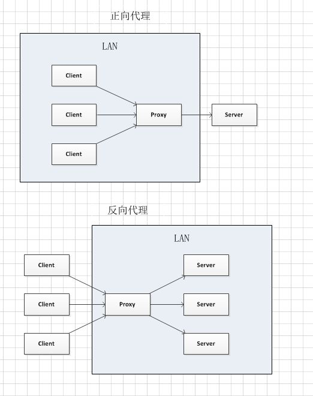

# 同源策略

同源策略是隔离了潜在的恶意文件的关键安全机制，限制了从同一个源加载的文档或脚本如何与另一个源的资源进行交互

## 同源策略相关概念

### 跨域判断

1. 协议、端口号、域名必须一致
2. a.bilibili.com 和 b.bilibili.com 是不同源的

### 跨域限制

#### DOM元素

#### AJAX和FETCH

#### 本地存储

1. cookie
2. localStorage
3. sessionStorage
4. indexDB

## cors

跨域资源共享(CORS) 是一种机制，用额外的HTTP头准许浏览器访问其他域的资源

### 相关首部字段

#### 请求首部字段

##### Origin（必须发送）

```
Origin: <origin>
```

表明预检请求或实际请求的源站

所有访问控制请求（Access control request）中，Origin 首部字段总是被发送

##### Access-Control-Request-Method

```
Access-Control-Request-Method: <method>
```

预检请求使用，将实际请求所使用的 HTTP 方法告诉服务器

##### Access-Control-Request-Headers

```
Access-Control-Request-Headers: <field-name>[, <field-name>]*
```

预检请请求使用，实际请求所携带的首部字段告诉服务器

#### 响应首部字段

##### Access-Control-Allow-Origin

```
Access-Control-Allow-Origin: <origin> | *
```

origin 参数的值指定了允许访问该资源的外域 URI

##### Access-Control-Allow-Credentials

```
Access-Control-Allow-Credentials: true
```

1. 普通响应
   1. 是否允许浏览器读取response的内容
2. 预检响应
   1. 指定了实际的请求是否可以使用credentials
   2. Credentials可以为cookies, authorization headers 或 TLS client certificates

##### Access-Control-Allow-Methods

预检响应中使用，明确了客户端所要访问的资源允许使用的方法列表

```
Access-Control-Allow-Methods: <method>, <method>, ...
```

##### Access-Control-Allow-Headers

预检响应中使用，明了实际请求中允许携带的首部字段

```
Access-Control-Allow-Headers: <field-name>[, <field-name>]*
```

##### Access-Control-Max-Age

预检响应中使用，指定了预检结果能缓存多久

```
Access-Control-Max-Age: <delta-seconds>
```

### cors请求过程

#### 简单请求

不会触发预检（OPTIONS）的请求

需要具备以下要求

1. 请求方法为：
   1. GET
   2. POST
   3. HEAD
2. 信息头不超过：
   1. Accept
   2. Accept-Language
   3. Content-Language
   4. Last-Event-ID
   5. Content-Type（值限制application/x-www-form-urlencoded，multipart/form-data和text/plain）

##### 简单请求步骤

1. 客户端发出CORS请求，携带Orign请求头
2. 服务器根据Orign字段判断是否同意请求，并返回相关头信息，响应头必须携带Access-Control-Allow-Origin
3. 浏览器检查响应头，缺少必要头则认为出错

#### 非简单请求

非简单请求在正式通信前会发送预检请求

##### 预检请求

1. 发送OPTIONS请求，携带以下请求头
   1. Orign
   2. Access-Control-Request-Headers
   3. Access-Control-Request-Method
2. 服务端按照请求头段判断，不符合报错，符合进行响应，响应头必须返回
   1. Access-Control-Allow-Origin
   2. Access-Control-Allow-Methods
   3. Access-Control-Allow-Headers

预检请求过多会降低性能，可以后端在请求的返回头部添加：Access-Control-Max-Age，对预检请求返回结果缓存

##### 正式请求

1. 每次CORS请求都携带Origin
2. 服务端也会返回Access-Control-Allow-Origin

## JSONP

JSON with Padding，JSON数据包裹

### JSONP实现

1. 利用Script标签支持跨域获取对应JS代码
2. JS代码最后调用预先注册在window的回调

### JSONP缺点

1. 只支持GET
2. XSS攻击

## 代理跨域

### 正向代理和反向代理



#### 正向代理

1. 正向代理其实是客户端的代理（客户端架设）
2. 客户端设置了一个代理服务器
3. 利用代理服务器去访问唯一目标服务器

##### 作用

1. 突破访问限制
2. 隐藏真实客户端
3. 提高访问速度（代理服务器缓存）

#### 反向代理

1. 反向代理则是服务器的代理（服务器架设）
2. 客户端访问代理服务器
3. 代理服务器指定目标服务器共客户端访问

##### 作用

1. 分担服务端负载（负载均衡）
2. 提供安全保障（代理服务器做防火墙）
3. 隐藏真实服务器
4. 提高访问速度（代理服务器缓存）

### 实现方式

服务器间的通信是不会有同源策略的，所以利用反向代理处理
1. 将客户端请求转发至目标服务器
2. 返回值可以添加cors的响应头部处理跨域

#### nginx

```conf
#proxy服务器
server {
    listen       81;
    server_name  www.domain1.com;
    location / {
        proxy_pass   http://www.domain2.com:8080;  #反向代理
        proxy_cookie_domain www.domain2.com www.domain1.com; #修改cookie里域名
        index  index.html index.htm;
        # 当用webpack-dev-server等中间件代理接口访问nignx时，此时无浏览器参与，故没有同源限制，下面的跨域配置可不启用
        add_header Access-Control-Allow-Origin http://www.domain1.com;  #当前端只跨域不带cookie时，可为*
        add_header Access-Control-Allow-Credentials true;
    }
}
```

#### nodejs 中间件（仅开发环境）

1. 非vue框架的跨域：node + express + http-proxy-middleware
2. vue框架：node + vue + webpack + webpack-dev-server

## WebSocket协议跨域

1. WebSocket protocol是HTML5一种新的协议
2. 它实现了浏览器与服务器全双工通信，同时允许跨域通讯，是server push技术的一种很好的实现
3. 推荐Socket.io，便于使用，同时向下兼容

## iframe跨域

### postMessage

#### postMessage API

HTML5 XMLHttpRequest Level 2中的API，可跨域操作
1. 页面和其打开的新窗口的数据传递
2. 多窗口之间消息传递
3. 页面与嵌套的iframe消息传递

##### postMessage参数

1. data：任意基本类型或可复制的对象，但是最好JSON.stringify()序列化
2. origin：（协议+主机+端口号，* 任意窗口，/ 同源窗口）

#### 实现方式

1. 主页面利用iframe和跨域页通信
2. 两边都对message进行监听
3. 主页面利用ifame获取跨域页面iframe.contentWindow.postMessage通信
4. 跨域页利用window.parent.postMessage通信

### document.domain + iframe跨域

1. 方案仅限主域相同，子域不同的跨域应用场景
2. 实现原理：两个页面都通过js强制设置document.domain为基础主域，就实现了同域

### location.hash + iframe跨域

1. 实现原理：a欲与b跨域相互通信，通过中间页c来实现。 
2. 三个页面，不同域之间利用iframe的location.hash传值，相同域之间直接js访问来通信

### window.name + iframe跨域

1. window.name属性的独特之处：name值在不同的页面（甚至不同域名）加载后依旧存在，并且可以支持非常长的 name 值（2MB）
2. a页面加载b页面，b更换name后将页面切换至a同源的proxy
