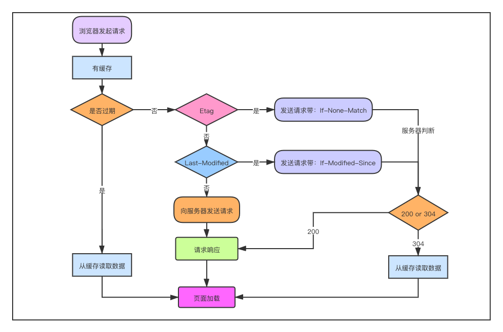

# 缓存机制

浏览器针对部分请求资源执行缓存的机制

## 缓存优点

1. 减少服务器的负担（减少请求次数和减少多余数据传输）
2. 加快网页的加载速度

## 缓存位置

### [缓存位置分类](https://web.dev/i18n/zh/service-worker-caching-and-http-caching/)

#### Service Worker

1. 工作者线程之一，拦截HTTP请求，利用CacheStorage缓存
2. 缓存是持续性的
3. 详见[浏览器原理/进程与线程](./02-进程和线程.md)

##### Service Worker缓存获取方式

1. Service Worker未命中缓存则从缓存优先级中其他方式获取数据，都没有则调用fetch函数获取数据
2. 但是无论是从Memory Cache还是网络获取数据都显示为Service Worker获取数据

#### HTTP缓存

1. Memory Cache
   1. 内存中的缓存，效率快
   2. 页面关闭缓存丢失

2. Disk Cache
   1. 硬盘上的缓存
   2. 缓存是持续性的，除非手动清理
   3. 通过header字段判断是否缓存，一旦存下来，就不会再次请求

#### 服务器推送缓存（Push Cache）

1. HTTP2中的服务器推送缓存
2. 所有资源都可以推送
3. 可以推送no-cache和no-store的资源
4. 一旦连接关闭，就会被释放
5. 缓存只能使用一次
6. 可以给其他域名推送
7. 浏览器可以拒绝接受已经存在的资源推送

### 缓存位置优先级：Service Worker > Memory Cache > Disk Cache > 服务器推送 > 网络

### chrome控制台状态

1. 200
   1. 强制缓存
      1. from memory cache
      2. from disk cache
   2. 网络资源（资源大小数值）
2. 304
   1. 协商缓存（报文大小）

## 缓存方式



### 强缓存

缓存资源有效，则直接使用，不再发起请求，返回200

#### Expires（不使用）

HTTP 1.0字段，后接到期时间

```
Expires: Thu, 10 Nov 2017 08:45:11 GMT
```

##### 缺点

1. 绝对时间，受客户端时间影响，推荐Cache-control
2. 写法复杂

#### Cache-control（优先级高于Expires）

HTTP/1.1新增字段，替代Expires

```
Cache-control: max-age=2592000

Cache-control: no-cache
```

##### 可缓存性

1. public：可被任何对象缓存（包括代理服务器），即使是通常不可缓存内容
2. private：只允许单个用户缓存，禁止共享缓存
3. no-cache：会向服务器确认缓存是否失效
4. no-store：不使用任何缓存

###### no-cache与no-store具有以下区别

1. no-cache代表放弃强缓存，但是协商缓存可使用
2. no-store代表放弃全部缓存，直接网络请求资源

##### 到期时间

1. max-age=seconds：设置缓存存储的最大周期，超过这个时间缓存被认为过期
2. s-maxage=seconds：覆盖max-age或者Expires头，仅适用于共享缓存(比如各个代理)，私有缓存会忽略
3. max-stale=seconds：客户端愿意接收一个已经过期的资源，不能超过给定的时间限制

### 协商缓存

#### 命中条件

1. Cache-control: max-age=xxx 过期
2. Cache-control: no-cache

#### 请求过程

1. 未修改，返回304，使用本地缓存
2. 修改，获取服务器最新数据，返回200

#### Last-Modified

源头服务器认定的资源做出修改的日期及时间

##### Last-Modified使用方式

服务器会返回资源和其相应的Last-Modified

```
Last-Modified : Fri , 12 May 2006 18:53:33 GMT
```

客户端再次请求，则会携带If-Modified-Since字段

```
If-Modified-Since : Fri , 12 May 2006 18:53:33 GMT
```

#### [Etag](https://developer.mozilla.org/zh-CN/docs/Web/HTTP/Headers/ETag)

1. 资源的特定版本的标识符，Etag 的优先级高于 Last-Modified
2. 每个服务器上 Etag 的值都不一样，因此在考虑负载平衡时，最好不要设置 Etag 属性

##### Etag的使用方式

服务器会返回资源和其相应的ETag值

```
ETag: "686897696a7c876b7e"
```

客户端再次请求，则会携带If-None-Match字段

```
If-None-Match: "686897696a7c876b7e"
```

## 刷新机制对比

### 刷新按钮/F5

1. 强制缓存过期
2. 协商缓存有效

### Ctrl+F5（强制缓存）

1. 缓存全部失效

### 地址栏回车

1. 正常流程
