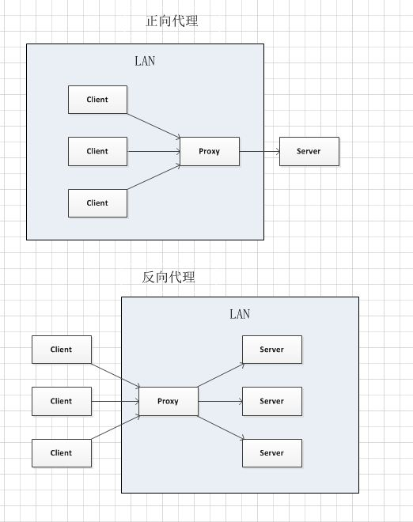

# 同源策略

同源策略是隔离了潜在的恶意文件的关键安全机制，限制了从同一个源加载的文档或脚本如何与另一个源的资源进行交互

## 同源策略相关概念

### 跨域判断

协议、端口号、域名必须一致，a.bilibili.com 和 b.bilibili.com 是不同源的

### 跨域限制

#### DOM元素

#### AJAX和FETCH

#### 本地存储

1. cookie
2. localStorage
3. sessionStorage
4. indexDB

## cors

跨域资源共享(CORS) 是一种机制，用额外的HTTP头准许浏览器访问其他域的资源

### 相关首部字段

#### 请求首部字段

##### Origin

```
Origin: <origin>
```

1. 表明预检请求或实际请求的源站
2. 所有访问控制请求（Access control request）中，Origin 首部字段总是被发送

##### Access-Control-Request-Method

```
Access-Control-Request-Method: <method>
```

预检请求使用，将实际请求所使用的 HTTP 方法告诉服务器

##### Access-Control-Request-Headers

```
Access-Control-Request-Headers: <field-name>[, <field-name>]*
```

预检请请求使用，实际请求所携带的首部字段告诉服务器

#### 响应首部字段

##### Access-Control-Allow-Origin

```
Access-Control-Allow-Origin: <origin> | *
```

origin 参数的值指定了允许访问该资源的外域 URI

##### Access-Control-Allow-Credentials

```
Access-Control-Allow-Credentials: true
```

普通响应
1. 是否允许浏览器读取response的内容

预检响应
1. 指定了实际的请求是否可以使用credentials
2. Credentials可以为cookies, authorization headers 或 TLS client certificates

##### Access-Control-Allow-Methods

预检响应中使用，明确了客户端所要访问的资源允许使用的方法列表

```
Access-Control-Allow-Methods: <method>, <method>, ...
```

##### Access-Control-Allow-Headers

预检响应中使用，明了实际请求中允许携带的首部字段

```
Access-Control-Allow-Headers: <field-name>[, <field-name>]*
```

##### Access-Control-Max-Age

预检响应中使用，指定了预检结果能缓存多久

```
Access-Control-Max-Age: <delta-seconds>
```

### cors请求过程

#### 简单请求

不会触发预检（OPTIONS）的请求

需要具备以下要求

请求方法为：
1. GET
2. POST
3. HEAD

信息头不超过：
1. Accept
2. Accept-Language
3. Content-Language
4. Last-Event-ID
5. Content-Type（值限制application/x-www-form-urlencoded，multipart/form-data和text/plain）

##### 简单请求步骤

1. 客户端发出CORS请求，携带Orign请求头
2. 服务器根据Orign字段判断是否同意请求，并返回相关头信息，响应头必须携带Access-Control-Allow-Origin
3. 浏览器检查响应头，缺少必要头则认为出错

#### 非简单请求

非简单请求在正式通信前会发送预检请求

##### 预检请求

发送OPTIONS请求，携带以下请求头
1. Orign
2. Access-Control-Request-Headers
3. Access-Control-Request-Method

服务端按照请求头段判断，不符合报错，符合进行响应，响应头必须返回
1. Access-Control-Allow-Origin
2. Access-Control-Allow-Methods
3. Access-Control-Allow-Headers

预检请求过多会降低性能，可以后端在请求的返回头部添加：Access-Control-Max-Age，对预检请求返回结果缓存

##### 正式请求

1. 每次CORS请求都携带Origin
2. 服务端也会返回Access-Control-Allow-Origin

## JSONP

JSON with Padding，JSON数据包裹

### JSONP实现

1. 利用Script标签支持跨域获取对应JS代码
2. JS代码最后调用预先注册在window的回调

原生实现

```JS
// 页面动态的加载js文件
function addScript(src) {
    const script = document.createElement('script');
    script.src = src;
    script.type = "text/javascript";
    document.body.appendChild(script);
}
addScript("http://xxx.xxx.com/xxx.js?callback=handleRes");
// 设置一个全局的callback函数来接收回调结果
function handleRes(res) {
    console.log(res);
}

// 服务端接口返回的数据格式
handleRes({
    a: 1,
    b: 2
});
```

axios实现

```JS
this.$http = axios;
this.$http.jsonp('http://www.domain2.com:8080/login', {
    params: {},
    jsonp: 'handleCallback'
}).then((res) => {
    console.log(res);
})
```

### JSONP缺点

1. 只支持GET
2. XSS攻击

## 代理跨域

### 正向代理和反向代理



#### 正向代理

正向代理其实是客户端的代理（客户端架设）
1. 客户端设置了一个代理服务器
2. 利用代理服务器去访问唯一目标服务器

正向代理具有以下作用
1. 突破访问限制
2. 隐藏真实客户端
3. 提高访问速度（代理服务器缓存）

#### 反向代理

反向代理则是服务器的代理（服务器架设）
1. 客户端访问代理服务器
2. 代理服务器指定目标服务器共客户端访问

反向代理有以下作用
1. 分担服务端负载（负载均衡）
2. 提供安全保障（代理服务器做防火墙）
3. 隐藏真实服务器
4. 提高访问速度（代理服务器缓存）

### 实现方式

服务器间的通信是不会有同源策略的，所以利用反向代理处理
1. 将客户端请求转发至目标服务器
2. 返回值可以添加cors的响应头部处理跨域

#### nginx

```
#proxy服务器
server {
    listen       81;
    server_name  www.domain1.com;
    location / {
        proxy_pass   http://www.domain2.com:8080;  #反向代理
        proxy_cookie_domain www.domain2.com www.domain1.com; #修改cookie里域名
        index  index.html index.htm;
        # 当用webpack-dev-server等中间件代理接口访问nignx时，此时无浏览器参与，故没有同源限制，下面的跨域配置可不启用
        add_header Access-Control-Allow-Origin http://www.domain1.com;  #当前端只跨域不带cookie时，可为*
        add_header Access-Control-Allow-Credentials true;
    }
}
```

#### nodejs 中间件（仅开发环境）

1. 非vue框架的跨域：node + express + http-proxy-middleware
2. vue框架：node + vue + webpack + webpack-dev-server

## WebSocket协议跨域

WebSocket protocol是HTML5一种新的协议

它实现了浏览器与服务器全双工通信，同时允许跨域通讯，是server push技术的一种很好的实现

推荐Socket.io，便于使用，同时向下兼容

前端代码

```HTML
<div>user input：<input type="text"></div>
<script src="https://cdn.bootcss.com/socket.io/2.2.0/socket.io.js"></script>
<script>
    var socket = io('http://www.domain2.com:8080');
    // 连接成功处理
    socket.on('connect', function() {
        // 监听服务端消息
        socket.on('message', function(msg) {
            console.log('data from server: ---> ' + msg);
        });
        // 监听服务端关闭
        socket.on('disconnect', function() {
            console.log('Server socket has closed.');
        });
    });
    document.getElementsByTagName('input')[0].onblur = function() {
        socket.send(this.value);
    };
</script>
```

后台代码

```JS
var http = require('http');
var socket = require('socket.io');
// 启http服务
var server = http.createServer(function(req, res) {
    res.writeHead(200, {
        'Content-type': 'text/html'
    });
    res.end();
});
server.listen('8080');
console.log('Server is running at port 8080...');
// 监听socket连接
socket.listen(server).on('connection', function(client) {
    // 接收信息
    client.on('message', function(msg) {
        client.send('hello：' + msg);
        console.log('data from client: ---> ' + msg);
    });
    // 断开处理
    client.on('disconnect', function() {
        console.log('Client socket has closed.');
    });
});
```

## postMessage

### postMessage API

HTML5 XMLHttpRequest Level 2中的API，可跨域操作
1. 页面和其打开的新窗口的数据传递
2. 多窗口之间消息传递
3. 页面与嵌套的iframe消息传递

postMessage参数为
1. data：任意基本类型或可复制的对象，但是最好JSON.stringify()序列化
2. origin：（协议+主机+端口号，* 任意窗口，/ 同源窗口）

### postMessage跨域实现

a.html：(domain1.com/a.html)

```HTML
<iframe id="iframe" src="http://www.domain2.com/b.html" style="display:none;"></iframe>
<script>
    var iframe = document.getElementById('iframe');
    iframe.onload = function() {
        var data = {
            name: 'aym'
        };
        // 向domain2传送跨域数据
        iframe.contentWindow.postMessage(JSON.stringify(data), 'http://www.domain2.com');
    };
    // 接受domain2返回数据
    window.addEventListener('message', function(e) {
        alert('data from domain2 ---> ' + e.data);
    }, false);
</script>
```

b.html：(domain2.com/b.html)

```HTML
<script>
    // 接收domain1的数据
    window.addEventListener('message', function(e) {
        alert('data from domain1 ---> ' + e.data);
        var data = JSON.parse(e.data);
        if (data) {
            data.number = 16;
            // 处理后再发回domain1
            window.parent.postMessage(JSON.stringify(data), 'http://www.domain1.com');
        }
    }, false);
</script>
```

## iframe跨域

### document.domain + iframe跨域

方案仅限主域相同，子域不同的跨域应用场景

实现原理：两个页面都通过js强制设置document.domain为基础主域，就实现了同域

父窗口：(domain.com/a.html)

```HTML
<iframe id="iframe" src="http://child.domain.com/b.html"></iframe>
<script>
    document.domain = 'domain.com';
    var user = 'admin';
</script>
```

子窗口：(child.domain.com/a.html)

```HTML
<script>
    document.domain = 'domain.com';
    // 获取父窗口中变量
    console.log('get js data from parent ---> ' + window.parent.user);
</script>
```

### location.hash + iframe跨域

实现原理：a欲与b跨域相互通信，通过中间页c来实现。 

三个页面，不同域之间利用iframe的location.hash传值，相同域之间直接js访问来通信

a.html：(domain1.com/a.html)

```HTML
<iframe id="iframe" src="http://www.domain2.com/b.html" style="display:none;"></iframe>
<script>
    var iframe = document.getElementById('iframe');
    // 向b.html传hash值
    setTimeout(function() {
        iframe.src = iframe.src + '#user=admin';
    }, 1000);

    // 开放给同域c.html的回调方法
    function onCallback(res) {
        alert('data from c.html ---> ' + res);
    }
</script>
```

b.html：(domain2.com/b.html)

```HTML
<iframe id="iframe" src="http://www.domain1.com/c.html" style="display:none; "></iframe>
<script>
    var iframe = document.getElementById('iframe');
    // 监听a.html传来的hash值，再传给c.html
    window.onhashchange = function() {
        iframe.src = iframe.src + location.hash;
    };
</script>
```

c.html：(domain1.com/c.html)

```HTML
<script>
    // 监听b.html传来的hash值
    window.onhashchange = function() {
        // 再通过操作同域a.html的js回调，将结果传回
        window.parent.parent.onCallback('hello: ' + location.hash.replace('#user=', ''));
    };
</script>
```

### window.name + iframe跨域

window.name属性的独特之处：name值在不同的页面（甚至不同域名）加载后依旧存在，并且可以支持非常长的 name 值（2MB）

a.html：(domain1.com/a.html)

```JS
var proxy = function(url, callback) {
    var state = 0;
    var iframe = document.createElement('iframe');
    // 加载跨域页面
    iframe.src = url;
    // onload事件会触发2次，第1次加载跨域页，并留存数据于window.name
    iframe.onload = function() {
        if (state === 1) {
            // 第2次onload(同域proxy页)成功后，读取同域window.name中数据
            callback(iframe.contentWindow.name);
            destoryFrame();
        } else if (state === 0) {
            // 第1次onload(跨域页)成功后，切换到同域代理页面
            iframe.contentWindow.location = 'http://www.domain1.com/proxy.html';
            state = 1;
        }
    };
    document.body.appendChild(iframe);
    // 获取数据以后销毁这个iframe，释放内存；这也保证了安全（不被其他域frame js访问）
    function destoryFrame() {
        iframe.contentWindow.document.write('');
        iframe.contentWindow.close();
        document.body.removeChild(iframe);
    }
};
// 请求跨域b页面数据
proxy('http://www.domain2.com/b.html', function(data) {
    alert(data);
});
```

proxy.html：(domain1.com/proxy.html)

中间代理页，与a.html同域，内容为空即可

b.html：(domain2.com/b.html)

```HTML
<script>
    window.name = 'This is domain2 data!';
</script>
```
