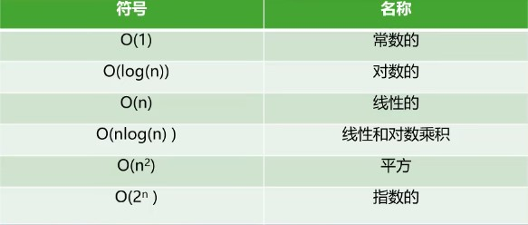
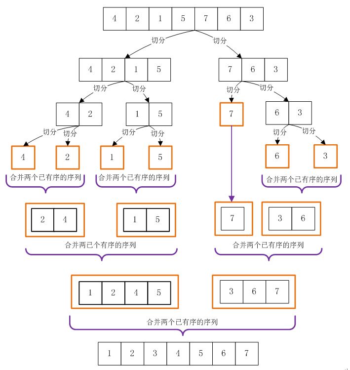
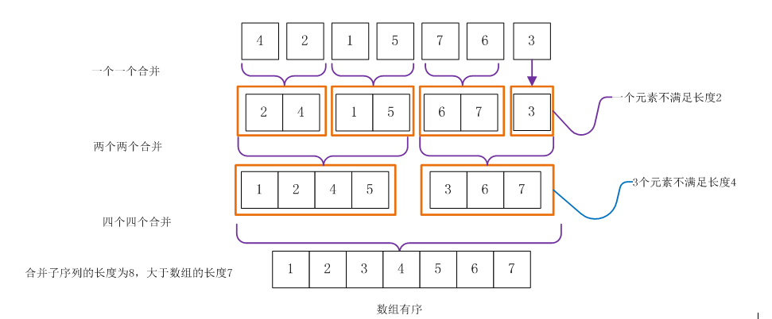

# 排序算法

## 基础概念

### 大O表示法

1. 粗略的度量算法效率
2. 不同数据规模，算法的效率会发生变化



### ArrayList类

```js
function ArrayList() { this.array = [] }
ArrayList.prototype.insert = function (item) { return this.array.push(item) }
ArrayList.prototype.toString = function () { return this.array.join(',') }
ArrayList.prototype.compare = function (m, n) { return this.array[m] > this.array[n] }
ArrayList.prototype.swap = function (m, n) {
    var temp = this.array[m]
    this.array[m] = this.array[n]
    this.array[n] = temp
}
// 之后再上面添加对应排序算法
```

## 简单排序

### 冒泡排序

#### 冒泡排序实现

1. 从头到尾依次比较相邻元素大小，左边大则和右边互换
2. 第一遍后则最大的就在最后，然后重复遍历（最后一个无需处理）

```js
ArrayList.prototype.bubbleSort = function () {
    // 最后一位无法处理，因为无法和下一位进行比较
    let j = this.array.length - 1
    while (j) {
        for (let i = 0; i < j; i++) {
            //  比较相邻元素大小，左大右小则交换数据
            if (this.compare(i, i + 1)) {
                this.swap(i, i + 1)
            }
        }
        j--
    }
}
```

#### 冒泡排序效率

1. 比较次数：O(N^2)
    1. N*(N-1)/2
2. 交换次数：O(N^2)
    1. 最高为：N*(N-1)/2
    1. 一般为：N*(N-1)/4

### 选择排序

#### 选择排序实现

1. 选出右边无序中最小的，并放到无序的第一个
2. 重复执行吗，直到整个列表变得有序

```js
ArrayList.prototype.selectionSort = function () {
    let length = this.array.length
    let j = 0
    while (j < length - 1) {
        let min = j
        // 遍历剩余寻找最小
        for (let i = min + 1; i < length; i++) {
            if (this.compare(min, i)) {
                min = i
            }
        }
        // 交换无序开头和最小
        this.swap(min, j)
        j++
    }
}
```

#### 选择排序效率

1. 比较次数：O(N^2)
    1. N*(N-1)/2
2. 交换次数：O(N)
    1. 每一次只需要交换一次，最高为：N-1

### 插入排序

#### 插入排序实现

1. 简单排序效率最高，是复杂排序基础
2. 核心思想：局部有序
    1. 一部分为排序好的，另一部分为未排序的
    2. 从未排序中取出并插入到排序好的部分
3. 实现思路
    1. 默认第一个为有序的
    2. 将第二个元素取出，和有序进行比较，大于则判断元素后移，小于的插入取出元素
    3. 循环处理剩余的无序

```js
ArrayList.prototype.insertionSort = function () {
    let length = this.array.length
    // 外层循环：向前面有序的进行插入
    for (let i = 0; i < length; i++) {
        let temp = this.array[i]
        let j = i
        // 内存循环：获取i元素，和有序的进行比较插入
        while (j > 0 && this.array[j - 1] > temp) {
            this.array[j] = this.array[j - 1]
            j--
        }
        this.array[j] = temp
    }
}
```

#### 插入排序效率

1. 比较次数：O(N^2)
    1. 倒序数组最高： N*(N-1)/2
    2. 一般只有： N*(N-1)/4
2. 交换次数：O(N^2)
    1. 倒序数组最高： N*(N-1)/2
    2. 一般只有： N*(N-1)/4
3. 只比较一般情况，插入排序只有处理完成时间和其它排序的比较时间差不多

## 高级排序

### 希尔排序

#### 希尔排序实现

1. 插入排序的改进版本，主要思路是间隔分组并将较小的往前移动
2. 间隔选择
    1. 默认：N/2
    2. Hibbard：2^k -1，即1，3，5，7，...
    3. Sedgewick：1，5，19，41，109，...
3. 实现思路
    1. 设置一个合适的间隔，然后将列表分组并进行插入排序
    2. 减少间隔大小，再次分组和插入排序
    3. 直到间隔为1，进行最后一次插入排序

```js
ArrayList.prototype.shellSort = function () {
    let length = this.array.length
    // 默认模式获取间隔
    let getGap = (num) => Math.floor(num / 2)
    // 初始化间隔
    let gap = getGap(length)
    // while循环处理，同时结尾缩小间隔
    while (gap >= 1) {
        // gap间隔的插入排序处理
        for (let i = gap; i < length; i++) {
            let temp = this.array[i]
            let j = i
            while (j > gap - 1 && this.array[j - gap] > temp) {
                this.array[j] = this.array[j - gap]
                j -= gap
            }
            // 将j位置的元素赋值给temp
            this.array[j] = temp
        }
        // 更新间隔
        gap = getGap(gap)
    }
}

```

#### 希尔排序效率

1. 效率和增量有关
2. 但是统计后最坏为O(n^2)
3. 通常都好于简单排序，合适增量和数量下，快于快速排序

### 快速排序（综合最优）

#### 快速排序实现

1. 冒泡排序的升级版，主要思想是分而治之
2. 核心思想：分而治之
    1. 随机取一个值，即为枢纽
    2. 列表中大于这个值的放左边，小于这个放右边
    3. 两边列表处理排
3. 枢纽的选择（中间值最好）
    1. 使用第一个元素
    2. 使用随机数
    3. 取头中尾的中位数（推荐）
4. 实现思路
    1. 创建left和right的指针，找出枢纽
        1. left不断增加找大于枢纽的下标
        2. right不断减少找小于枢纽的下标
        3. 交换两边指针的值
        4. left和right指针相同则将该下标设置为枢纽值
    2. 两边再进行找出枢纽，创建指针处理，直到最后

### 归并排序

利用归并的思想实现排序算法，采用分治策略

#### 两个有序子项列表合并策略

1. 使用两个指针，分别指向两个列表开头
2. 比较两个有序列表所指的值，将小的值放入新数组，指针后移
3. 循环下去，直到合并完成

#### 自顶向下的归并排序（递归实现）

1. 数组不断两两拆分，直到分成子项列表长度为1
2. 在执行合并策略两两合并，直到所有都合并完成



#### 自底向上的归并排序（循环实现）

1. 按照长度为1的列表两两合并
2. 合并结果再进行两两合并
3. 一直合并成一个完整的列表



### 堆排序

#### 列表变大顶堆

1. 按照列表构建二叉树
2. 当子节点不满足小于父节点，则交换
3. 循环下去直到都处理完成

#### 堆排序实现原理（O(nlogn)）

1. 列表变成大顶堆
2. 然后将堆顶和数组最后一个节点交换
3. 将树结尾的节点移动至堆顶，重新构建大顶堆
4. 将堆顶和倒数第二的节点替换，循环执行下去直到所有都处理完
