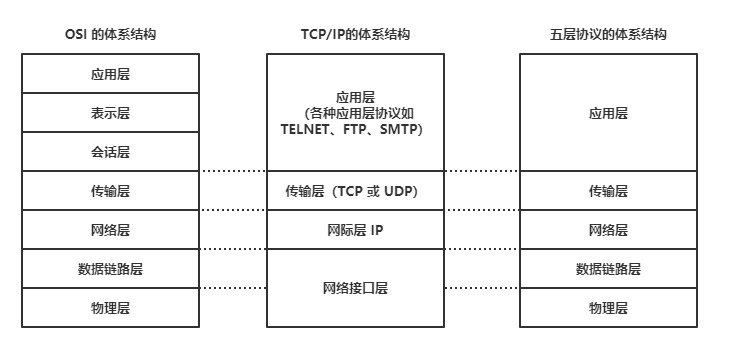

# 相关概念

## 网络模型

### 模型定义

网络模型定义方式分为两种

1. ISO七层网络模型（国际标准化组织（ISO）制定的一个用于计算机或通信系统间互联的标准体系）
2. TCP/IP四层模型（ISO七层模型的简化形式）

其中四层模型的应用层是应用层，表示层，会话层的合并，网络接口层是物理层和数据链路层的合并

### 模型组成

应用层

1. 应用层（为应用软件而设计的接口,处理软件间通信）
2. 表示层（数据转换为兼容并适合传输的格式）
3. 会话层（设置和维护两台设备间连接）

传输层（传输表头（TH）加至数据以形成数据包）

网络层（决定数据的路径选择和转寄）

网络接口层

1. 物理层（发送数据帧，负责管理通信设备和网络媒体之间的互通）
2. 数据链路层（负责网络寻址、错误侦测和改错）

## 浏览器访问流程

### 解析URL

分析路径是否合法

合法，则确定传输协议和路径

不合法，则直接搜索引擎搜索

### 本地缓存判断

检查请求资源是否在本地缓存

本地存在获取资源并返回200

本地不存在则继续

### DNS解析

通过URL向DNS服务器获取目标IP

### TCP三次握手

利用三次握手与目标服务器建立稳定连接

### HTTP/HTTPS通信

通过HTTP/HTTPS协议发送请求

### 返回数据

接收服务器返回数据并处理

### 页面渲染

本地状态变动，浏览器重新渲染

### TCP四次挥手

使用四次挥手断开与目标服务器连接
