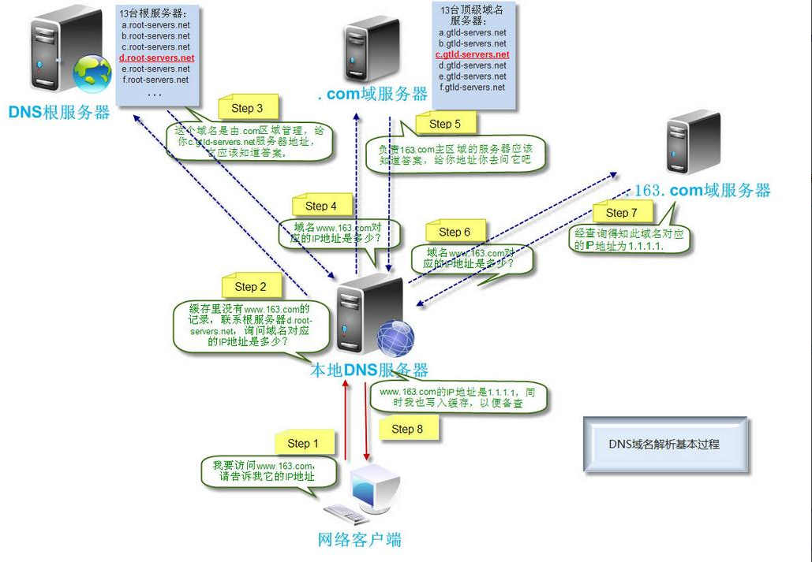

# DNS

域名系统(Domain Name System)

域名和IP地址互相映射的分布式数据库，便于客户端将域名转化为IP地址

## 传输协议

DNS同时占用UDP和TCP端口53

区域传输的时候使用TCP协议

> 区域传输：辅域名服务器每隔一段时间向主域名服务器发送请求检查是否变动，存在变动执行区域传输，用于同步数据

其它时候则使用UDP协议，原因是不经历三次握手，DNS服务器负载低，响应快

## 查询方式

DNS解析是一个包含迭代查询和递归查询的过程

### 递归查询

客户端向本地服务器请求的过程

特点
1. 下一级查询由服务器代理查询
2. 客户端只需要进行一次查询，就能获取目标地址

### 迭代查询

本地 DNS 服务器向其他域名服务器请求的过程

特点
1. 每一级服务器都会返回结果
2. 客户端接收到结果后进行下一级查询
3. 客户端需要多次查询

## 域名解析过程

1. 浏览器缓存
   本地浏览器检查是否缓存对应IP地址，存在直接返回
2. 本机系统
   查看本机HOST文件配置是否指定了对应IP地址
3. 本地域名解析服务器
    访问本地域名服务器，查询是否有已缓存的IP地址
    若本地不存在，本地域名解析服务器将按顺序查询以下服务器

    1. 根域名解析服务器（.com/.cn/.net）
    2. 顶级域名解析服务器（xx.com）
    3. 网站注册的域名服务器（ns-tel1.qq.com）
    4. 本地域名解析服务器缓存返回的IP地址
4. 客户端获取IP并访问
   客户端访问目标IP并建立连接进行数据传输，浏览器缓存此次IP

