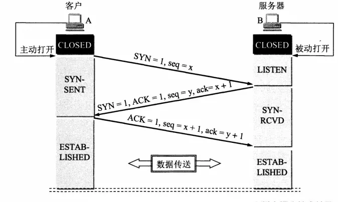
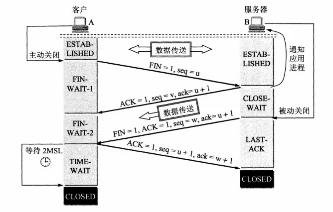

# TCP和UDP

[TCP和UDP-思维导图](./mind/03-TCP和UDP.html)

## TCP

传输控制协议（Transmission Control Protocol）

### TCP特点

####  面向连接

1. 发送数据之前必须在两端通过三次握手建立连接

#### 可靠传输

1. 超时重传
   1. 消息发出后会设置一个定时器，接收方确认超时则会重新发送
2. 流量控制
   1. 通信双发具有固定大小的缓冲空间，发送方只能发送接收方允许的数据大小，并利用滑动窗口实现流量控制
3. 拥塞控制
   1. 检测到网络拥塞时，减少数据发送
4. 数据分块
   1. 数据分割成适合发送的块
5. 序列号（有序发送）
   1. 每一个发送的数据包都具有序号
   2. 接收端通过序号对数据包进行排序后发送给应用层
6. 校验和
   1. 保持首部和数据的校验和，出错则直接丢弃报文
7. 停止等待协议
   1. 发送完一个分组则停止发送，等双发确认后继续发送

#### 单播

1. 仅支持一对一通信

#### 字节流

1. 不保留报文边界，使用字节流进行数据传输

### 连接方式

#### 相关字段

1. 1位字段
   1. SYN：发起新请求
   2. ACK：确认序号是否有效
   3. FIN：是否释放连接
2. 32位字段
   1. 序号（seq）：标识客户端向服务端发送的字节流，发起放会发送数据时会进行标记
   2. 确认序号（ack）：用于确认sep消息，值通常位seq+1

#### 三次握手：确保双方收发正常

1. 客户端发送：SYN=1，seq=x
2. 服务端发送：SYN=1，ACK=1，seq=y，ack=x+1
3. 客户端发送：ACK=1，seq=x+1，ack=y+1
4. 连接建立

#### 四次挥手：确保数据传输完，双方断开连接

1. 客户端发送：FIN=1，seq=u
2. 服务端发送：ACK=1，seq=v，ack=u+1
3. 等待服务端剩余数据发送完毕
4. 服务端发送：FIN=1，ACK=1，seq=w，ack=u+1
5. 客户端发送：ACK=1，seq=u+1，ack=w+1
6. 链接断开（客户端会等待2MSL再断开）

### TCP粘包

#### TCP粘包产生原因

1. 面向字节流传输，应⽤程序必须以消息为单位提取数据，不能⼀次提取任意字节的数据
2. 延迟传送算法 (Nagle算法）：多次数据发送，会缓冲起来作一次发送

#### UDP不粘包原因

1. UDP具有保护消息边界，在每个UDP包中就有了消息头（消息来源地址，端⼝等信息）
2. 传输协议把数据当作⼀条独⽴的消息在⽹上传输，接收端只能接收独⽴的消息

#### 粘包解决方式

1. 多次发送增加时间间隔
2. 关闭Nagle算法(不推荐)
3. 封包/拆包：在每个数据包的前后添加特征数据，接收数据后根据特征数据分割数据包

## UDP

用户数据报协议（User Datagram Protocol）

### UDP特点

#### 面向无连接

1. 发送时无需建立连接

#### 不可靠

1. 不保证交付成功
2. 无交付顺序（无序发送）
3. 无拥塞控制
   

#### 单播/多播/广播

1. 可以一对一，一对多，多对多通信

#### 报文

1. 应用层传入的报文不进行处理
2. 保留报文边，仅添加头部后直接发送给网路层

#### 传输高效（头部占比小）

1. UDP首部8字节
2. TCP首部最小20字节，最大60字节
