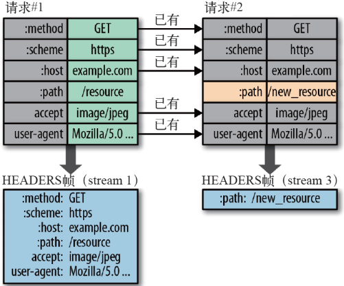
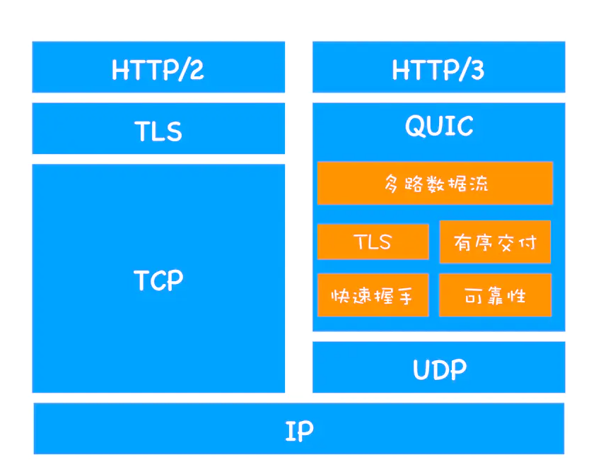
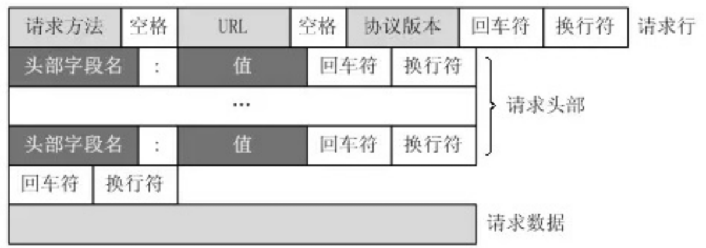
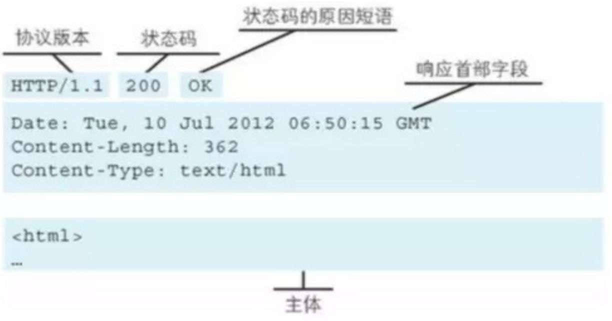
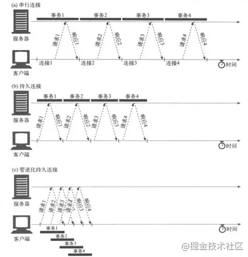

 # HTTP 
 
1. 超文本传输协议（Hyper Text Transfer Protocol，HTTP）
2. 一个简单的请求-响应协议，它通常运行在TCP之上

## HTTP优缺点

### HTTP优点

1. 请求和响应方式简单
2. 支持任何资源

### HTTP缺点

1. 不安全
   1. 明文传输
   2. 无法验证身份
   3. 消息完整性无法确定

## 版本比较

### HTTP1.0

1. 短连接
   1. 一个请求一个连接，完成后断开
2. 可以传输任何资源
3. 信息头
4. 状态码
5. GET/POST/HEAD
6. 缓存
   1. Expires

### HTTP1.1

1. 持久连接
   1. 默认Connection: keep-alive，同时具有管道机制

    >管道机制： 同一个TCP连接可以发送多个HTTP请求，但是同一时刻只能处理一个请求，队首处理时间过长，会导致其他请求一直等待，造成队头堵塞

2. 字节范围请求（range）
   1. range头来请求部分资源，返回206
3. 默认发送HOST头
4. PUT/PATCH/HEAD/OPTIONS/DELETE
5. 缓存
   1. 协商缓存
      1. Etag、If-None-Match
      2. Last-Modified、If-Modified-Since
   2. 强缓存
      1. 增加Cache-Control

### HTTP2

1. 流传输（二进制帧）
   1. 二进制传输，将消息分成多帧进行传输
2. 多路复用
   1. 一个域名只用一个TCP长连接进行数据传输
   2. 不需要按照顺序发送，处理了队头堵塞
3. 头部压缩
   1. 头信息经过gzip或compress压缩后再发送
   2. [HPACK算法](https://segmentfault.com/a/1190000017011816)：客户端和服务器维护一张头信息表，后续双方通信发送差异头部



4. 服务器推送SSE
   1. 服务器可以在未请求的情况下向客户端发送数据

#### 页面请求多张图片

1. HTTP1
   1. 由于TCP最大连接数是6，只能同时6张加载，并且后续的依次加载
   2. 可以用多域名部署解决，这样可以提高同时请求的数目，加快页面图片的获取速度
2. HTTP2
   1. 多路复用的支持，请求无限制，可以同时传输

### HTTP3

1. 基于UDP的QUIC协议实现
2. 存在以下几个优势
   1. 原生支持多路复用
      1. 同一物理连接上可以有多个独立的逻辑数据流
   2. 加密认证的报文
      1. 头部经过认证
      2.  内容经过加密
   3. 基于UDP从而支持快速握手



## 请求方式

### 请求方式分类

#### GET

获取服务器数据

#### POST

提交实体到指定资源

##### 与GET的差异

1. 影响服务器资源
   1. GET一般不会影响资源
   2. POST一般用于新增或修改资源
2. 缓存
   1. GET一般默认缓存
   2. POST一般不缓存
3. 参数
   1. GET将参数放在URL中，参数长度受限，不安全并且会留存在历史记录中
      1. GET长度限制
         1. 主流浏览器IE的URL最短的，限制是2083字节
         2.  GET的长度值 = URL（2083）- （你的Domain+Path）-2（2是get请求中?=两个字符的长度）

   2. POST将数据放在报文中，长度不限

#### PUT

更新，上传文件

#### DELETE

删除服务器对象

#### HEAD

获取报文首部，与GET相比，不返回报文主体部分

#### OPTIONS

1. 获取目的资源所支持的通信选项
2. CORS 中的预检请求，检测服务器所支持的HTTP请求方法和请求头

#### TRACE

回显服务器收到的请求，主要⽤于测试或诊断

### RESTful API

目前比较成熟的一套互联网应用程序的API设计理论
1. 每个 url 当作一个唯一的资源
2. 不用 url 参数标识类型
3. method 表示操作类型

```bash
# 创建
（post）/api/create-blog ==> （post）/api/blog
# 更新
（post）/api/update-blog?id=100 ==> （put）/api/blog/100
# 获取
（get）/api/get-blog?id=100 ==> （get）/api/blog/100
```

## 报文

### 请求报文

请求报文分为

1. 请求行
2. 请求头
3. 空行
4. 请求体



#### 请求行

1. 请求方法
2. 请求URL
3. HTTP协议版本

#### 请求头

列出一些常见的请求头

1. 可接收
   1. Accept：可接收的类型
   2. Accept-Encoding：浏览器能处理的压缩编码
   3. Accept-Language：浏览器语言设置
   4. Accept-Charset：浏览器能显示的字符集
2. 连接方式 Connection
3. HOST域 Host
4. 用户代理 User-Agent
5. Cookie
6. 页面链接 Referer
7. 断点续传 Range
8. 缓存
   1. 协商缓存
      1. If-Modified-Since
      2. If-None-Match
   2. 强缓存
      1. Cache-Control

### 响应报文

响应报文分为
1. 响应行
2. 响应头
3. 空行
4. 响应体



#### 响应行

1. HTTP协议版本
2. 状态码
3. 状态描述

#### 响应头

列出一些常见的响应头

1. 内容格式
   1. Content-Type 文档MIME类型
      1. application/x-www-form-urlencoded 浏览器的原生 form 表单
      2. multipart/form-data 表单上传文件
      3. application/json 序列化后的 JSON 字符串
      4. text/xml 提交 XML 格式的数据
   2. Content-Encoding
2. 连接方式 Connection
3. 消息发送的服务器时间 Date
4. 服务器名称信息 Server
5. 缓存
   1. 强缓存
      1. Expires
      2. Cache-Control
   2. 协商缓存
      1. Etag
      2. Last-Modified

## 持久连接

1. HTTP的keep-alive开启后可以在一个TCP连接中发送多个HTTP请求
2. 管道化，HTTP维护一个队列，可以同时发送多个请求，直到请求处理完成后关闭连接

### keep-alive开启/关闭

1. Connection: Keep-Alive （HTTP1.1后默认开启）
2. Connection: close

### 持久连接比较



1. 优点
   1. 减少CPU和内存使用
   2. 减少后续请求时间，因为无需连接
   3. 降低拥塞控制
   4. 报告错误无需关闭TCP连接
2. 缺点
   1. 单文件不断请求的网站(多图片网站)，会影响性能
