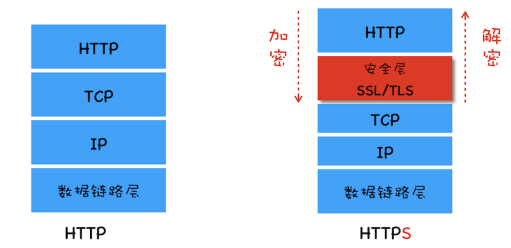
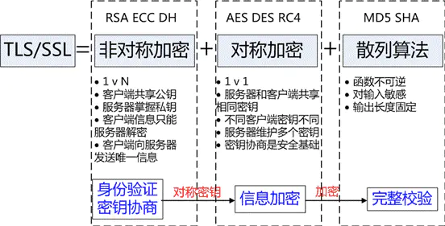
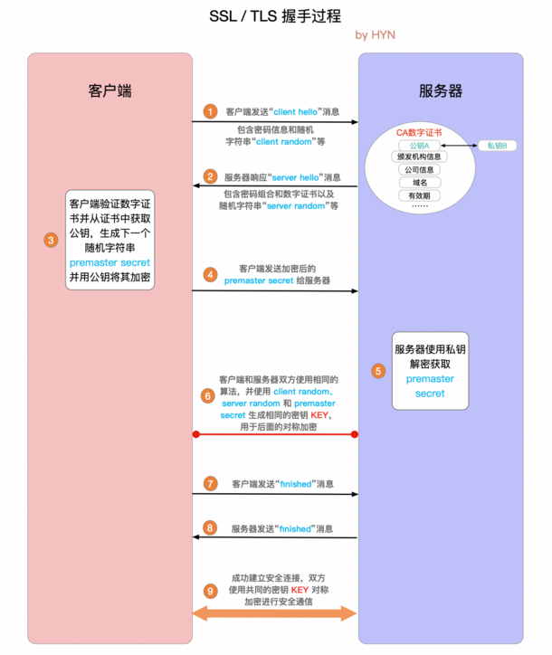
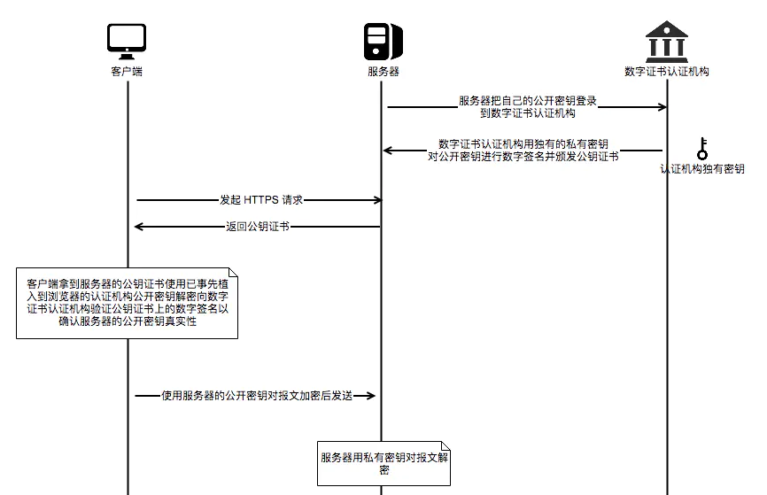

# HTTPS

## 相关概念

### 超文本传输安全协议

超文本传输安全协议，一种通过计算机网络进行安全通信的传输协议

1. 由HTTP进行通信
2. 利用SSL/TLS来加密数据包
   1. 身份验证
   2. 信息加密
   3. 完整性校验
   

### 加密方式

#### 非对称加密

RSA，ECC，DH

1. 密钥成对出现
2. 公钥或私钥所加密的信息，只能由对方解开
3. 加密速度慢，不利于通信

#### 对称加密

AES-CBC，DES，3DES，AES-GCM

1. 双方使用同一个密钥进行加密解密
2. 需保证密钥传输安全性

#### 散列函数hash

MD5，SHA1，SHA256

1. 不可以解密
2. 用于校验信息完整性

## TLS/SSL

### TLS/SSL概念

1. SSL 为安全套接层（Secure Sockets Laye）
2. 传输层安全性协议（Transport Layer Securit）
3. SSL为TLS的继任者

### [TLS/SSL握手过程](https://segmentfault.com/a/1190000021559557)

1. 客户端发送 client hello 消息
   1. client hello 消息
      1. 支持的 TLS 版本和密码组合
      2. "client random"随机字符串
2. 服务器回应 server hello 消息
   1. server hello 消息
      1. 数字证书
         1. hash信息摘要
         2. 公钥

      2. 服务器选择的密码组合
      3. "server random"随机字符串
3. 客户端验证，并发送公钥加密信息
   1. 对证书进行验证
      1. 检查信息完整
      2. 获取公钥
   2. 公钥加密新生成的随机字符串，生成"premaster secret (预主密钥)"，发送
4. 服务器使用私钥解密信息
5. 双方使用当前信息生成共享密钥
   1. 双方使用 client random，server random 和 premaster secret 通过相同算法生成对称加密key
6. 客户端 finished
   1. 发送共享密钥 KEY加密过的"finished"信号
7. 服务器 finished
   1. 发送共享密钥 KEY加密过的"finished"信号
8. 建立连接，达成安全通信

## 数字证书

### 中间人攻击

1. 公钥可能被第三方拦截并替换，然后冒充用户进行通信

### 数字证书过程

1. 服务器将公钥和其他信息通过hash加密生成信息摘要
2. 摘要发送给受信任的证书机构（CA）
3. CA生成证书
   1. CA用自身私钥对摘要进行加密，形成签名
   2. 将原始信息和签名合在一起形成数字证书
4. 客户端请求获取数字证书并校验
   1. 根据原始信息利用hash加密获取摘要
   2. 通过公证处的公钥来解密数字证书
   3. 比对解密摘要和生成摘要，确定信息是否被更改
   

