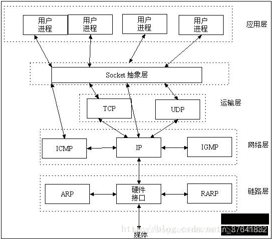
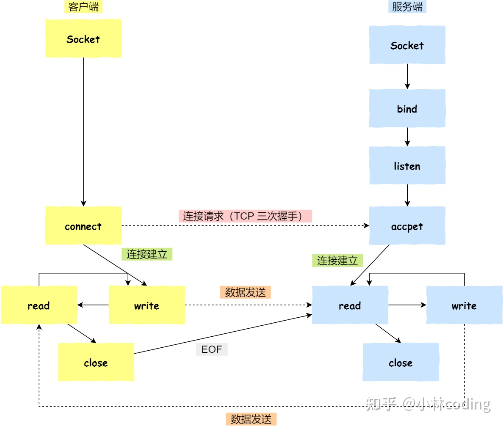

# [WebSocket](https://developer.mozilla.org/zh-CN/docs/Web/API/WebSocket)
1. WebSocket是 HTML5 定义的一个新的网络传输协议，位于应用层
2. 可在单个TCP连接上进行全双工通信
3. 一开始的握手需要借助HTTP请求完成

## [socket](https://www.zhihu.com/question/29637351)

1. socket 其实就是操作系统提供给程序员操作「网络协议栈」的接口
2. 通过socket 的接口，来控制协议找工作，从而实现网络通信，达到跨主机通信
3. socket没有指定传输层协议，可以TCP，也可以UDP

### 结构



### 网络编程



### [socket与http](https://zhuanlan.zhihu.com/p/142650150)

1. Socket是对TCP/IP协议的封装，Socket本身并不是协议，而是一个调用接口（API），通过Socket，才能使用TCP/IP协议
2. Http协议即超文本传输协议，http协议是建立在TCP协议之上的一种应用
3. socket连接即是所谓的长连接，理论上客户端和服务端一旦建立连接，则不会主动断掉
4. http连接就是所谓的短连接，及客户端向服务器发送一次请求，服务器端相应后连接即会断掉

### socket与websocket

1. Socket是传输控制层协议
2. WebSocket是应用层协议

### websocket与http

1. 相同点
   1. 都是基于TCP，是可靠的的传输
   2. 都是应用层协议
2. 不同点
   1. Websocket是双向通信，模拟了socket协议，而HTTP是单向的
   2. Websocket建立链接是需要通过HTTP进行传输，链接成功后的真正传输不再使用HTTP

## 使用

```js
// 创建连接实例
const socket = new WebSocket('ws://localhost:8080');

// 连接监听
socket.addEventListener('open', function(event) {
    socket.send('Hello Server!');
});

// 关闭监听
socket.addEventListener('close', function(event) {
    socket.send('Bey Server!');
})

// 服务端消息监听
socket.addEventListener('message', function(event) {
    console.log('Message from server ', event.data);
})

// 发送消息
socket.send("Hello WebSockets!");
```

## 即时通讯

### 短轮询

1. 浏览器每隔一段时间向浏览器发送 http 请求
2. 服务器端在收到请求后，不论是否有数据更新，都直接进行响应

### 长轮询

1. 首先由客户端向服务器发起请求
2. 当服务器收到客户端发来的请求后，服务器端不会直接进行响应，先将这个请求挂起
3. 判断服务器端数据是否有更新
4. 如果有更新，则进行响应，如果一直没有数据，则到达一定的时间限制才返回

### [SSE](https://juejin.cn/post/6854573215516196878)

1. 服务器使用流信息向服务器推送信息

### WebSocket 

1. 该协议允许由服务器主动的向客户端推送信息

### 比较

1. 前三个都是基于HTTP协议的
2. 性能：WebSocket > 服务端消息推送（SSE） > 长轮询 > 短轮询
3. 兼容性： 短轮询 > 长轮询 > 服务端消息推送（SSE） > WebSocket
