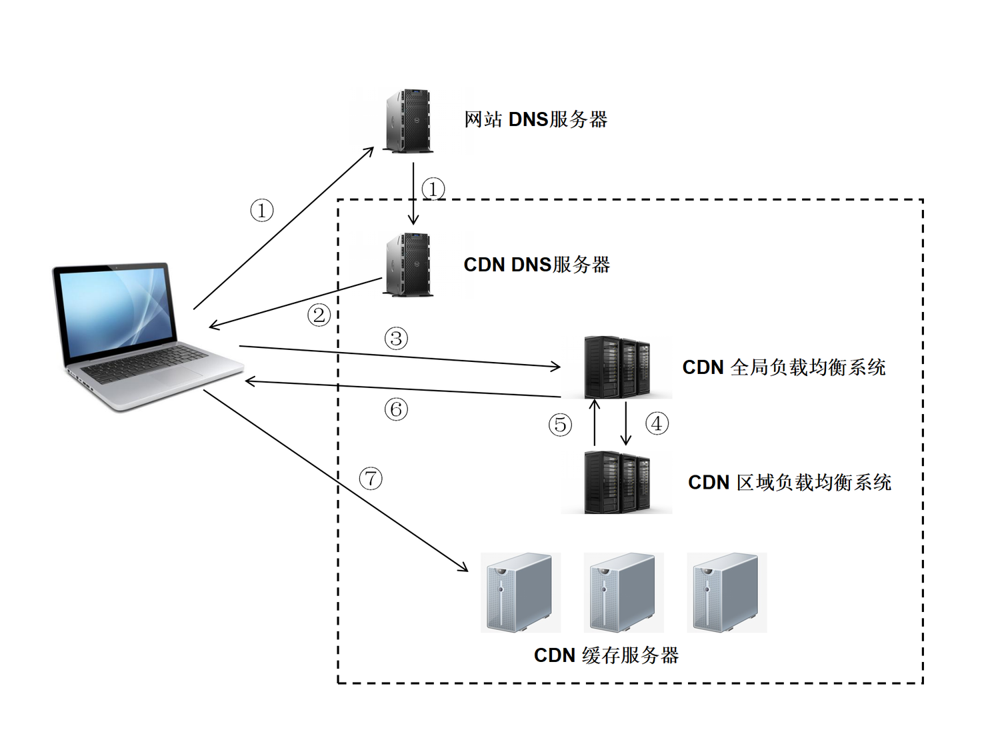

# CDN

[CDN思维导图](./mind/08-CDN.html)

1. Content Delivery Network，内容分发网络
2. 互联网互相连接的电脑网络系统

## CDN组成

### 分发服务系统

1. 响应用户请求，发送本地缓存数据
2. 不同站点内容同步
3. 更新内容和本地没有的从源服务器获取并缓存本地

### 负载均衡系统

1. 对用户请求进行调度，提供最好的访问地址

### 运营管理系统

1. 对用户，产品，计费进行管理

## CDN作用

### 性能

1. 用户最终访问最近的数据中心获取数据，延迟低，加载快
2. 将部分资源分配给了CDN服务器，减少了服务器负载

### 安全

1. 监控分析异常流量，针对DDoS攻击
2. 全链路HTTPS通信

## CDN应用场景

1. 开源项目的CDN
2. 使用CDN存放静态文件
3. 直播传输，CDN支持流媒体传输，用于直播提高加载速度
